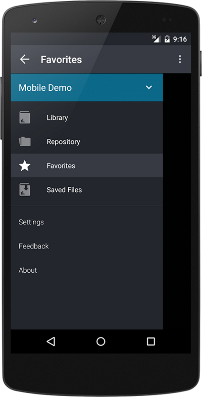
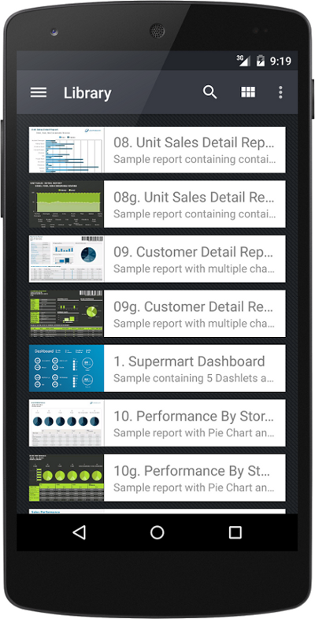
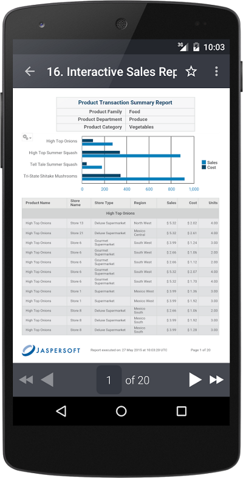
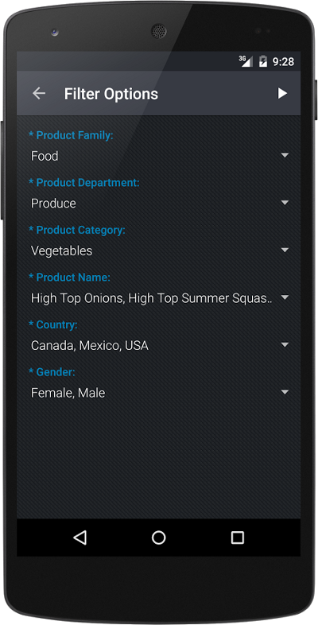
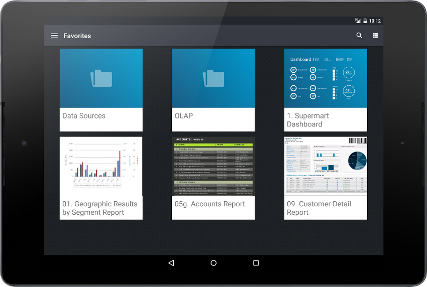
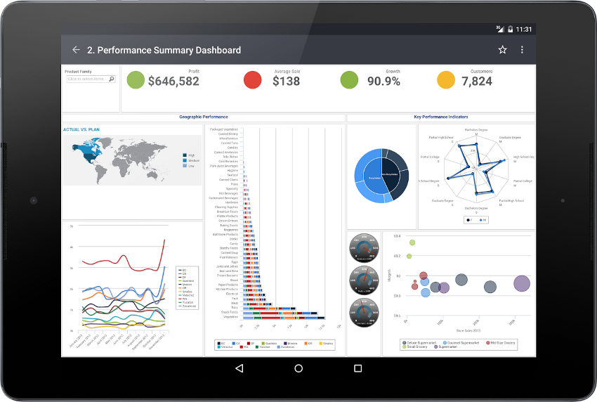

# 1.1 JasperMobile App for Android

Jaspersoft publishes the JasperMobile app for Android that was developed with the Mobile SDK. The app is a client that lets you access one or more JasperReports Server instances and run reports and dashboards to display on your Android device.

You can install the app from the Google Play:

[https://play.google.com/store/apps/details?id=com.jaspersoft.android.jaspermobile](https://play.google.com/store/apps/details?id=com.jaspersoft.android.jaspermobile)

The JasperMobile app for Android uses both the client and UI packages of the Mobile SDK to implement the following features:

-   Thumbnails – When the thumbnail feature is enabled on the server, JasperMobile displays a small image of the report or dashboard in both list and tile layouts.
-   Library – View a list of all reports and compatible dashboards on the server.
-   Repository browser – Explore the repository of JasperReports Server and view all the resource properties. A built-in viewer lets you display image resources and text files of type JRXML, resource bundle, or CSS.
-   Repository search – Search for resources by name in the whole repository.
-   Favorites – When browsing the repository or viewing a report, any resource can be easily flagged as a 'Favorite' and then displayed in the special Favorites view.
-   Saved files – You can store report output as HTML, PDF, or XLS on your device to view at any time.
-   Running dashboards – JasperMobile can display dashboards from versions of JasperReports Server prior to 6.0 and legacyDashboard in version 6.0 and later.
-   Running reports – JasperMobile allows you to easily execute reports and interact with them.
-   Input Controls – The application introspects the report unit, identifies the input controls and then renders them in a table view based on the report parameters. The support for cascading input controls allows you to dynamically populate list items based on user selection. All input controls are rendered using native components, including Boolean check boxes, text and numeric fields, date and time selectors, and single or multiple choice lists.

When you first run JasperMobile, you connect to your instance of JasperReports Server with a user name and password. You can later configure the app to remember the connection parameters for several servers.

    

*Figure 1-1 Main Menu and Library Page of the JasperMobile App For Android*

The main menu gives access to all of the features of JasperMobile.

    

*Figure 1-2 Viewing a Report and Input Controls with the JasperMobile App For Android*

Once you select a report to view, you can modify any of its input controls (also known as filters).

*Figure 1-3 Library Page Viewed on a Tablet with JasperMobile App For Android*

The JasperMobile app for Android also supports tablet layouts. When enabled on the server, report thumbnails and the tile layout make it easy to find the data you're looking for.

*Figure 1-4 Dashboard Viewed on a Tablet with JasperMobile App For Android*

Because of their size, tablets are particularly well-suited for viewing complex reports and dashboards.
