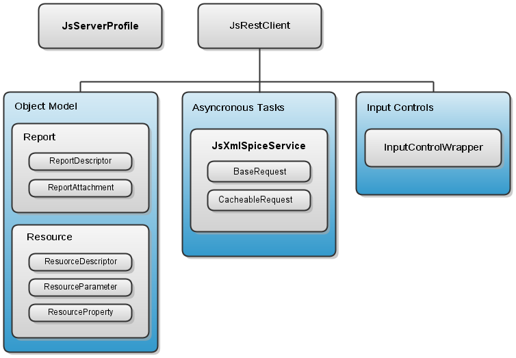
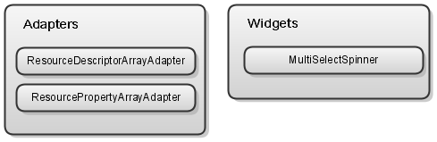

# 1.1 Structure of the Mobile SDK for Android

The Jaspersoft Mobile SDK for Android is a set of Java classes and UI components to easily connect and consume the services provided by JasperReports Server using the REST API. The Mobile SDK uses the version of the REST API available in JasperReports Server 5.5 or later.

The Mobile SDK is divided into a client package and a user interface (UI) package.

## 1.1.1 Mobile SDK Client Package

The Mobile SDK client package includes all the classes to interact with JasperReports Server through its REST API. The following diagram shows the relationship between the classes of the client package.

*Figure 1-1 Client Package of the Jaspersoft Mobile SDK for Android*

The components of the client package are:

- `JsRestClient` – Provides a set of convenient methods to interact with the JasperReports Server REST API and performs the mapping of the returned data to the object model.
- Object model – A set of classes that represent objects in the server. These classes make it simpler to work with REST data, which can be returned in JSON or XML format.
- Asynchronous tasks mechanism – Performs expensive operations in background mode and publishes the results to the UI thread without having to manipulate threads or handlers.
- Input controls wrapper – Simplifies the manipulation of input controls, independent of their type and UI appearance.

## 1.1.2 Mobile SDK UI Package

The UI package of the Mobile SDK is no longer supported. It can still be used for backward compatibility, but new apps should not use it. It is used in the JasperMobile app for Android. The following diagram shows the components of the UI package:

*Figure 1-2 UI Packages of the Jaspersoft Mobile SDK for Android*
