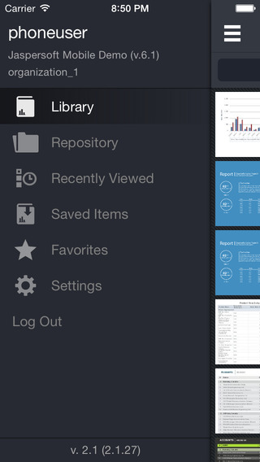
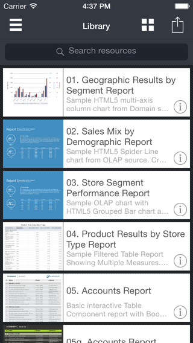
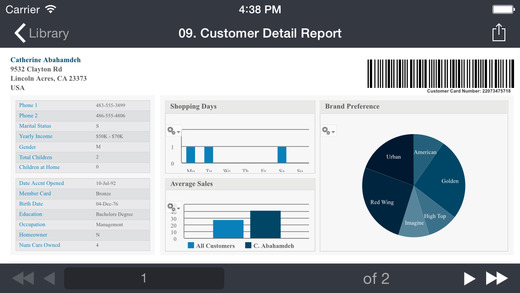
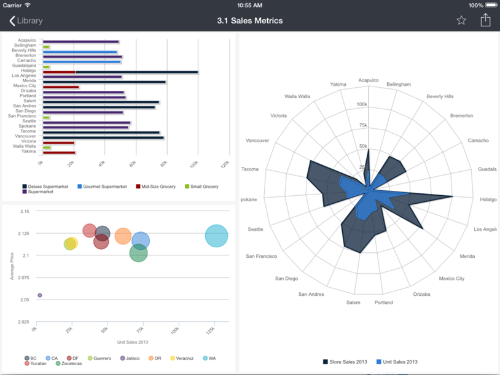

# 1.1 JasperMobile App for iOS

Jaspersoft has published the JasperMobile app for iOS that was developed with the Jaspersoft Mobile SDK. The app is a client that lets you access one or more JasperReports Server instances and run reports and dashboards to display on your iPhone, iPad, or iPod Touch.

You can install the app from the iTunes Store:

[https://itunes.apple.com/us/app/jaspermobile/id467317446?l=it&ls=1&mt=8](https://itunes.apple.com/us/app/jaspermobile/id467317446?l=it&ls=1&mt=8)

The JasperMobile app uses the Mobile SDK to implement the following features:

-   Thumbnails – When the thumbnail feature is enabled on the server, JasperMobile displays a small image of the report or dashboard in both list and tile layouts.
-   Library – View a list of all reports and compatible dashboards on the server.
-   Repository browser – Explore the repository of JasperReports Server and view all the resource properties. New icons provide visual cues about resource types (folders, reports, and more).
-   Repository search – Search for resources by name in the whole repository.
-   Favorites – When browsing the repository or viewing a report, any resource can be easily flagged as a 'Favorite' and then listed on the Favorites page.
-   Recently viewed – Easy access to the reports and dashboards that you use the most.
-   Saved files – You can store report output as HTML, PDF, or XLS on your device to view at any time.
-   Running dashboards – JasperMobile can display dashboards from versions of JasperReports Server prior to 6.0 and legacyDashboard in version 6.0 and later.
-   Running reports – JasperMobile allows you to easily execute reports and interact with them.
-   Input Controls – The application introspects the report unit, identifies the input controls and then renders them in a table view based on the report parameters. The support for cascading input controls allows you to dynamically populate list items based on user selection. All input controls are rendered using native components, including Boolean check boxes, text and numeric fields, date and time selectors, and single or multiple choice lists.
-   Printing – Send reports and dashboards from your device to your printer when needed. 

When you first run JasperMobile, you connect to your instance of JasperReports Server with a user name and password. You can later configure the app to remember the connection parameters for several servers.

       

*Figure 1-1 Main Menu and Library page of the JasperMobile App for iOS*

The main menu gives access to all of the features of JasperMobile.

*Figure 1-2 Running a Report in Portrait Orientation in the JasperMobile App for iOS*

The app supports device rotation to help display reports on small screens. You can still zoom in and interact with the report.

*Figure 1-3 Dashboard Viewed on an iPad with JasperMobile App for iOS*

JasperMobile app for iOS supports iPad at the native resoulution, which is particularly well-suited for viewing dashboards and complex reports.
