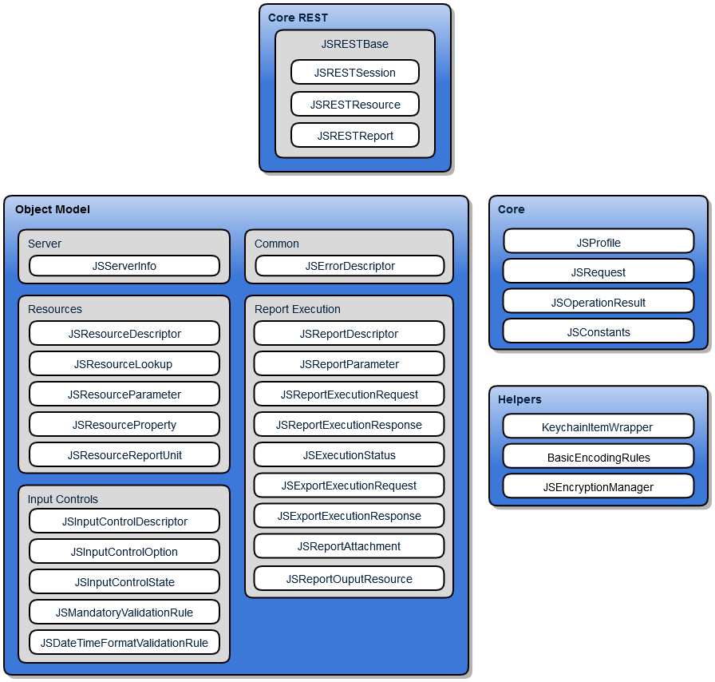

# 1.1 Structure of the Mobile SDK for iOS

The Jaspersoft Mobile SDK for iOS is a set of object models, methods, and services to easily connect to JasperReports Server using the REST API. The Mobile SDK uses the version of the REST API available in JasperReports Server 5.5 or later.

The following diagram shows the relationship between the classes.

*Figure 1-1 Components of the Jaspersoft Mobile SDK for iOS*
