# Applying the Model

By following these processes, you define a model that describes your data in terms of dimensional analysis.

## Example Using FoodMart Data

This example is based on the FoodMart sample data that can be installed with JasperReports Server. It illustrates the types of questions that can be answered interactively using Jaspersoft OLAP. Our goal in this section is to answer this question: what type of alcoholic beverage generates the most revenue?

Each step in this example shows the corresponding MDX query so that you can explore the data on your own.

To analyze the FoodMart view

1.  Begin by looking at a top-level summary of sales for all products. An aggregated view like this lets us dive into the data in any direction of interest. In this example, we look at data for the month of December.

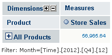

Top-level Summary for December

<table>
<colgroup>
<col style="width: 100%" />
</colgroup>
<tbody>
<tr>
<td>
select {[Measures].[Store Sales]} ON COLUMNS,

Hierarchize({[Product].[All Products]}) ON ROWS

from [Sales]
</td>
</tr>
</tbody>
</table>

1.  Drill-down is the most basic function in analysis.

To drill-down, click 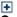 next to the ALL PRODUCTS member. The next level of the PRODUCT hierarchy, **Product Family**, appears.

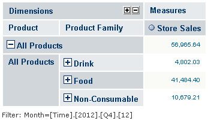

Expand All Products

<table>
<colgroup>
<col style="width: 100%" />
</colgroup>
<tbody>
<tr>
<td>
select {[Measures].[Store Sales]} ON COLUMNS,

Hierarchize(Union({[Product].[All Products]}, [Product].[All Products].Children)) ON ROWS

from [Sales]

where [Time].[2012].[Q4].[12]
</td>
</tr>
</tbody>
</table>

1.  Drill down again, this time by zooming on the Drink product family. Use  on DRINK.

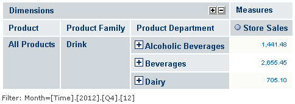

Zoom on the Drink Product Family

<table>
<colgroup>
<col style="width: 100%" />
</colgroup>
<tbody>
<tr>
<td>
select {[Measures].[Store Sales]} ON COLUMNS,

[Product].[Drink].Children ON ROWS

from [Sales]

where [Time].[2012].[Q4].[12]
</td>
</tr>
</tbody>
</table>

1.  By zooming, we could drill down to the lowest level of data in the cube. Let us instead focus our attention by zooming on the ALCOHOLIC BEVERAGES product department, then the BEER AND WINE product category.

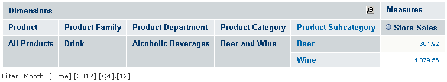

Expand Beer and Wine Subcategories

<table>
<colgroup>
<col style="width: 100%" />
</colgroup>
<tbody>
<tr>
<td>
select {[Measures].[Store Sales]} ON COLUMNS,

[Product].[Drink].[Alcoholic Beverages].[Beer and Wine].Children ON ROWS

from [Sales]

where [Time].[2012].[Q4].[12]
</td>
</tr>
</tbody>
</table>

Now we can see that, overall, wine makes up the majority of the dollar amount for this category.

1.  Let us see if that finding holds true across different stores. To do so, we add another dimension, which creates a crossjoin. Analytic views make creating a crossjoin easy.

<!-- -->

1.  Select 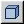, make STORE a row, and select **All Stores**\> USA \> CA (for instructions on adding a dimension, refer to [Cube Configuration](../analyze-data/cube_configuration.md)). Adding the STORE dimension to rows allows you to see the breakdown within the store as well as across different stores with respect to certain products (if we wanted to compare different products across stores, we would make PRODUCTS a row instead of STORES).

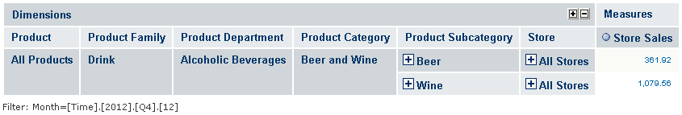

Adding the All Stores Dimension

<table>
<colgroup>
<col style="width: 100%" />
</colgroup>
<tbody>
<tr>
<td>
<code>select {[Measures].[Store Sales]} ON COLUMNS,</code>

<code> Crossjoin([Product].[Drink].[Alcoholic Beverages].[Beer and Wine].Children, {[Store].[All Stores]}) ON ROWS</code>

<code>from [Sales]</code>

<code>where [Time].[2012].[Q4].[12]</code>
</td>
</tr>
</tbody>
</table>

1.  Deselect the , then use  to drill down to navigate to intersections of the store and city data. For example, under both the BEER and WINE subcategories, drill-down on ALL STORES, then USA, then CALIFORNIA to examine the data on the California stores. Notice that your are comparing two products across five stores, in an easy-to-understand format. We did this by navigating the data presented by Jaspersoft OLAP without having to design and run a report.

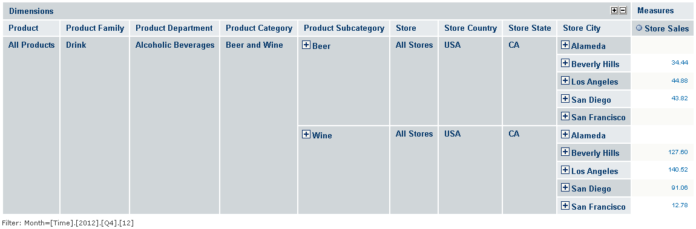

Stores in California

<table>
<colgroup>
<col style="width: 100%" />
</colgroup>
<tbody>
<tr>
<td>
<code>select {[Measures].[Store Sales]} ON COLUMNS,</code>

<code> Crossjoin([Product].[Drink].[Alcoholic Beverages].[Beer and Wine].Children, [Store].[USA].[CA].Children) ON ROWS</code>

<code>from [Sales]</code>

<code>where [Time].[2012].[Q4].[12]</code>
</td>
</tr>
</tbody>
</table>

With Jaspersoft OLAP, the data can be “sliced and diced” in many ways, allowing you to focus the viewer’s attention on the most relevant data. There are usually several ways to view the same data. The previous steps showed some of these ways. We could also make the STORE dimension a column. This might be a good approach when you have many different products to compare. Doing so results in a two-by-five grid, with the single-dimension layout becoming a two-dimension layout.

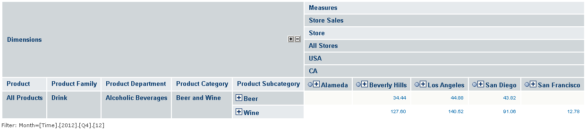

Stores as Columns Instead of Rows

<table>
<colgroup>
<col style="width: 100%" />
</colgroup>
<tbody>
<tr>
<td>
<code>select Crossjoin({[Measures].[Store Sales]}, [Store].[USA].[CA].Children) ON COLUMNS,</code>

<code> [Product].[Drink].[Alcoholic Beverages].[Beer and Wine].Children ON ROWS</code>

<code>from [Sales]</code>

<code>where [Time].[2012].[Q4].[12]</code>
</td>
</tr>
</tbody>
</table>

For another example, let us make the table easier to understand by switching the rows and columns. This is called “pivoting”, that is, we are rotating this section of the cube. Pivoting gives us a five-by-two grid of data cells, which is often easier to read online and is better suited to printing on U.S. Letter-sized paper. While the previous example compares product subcategories by store, swapping the columns and rows lets us compare each store’s results by product.

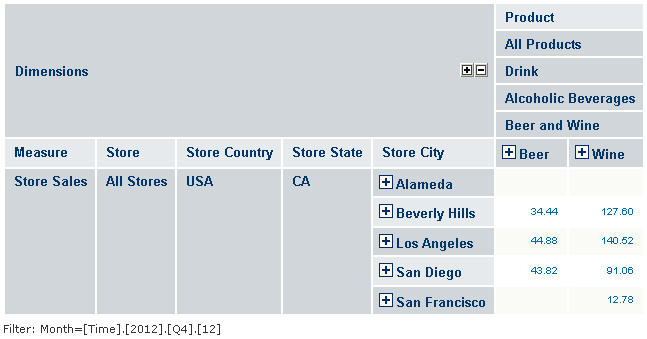

Pivoting the View

|  |
|----|
| select \[Product\].\[Drink\].\[Alcoholic Beverages\].\[Beer and Wine\].Children ON COLUMNS, Crossjoin({\[Measures\].\[Store Sales\]}, \[Store\].\[USA\].\[CA\].Children) ON ROWS from \[Sales\] where \[Time\].\[2012\].\[Q4\].\[12\] |

We now see that the San Francisco store sold a fraction of the alcoholic beverages that other California stores sold, and that it sold no beer at all. Perhaps this points to supply chain problems.

## Leveraging the Ad Hoc Editor

The model we defined in [Designing the Model](designing_the_model.md) and implemented in [Applying the Model](applying_the_model.md) can also be leveraged by the Ad Hoc Editor. Select the sample FoodMart Mondrian connection as your data source when you open the editor. Then slice, dice, and drill in the same manner as you have done in Jaspersoft OLAP. The resulting Ad Hoc view can be saved as a report, which in turn can be scheduled for email distribution and incorporated into dashboards. FoodMart Sales data in an Ad Hoc View shows an Ad Hoc view of the same data as shown in the OLAP view in Pivoting the View.

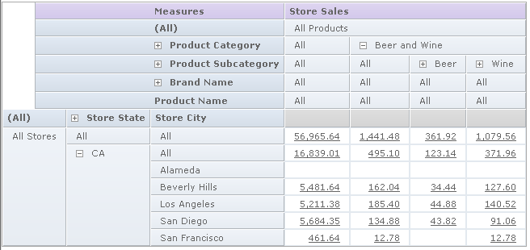

FoodMart Sales data in an Ad Hoc View

In the course of this example, we have unearthed questions we had not thought to ask previously: is the lack of beer sales part of a trend in this store’s overall beverage sales? We can answer other questions, such as whether the store’s overall sales lag across all products, or whether another product’s sales make up for the lack of beer sales.

Alternately, we could look at the best performing stores in each category or product to try to understand the secrets to their success. Ranking and sorting can be very helpful in this type of analysis when comparing many values. Your MDX statements can include any imaginable statistical functions. For example, you could include arbitrarily complex expressions to show the top or bottom percent of any measure.

<table>
<colgroup>
<col style="width: 100%" />
</colgroup>
<tbody>
<tr>
<td>
<code>select [Product].[All Products].[Drink].[Alcoholic Beverages].[Beer and Wine].Children ON COLUMNS</code>

<code>Crossjoin([Store].[All Stores].[USA].[CA].Children, {[Measures].[Store Sales]}) ON ROWS</code>

<code>from [Sales]</code>

<code>where [Time].[2012].[Q4].[12]</code>
</td>
</tr>
</tbody>
</table>

We can show analysis data as a graphical chart, just as might be defined in a report. This chart shows the same data as the sample above, but in a vertical 3D bar chart:

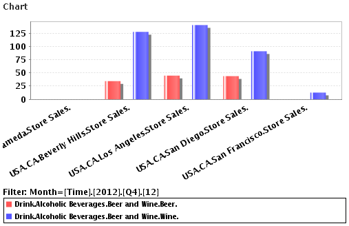

Chart of Beer and Wine Sales in California

The chart focuses on aggregated data, that is, the totals for all the sales at any dimensional coordinates. This is not to imply that analysis supplants transactional reporting. Analysis provides transactional reporting on demand by showing your data in different contexts and at different levels of roll up.

Examining the basic row data is still very helpful in furthering your understanding of a particular area. For example, in the table, use  to drill-through to the wine sales for San Francisco to show detailed transactional information. You are looking at individual rows of data to understand this one store’s wine sales in December of 2012 (table is truncated).

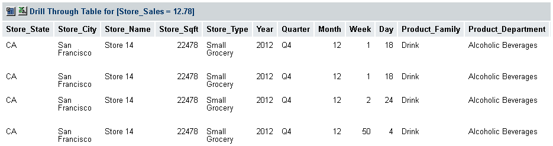

Drill-through Table of San Francisco Beer And Wine Sales
