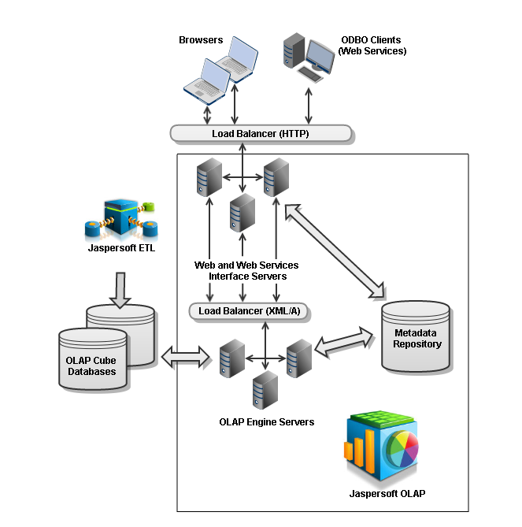

# Jaspersoft OLAP Tuning Process and Options

Building a high-performance database for the largest scale of data volume can involve various optimizations that are categorized here as the physical hardware level, the Relational Database Management System (RDBMS) level, the OLAP engine level, and the logical schema level. Each of these levels has its own complexities and requires domain knowledge to make the proper decisions, so it is not uncommon that a large-scale data warehouse project would involve experts in each of these areas. The following table summarizes hardware level performance tuning.

## Hardware Level

<table>
<colgroup>
<col style="width: 50%" />
<col style="width: 50%" />
</colgroup>
<thead>
<tr>
<th>
Optimization Issue
</th>
<th>
Comments
</th>
</tr>
</thead>
<tbody>
<tr>
<td>
Disk I/O, 
bus speed
</td>
<td>
Hardware used for the database server should be selected for latency and bandwidth of data transfer. RAID striping is an example of a hardware optimization that should be considered, unless specifically counter indicated by the RDBMS vendor, as, for example, DB2 does. RAID mirroring can have a negative impact on I/O performance for some database systems, so a backup solution is preferable to redundant disks from a performance tuning standpoint.
</td>
</tr>
<tr>
<td>
File systems
</td>
<td>
For the largest, most scalable implementations, some vendors offer specialized file systems for supporting RDBMS systems.
</td>
</tr>
<tr>
<td>
Clustering
</td>
<td>
Some database vendors have support for clustering, which allows for a single database instance to use multiple physical servers, both for performance and uptime reasons.
</td>
</tr>
<tr>
<td>
CPU and memory
</td>
<td>
CPU usage of the database server typically comes into play to a greater extent for OLAP than for <code>OLTP</code> database applications, both because of the number of large joins usually involved in multidimensional queries and because of the number crunching functions like summation that are often applied to calculate aggregated measures. Memory can be used by the database server both for computing joins, and for caching SQL results and indexes.
</td>
</tr>
</tbody>
</table>

## RDBMS Level

The biggest decision at this level is which RDBMS to use. Oracle, MySQL, PostgreSQL, Microsoft SQL Server, DB2, and so on, all have their own trade-offs and offer different performance tuning options. Comparing them is beyond the scope of this document. Each of these vendors provides its own information on performance tuning and recommended operating system settings. The following table summarizes RDBMS level performance tuning.

| Optimization Issue | Comments |
|----|----|
| Temp space | The number of large joins required by multidimensional queries makes heavy use of temp space for storing intermediate results. A SQLException is generated when the amount of available temp space is exceeded, and the space should be increased sufficiently to avoid this. This should be tested with a realistic number of simultaneous users. |
| Data spaces and index spaces | Having separate devices for the data space and index space is important in synchronizing the use of indexes for faster lookups, which becomes especially important for fact tables. Having a separate device for database log files is also recommended. |
| Memory block sizes | OLAP applications can often benefit from bigger block sizes than for OLTP applications, primarily for loading the data, but also for retrieval. |
| Caches | Experiment with changing the sizes of various database caches and buffers, and using profiling tools to analyze the results. |
| Table partitioning | Some RDBMS, for example Oracle Enterprise Server, support partitioning, so that one logical fact table with several million rows can be separated into different physical tables. |
| Statistics | Some RDBMS incorporate various types of optimizers. For example, two common kinds are statistics-based optimizers or cost-based optimizers. For Jaspersoft OLAP, we recommend statistics-based optimizers, and statistics should be generated or estimated periodically, or when there are significant changes to the indexes or data. |
| Materialized views | Oracle includes a feature known as materialized views, which are queried and automatically updated as normal views, but are backed by actual physical tables, meaning they do not have the added cost of recomputing the query that makes up the view. These are especially useful for building aggregate tables in an Oracle installation, so that they are automatically updated when new data is loaded to the underlying fact and dimension tables. Otherwise, aggregate tables must be rebuilt, re-indexed, and re-analyzed after each new data load. |
| Read-only connections and redo/undo logs | Using read-only connections for OLAP may allow for faster cursor access. Disabling undo and redo logs for the OLAP schema may also be appropriate, if the data is simply a copy from the original data source. |

## Schema Design and Optimization Level

Whatever the hardware and RDBMS choices, the logical schema design has a large role in determining the performance of a data warehouse, and often a bad logical design cannot be improved significantly by any amount of hardware and RDBMS tuning. Furthermore, optimizations at the schema level, such as indexes, give the RDBMS the greatest amount of information to build the proper query plans for efficient queries.

Keep the following in mind when designing a new schema for Jaspersoft OLAP:

-   Snowflake schemas (where one or more dimension tables have a “sub-dimension” table) are not as efficient in returning queries as non-snowflake schemas.

-   For best performance in a star schema, it is better to construct each dimension as a single table, even if this means having redundant information in a column. For example, `location (city, state, country)` is better than `city_loc (city, state)` and `state_loc (state, country)`.

-   Virtual cubes (where multiple fact tables are joined as if a single cube) pay a performance penalty on each query to do this join. For best end-user performance, it is preferable to build the joined fact table during data-loading time, or instantiate it as a materialized view in Oracle.

-   Build closure tables for parent-child relationships. For example, use a closure table for an `employee_id` and a `supervisor_id` that references the supervisor’s `employee_id`. Without a closure table, multiple SQL queries would be required to look up an ancestor or descendent more than one level away. By building a closure table, which has a row for every combination of `employee_id` and ancestor, along with the distance of the relationship, it is possible to lookup a relationship of any distance with a single SQL query, which is how Jaspersoft OLAP generates the query for the corresponding MDX.

-   One of the most important variables in determining the duration of a multidimensional query is the size of the fact table involved. Depending on the nature of the query, the duration of the query may be more than directly proportional (polynomial) to the size of the fact table. In this case, it would be quicker to query two fact tables half the size, then take the union of the results.

    Also, if a large fact table has many rows that are not commonly queried, it makes sense to split them into another table, making a logical partition. For example, if most queries about product orders are only concerned with the current year, putting order information for other years into separate fact tables would be an effective performance optimization. The schema might have an orders_2013 and orders_historical table, and the orders_historical table could be further split into tables for each historical year.

-   Use NOT NULL constraints wherever applicable. Specifying this for a column not only helps as a check on data integrity, but allows the RDBMS to speed up joins involving these columns.

-   Properly indexing columns can make the single biggest difference in optimizing multidimensional queries. All foreign keys should be indexed, with particular attention to the dimension IDs in the fact tables. RDBMS like Oracle allow for compound indexes, which are recommended for OLAP. The order of the columns in a compound index matter, so there should be compound indexes for each ordering that corresponds to the order of joins in queries.

-   Aggregate tables can be used to build a higher-level fact table, where the data is rolled up and there are fewer overall rows. For example, a fact table that has one row per second could have an aggregate table with one row per day.

    Maintain your aggregate tables using your data load processes (such as JasperETL jobs). Usually, after loading a fact table, the data load process empties the aggregate tables and repopulates them with the results of aggregate queries that are run against the refreshed fact and dimension tables.

    Determining the best set of aggregate tables to use involves weighing a series of trade-offs. Having many aggregate tables is often a waste of time and disk space, as the aggregate tables that can be used varies according to what MDX is being run. There is a desktop tool from the Mondrian open source community, the Aggregation Designer, which uses statistical analysis of the underlying database combined with the schema to determine what are the best aggregate tables to have. The Aggregation Designer can the update your schema XML file with new aggregate definitions, which can be used by Jaspersoft OLAP and also generates SQL to create and populate the suggested aggregate tables, which can be used as part of your data load processes. You can download the Aggregation Designer from [SourceForge](http://sourceforge.net/projects/mondrian/files/aggregation%20designer/).

    For more information, refer to the Mondrian Technical Guide.

-   In the schema XML file, a Level tag may have an `approxRowCount` attribute. If you can provide a reliable estimate of the number of rows at a given level, `approxRowCount` reduces the time required to determine the size of the level at query time.

-   Different MDX queries can achieve the same results but with different performance characteristics. There are no simple rules about which queries perform better. Instead, you have to use a trial-and-error approach to determine the best ones for your system.

## OLAP Engine

There are a number of system properties, which control the behavior of the OLAP engine. These properties control decisions about the algorithms used and limits on resources. They may be modified on the Analysis Options page in Jaspersoft OLAP Community Edition, as part of an iterative tuning process. For more information on these properties, see the Jaspersoft OLAP User Guide.

## Load Balancing

For systems with many simultaneous users, multiple application servers and load balancing keep response times close to those for a single user with a single application server. Both the front-end and OLAP engines can be distributed in a load-balancing setup. The OLAP engine does more of the number crunching and “heavy lifting” than the front-end, so it is especially important to have multiple engines when there are many simultaneous users of a deployment. To ensure that a single failure cannot limit access to the data, there should be at least two front-end application-servers on different computers and two OLAP engines on different computers. The complete Jaspersoft OLAP software is installed similarly on each computer, but the metadata will be configured slightly differently.

For example, consider the scenario where there are to be two front-ends and two back-ends. If there are sufficient resources, you can put each front-end or engine on a separate computer. If you only have two computers, you can put one front-end on each of the two, and one back-end on each of the two. Users are directed to either of the front-ends through some URL with a standard external load-balancing tool such as an Apache web server with mod_jk or an internally redundant network appliance. Both of the front-ends will be load-balanced so that their requests are routed to either of the two engines. The requests from the front-ends to the back-ends will be transmitted through HTTP using the SOAP protocol to deliver XML/A requests (containing MDX queries) and responses (result sets).

Let us say the front-end application servers are running on server1:8080 and server2:8080, and the back-end application servers are running on server1:9080 and server2:9080. In a typical setup, all four of these application servers should use the same JasperReports Server repository for metadata, and the same data sources. You should configure the front-end load-balancer to direct traffic between server1:8080 and server2:8080. You should create an XML/A Connection using the Jaspersoft OLAP interface with a virtual host as the server in the URL name, for example http://xmla.yourdomain.com. This URL should be directed to load balance between server1:9080/jasperserver-pro/xmla and server2:9080/jasperserver-pro/xmla. This effectively splits the load from simultaneous users across the two computers evenly.

In addition to the performance and scalability benefits of load balancing, there are also uptime benefits. The above network architecture removes any single point of failure, other than the database. Ensuring redundancy in the database server can be achieved with clustering and hot, warm, or cold backups, depending on the RDBMS. Consider an operation that must be up 24 hours 7 days a week. When the new data is loaded overnight, the OLAP engines cache must be cleared and reloaded. If there are multiple OLAP engines in a load-balanced deployment, each of these can be taken offline and refreshed by itself. This same technique of taking an OLAP engine or front-end out of the load-balancing mix of active servers can be used for other types of scheduled maintenance, and to reduce the end-user impact of unexpected outages.

Figure 5‑13 depicts a load-balanced OLAP environment.

*Figure 1: Load-Balanced Jaspersoft OLAP Environment*
