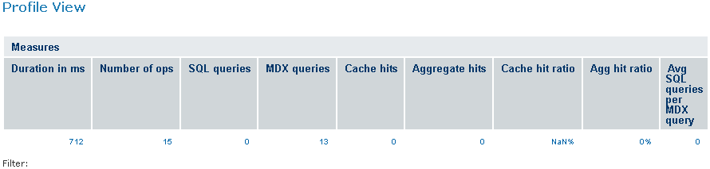
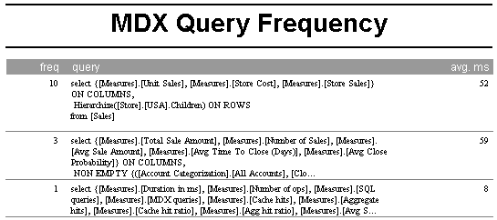

# Profiling Performance

!!! info "Important"

    This section describes functionality that can be restricted by the software license for JasperReports Server. If you don’t see some of the options described in this section, your license may prohibit you from using them. To find out what you're licensed to use, or to upgrade your license, contact Jaspersoft.

A basic observation about performance optimization is that improving the speed of any subsystem speeds up the overall system only in proportion to the amount of time that is spent in that subsystem as compared to the overall duration. This is sometimes referred to as Amdahl’s Law. The law suggests an approach for iterative performance tuning, where the first step is to observe how much time is spent in each subsystem and therefore where the biggest improvements to the overall system can be made. After improvements are made to a subsystem, the whole system should be profiled again and the process repeated.

In ROLAP implementations such as Jaspersoft OLAP, one quickly finds that most of the system time is spent running SQL queries. The most effective ways to improve this time are (a) tuning the database for the common queries and (b) increasing the size of the OLAP engines’ available memory for caching, which reduces the number of queries that must be sent to the database itself. JasperReports Server commercial editions have a profiling feature that can be used to save performance statistics for any part of the system code. This profiling can be used to analyze MDX and SQL execution times.

When the profiling feature is enabled, every query is timed and the timing data is stored in the ProfilingRecord table and displayed in performance reports and views. The reports are in organization&gt;/Performance/Reports. The views are in organization&gt;/Performance/Views.

To use the profiling feature

1.  Login with `superuser` privileges and display the OLAP Settings page.
2.  In the OLAP Settings panel, select **Performance Profiling Enabled** and click **Change**.
3.  Review the results to determine if all the data that you need was recorded.
4.  Change the settings in the OLAP Settings panel as needed and analyze the results again.

Sample profiling OLAP schemas are included with the product in /Analysis Components/Analysis Schemas, as are some sample reports and views showing MDX and SQL timings (/Performance). The samples can be modified and used to create your performance reports, or they can serve as templates for entirely new reports. Figure 5‑12 shows two examples: the Profiling OLAP view and the MDX frequency report.

Typical Performance Profile and MDX Report

Enabling performance profiling may have a minor impact on the overall performance of the system, since Jaspersoft OLAP must run additional queries to time each query. Therefore, we recommend disabling performance profiling in production environments, unless you are actively performance tuning. The profileris is designed to minimally impact the queries it times. The overhead of generating and saving objects to the database occurs outside of the execution timing of the target queries.

There are several approaches to performance profilings, depending on your goal:

-   To get a general sense of the mix of queries being performed and their average response time, collect data from actual users’ activities. This is useful for observations about what the most frequent queries are and what the slowest queries are.
-   To investigate the cause of individual queries that are slow, repeat the same query in various conditions, such as load on the application server or database server.
-   To develop better MDX, try rewriting an MDX query and looking at the generated SQL timings for the various approaches.

Having a test automation tool (such as Selenium) simulate users performing queries are very helpful, so that you can compare results for the same actions with different settings for the database, application configuration, and so on.

After viewing and analyzing the query data, you can make some controlled changes and collect timing data again, holding other variables constant, to determine if your changes result in an improvement for the sample set of queries. Having a large sample set is desirable so that you do not overly tune for a particular usage at the expense of others. A standard set of data and sample queries may be referred to as a benchmark. Having a benchmark is an important part of effective performance tuning.
