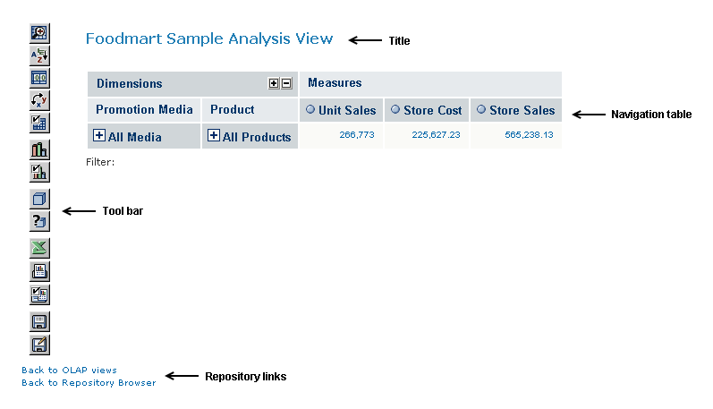

# Analysis Tool Bar and Navigation Table

In the tool bar, the buttons are grouped by function: display, cube, chart, output, and save:

-   The Display buttons configure dimension and navigation options.
-   The Cube buttons mainly change cube contents.
-   The Chart and Output buttons let you add a chart to the view and export the view to specific file formats.
-   The Save buttons let you save your changes to the view.

A Sample OLAP View

The navigation table displays rows and columns (that is, horizontal (X axis) and vertical (Y axis) elements) to organize information containing multiple logical dimensions (for example, Product, Customers, Time, and Store). The underlying data points, or facts, are summarized by the logical dimensions in terms of the measures, which are aggregated values and calculations, using standard functions such as sum and average of the fact values, or more sophisticated calculated values such as year over year ratios and linear regressions.

Figure 3‑10 shows a navigation table with three dimensions— Time, Store, and Promotion Media. Two of the dimensions (Promotion Media and Store) are placed on the vertical axis on the left; and the other dimension (Time) is placed on the horizontal axis along the top. The numbers at the intersection of each fiscal quarter and state indicate the store sales in that state during that time. This is the measure being analyzed.

Typical Navigation Table
