# Cube Configuration

The data cube behind a navigation table can be configured by controls in the following dialogs in the Display Options group: Change Data Cube, Show MDX Query, and Sort Options. These options are described in the following sections.

## Columns, Rows, and Filters

Click  to open the Change Data Cube dialog.

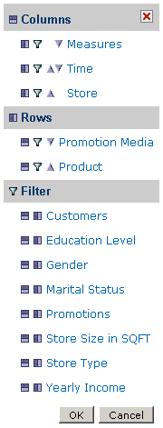

*Figure 1: Change Data Cube Tools*

The Change Data Cube dialog configures the information that appears in the navigation table. In the table, the measures are organized as the columns on the right. The measures are aggregations (such as Store Sales) and each row is a summary of the measures in a different dimension, such as Store Sales by Store Country and Store State.

The navigation table can also be filtered by dimensions that are not displayed, for analyses like “Show Store Sales for June by Product and Store”. In this case, the filter would be Time = June, the rows would be Product and Store, and the columns would be Store Sales.

After making changes with the Change Data Cube tools, you must click **OK** for the selections to take effect.

### Columns and Rows

The Columns section of the Change Data Cube dialog configures the measures of crosstab navigation tables. Measure columns are normally aggregations, such as STORE SALES, while measure rows are granularities of such aggregations, such as STORE SALES by STORE COUNTRY, STORE STATE, and STORE CITY.

The Dimensions section of the dialog configures the table’s rows. Dimension rows are hierarchy levels representing the granularity of the hierarchies, such as Canada, Mexico, and USA for STORE COUNTRY, and CA, OR, and WA for STORE STATE. The row position of the dimensions can be changed by clicking the triangles, similar to how column positions can be changed.

*Figure 2: Measures and Dimensions*

Measures can be selected, deselected, moved to a different column position, or moved to rows (pivoted).

To configure a measure

1.  Click the **Measures** hyperlink in the Change Data Cube dialog.

The Measures dialog appears.

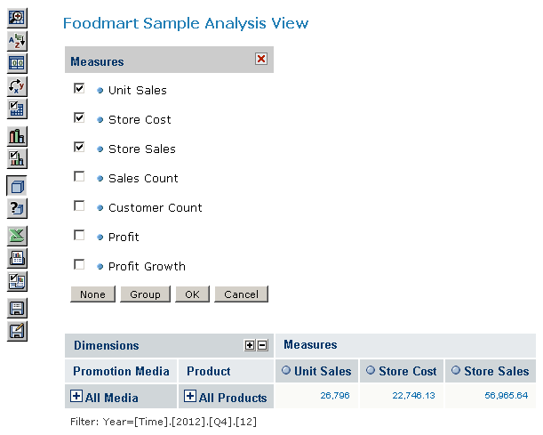

*Figure 3: Measures Dialog*

1.  Click a checkbox to select its measure.

To move a measure within its section of the dialog

1.  Click  next to the measure. The icon changes color to red 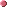.

Other icons throughout the dialog change, as well, to signal that moving is enabled.

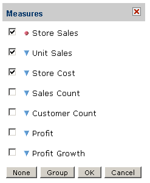

*Figure 4: Measures Dialog with Moving Enabled*

1.  Click any triangle. The measure selected in step 1, Store Sales, moves down one position in the list.
2.  Click a checkbox to indicate that the corresponding measure should be displayed in the view.
3.  Click **Group** to collapse the list of measures into groups of 12 measures each.

The **Group** button changes to a **Flat** button. Click **Flat** to return to the expanded list.

1.  Click **None** to clear the icons and your selections. This removes all measures from the view.

To move a dimension into the Columns or Rows section of the Change Data Cube dialog

- Click  next to the dimension to move the data to a column.
- Click  next to the dimension to move it to a row.
- To configure a dimension, click the dimension in the dialog. For example, to configure the STORE dimension, click **STORE** in the Rows section, and the root level of the STORE dimension appears:

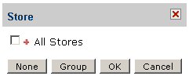

*Figure 5: STORE Dimension Collapsed*

The root level of the STORE dimension contains a special member called ALL STORES. Clicking the checkbox next to the member selects all hierarchy levels of the STORE dimension. Clicking 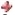 displays the members in the next level of the STORE hierarchy. Select a lower-level member to limit the view to that data.

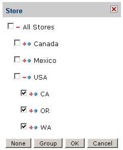

*Figure 6: STORE Dimension Expanded*

### Filter

Dimensions can be used to filter the data in a navigation table.

To use a dimension as a filter

1.  In the Change Data Cube dialog, click  next to the dimension.

The dimension appears in the Filter section.

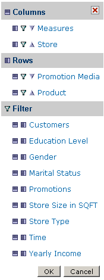

*Figure 7: TIME Dimension as a Filter*

1.  Click the dimension.

The root level of the dimension appears. In this example, look at the TIME dimension.

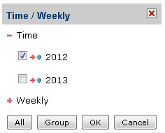

*Figure 8: Selecting a Member from the TIME Dimension*

1.  Click **Group** to collapse the list of TIME measures into groups of 12 measures each.

The **Group** button changes to a **Flat** button. Click **Flat** to expand the list of measures.

!!! note

    Only one member of a dimension can be used as a filter. Also, the member position in the dialog is fixed and cannot be changed.

## Show MDX Query

The MDX Query Editor contains the MDX query that retrieves the contents of the navigation table. As you change the content of the navigation table, the MDX query is automatically updated. You can also change the contents of the navigation table by changing the MDX in the editor. Click 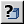 to open the MDX Query Editor.

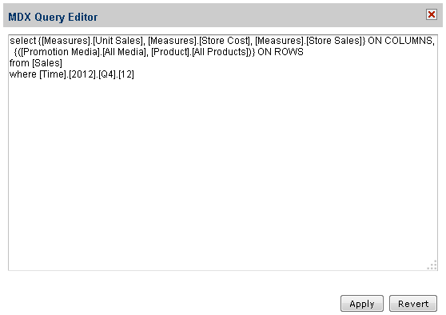

*Figure 9: MDX Query Editor*

An MDX query consists of data sets, query scope, and filter specifications:

- A SELECT statement determines the data sets that populate the columns (x-axis) and rows (y-axis) of the navigation table. The SELECT statement includes the measures to use as columns and rows. The query in this example specifies data sets in terms of:
  - \[Measures\].\[Unit Sales\], \[Measures\].\[Store Cost\], \[Measures\].\[Store Sales\] as columns; \[Promotion Media\].\[All Media\] and \[Product\].\[All Products\] as rows.
  - The FROM clause specifies the cube that is queried. You can query only one cube at a time.
  - The WHERE clause uses dimensions to constrain the data sets retrieved by the query, that is, the clause specifies the filters that screen the data the query returns. In this example, \[TIME\].\[2012\] is the filter.

Click **Apply** to update the navigation table in the OLAP view. The system validates the query and updates the navigation table. Click **Revert** to discard all changes.

For a reference to the MDX query language, see <https://learn.microsoft.com/en-us/analysis-services/multidimensional-models/mdx/mdx-query-the-basic-query?view=asallproducts-allversions>.

!!! note

    The rest of the examples in this chapter start with the query in MDX Query Editor above. To re-create the examples yourself, start with that query.

## Sort Options

The sort options include the following:

- Sort into a cube hierarchy.
- Start sorting in descending order.
- Display only the first N rows.

To use the sort options, first click  to open the Display Options dialog:

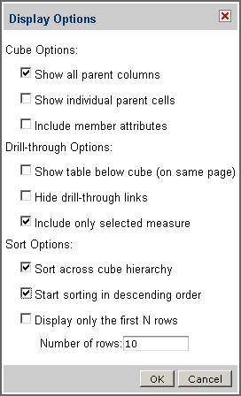

*Figure 10: Sort Options in Display Options Dialog*

Then make your selections in the Sort Options section of the dialog and click **OK**.

The following sections explain the options.

### Sort across cube hierarchy

Generally, dimension members are sorted hierarchically, within their parent member. Take, for instance, a crosstab showing the store sales for all stores in the United States. The dimension hierarchy might be as follows:

- All Stores
- USA
- CA
- Alameda
- Beverly Hills 
  OR
- Portland
- Salem
- WA
- Bellingham
- Seattle

All Stores is above USA in the hierarchy, which is above CA in the hierarchy, and so on.

In the above list, the STORE COUNTRY (USA) and STORE STATE (CA, OR, WA) are hierarchy boundaries. STORE CITY items (such as Alameda and Portland) are hierarchy members.

You can use the **Sort across cube hierarchy** option to change the navigation table so the member measures are sorted without regard to the hierarchies that contain them. For instance, you may want to list all of your USA stores based on their sales, highest to lowest, regardless of the states they are in, as illustrated below.

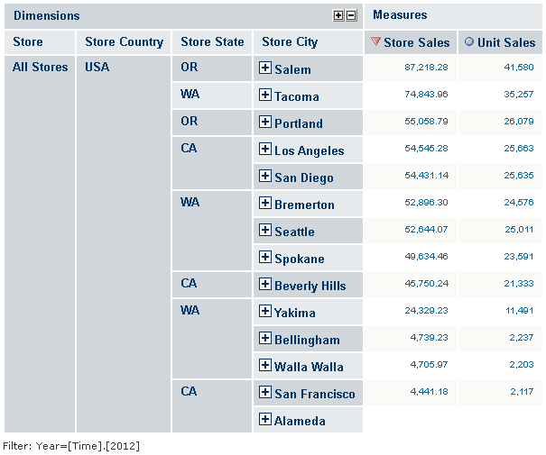

*Figure 11: Sorting Across the Cube Hierarchy*

To do this, set up your analysis view to show the dimensions you want to display in rows, and the measures you want to display in columns. Click the **Sort** icon  next to the measure that you want to sort on. Then open the Display Options dialog as described above, and click **Sort across the cube hierarchy**.

Click 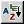 to toggle between sort across and sort within hierarchy boundaries.

### Start sorting in descending order

By default, data are sorted in ascending order. To sort in descending order, select the **Start sorting in descending order** checkbox.

### Display only the first N rows

**Display only the first N rows** limits the display to either the top-most or bottom-most n rows, depending on the sort order. You can specify an integer for n, which defaults to 10. Limiting the display to a certain number of rows can help with performance or narrow the view to highlight records at the extremes of your dataset; for example, it can be used to highlight the top 10 sellers or the bottom 10 prices. Clear the checkbox to disable the row limitation.
