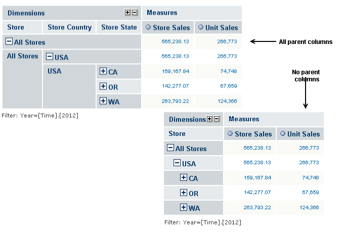
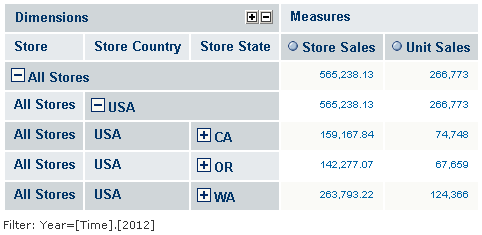
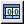
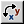
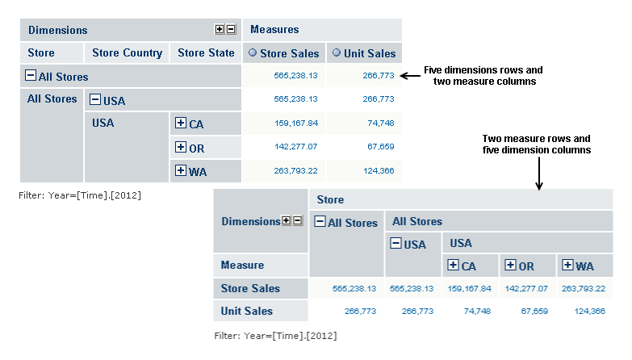

# Dimension Column Layout

The layout of the dimension columns in a navigation table is configured using these options:

- Edit Display options:
  - Show all parent columns
  - Show individual parent cells
  - Include member attributes
- Hide Empty Rows/Columns
- Swap Axes

## Show all parent columns

The **Show all parent columns** checkbox displays a header for every dimension column. When the checkbox is cleared, all the columns are collapsed into one. The rows of that column have the same hierarchy as the separate columns. For example, in Figure 1-1, the All parent column view has separate columns for STORE, STORE COUNTRY, and STORE STATE. The No parent view has only one column. The topmost header is STORE, then ALL STORES, then USA, then the individual states.

**Show that all parent columns is** often used with **Zoom on Drill** to provide complete context after zooming in.

*Figure 1: Comparing Layout: All Parent Columns and No Parent Columns*

## Show individual parent cells

The **Show individual parent cells** checkbox determines whether redundant dimension hierarchy member labels are displayed or hidden. The checkbox takes effect when the **Show all parent columns** checkbox is checked. The following figure shows the example in Figure 1-1 with **Show individual parent cells** selected. This view is useful when outputting the table to an Excel spreadsheet so that headers appear on every page. It also prevents cell-spanning and the empty cells that can result.

*Figure 2: Showing Individual Parent Cells*

## Hide Empty Rows/Columns

Clicking  toggles between showing and hiding rows that do not have a value for the selected measures. By default, all rows of are measured display, even when they have no value.

## Swap Axes

Clicking  changes the orientation of a navigation table by switching the columns with the rows—each column becomes a row, and each row becomes a column.

Suppose that a table contains five dimensioning rows and two measure columns. Clicking  changes the orientation of the table so it has one measure row and five dimension columns.

*Figure 3: Swapping Axes*
