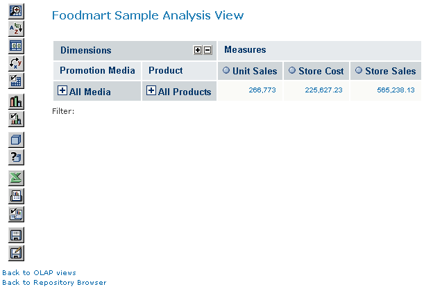
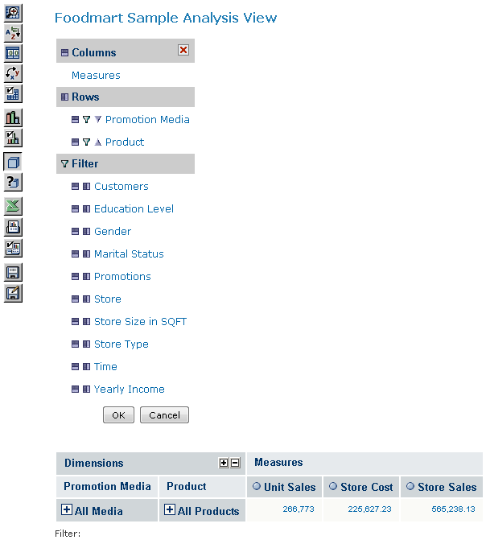
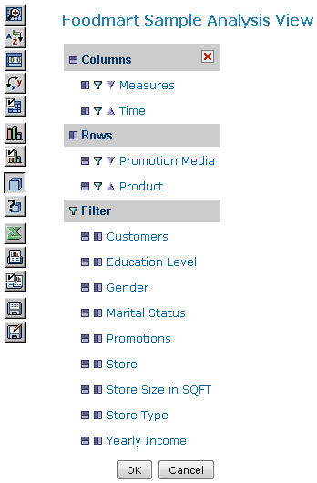
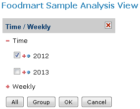
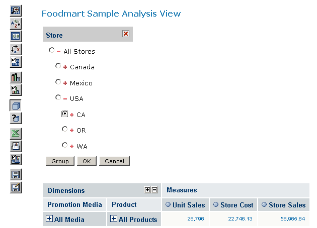
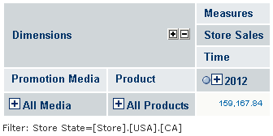
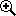
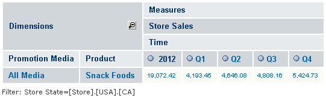

# Displaying Product Sales by Quarter

Jaspersoft OLAP is well suited to comparing numeric data across a period of time or by product category. That is how to answer the example question about snack food sales.

To open the sample OLAP view

1.  Click **View \> Repository** to display the Repository panel.

2.  In the Folders panel, expand the folder **Organization \>** **Analysis Components \>** **Analysis Views**.

    A list of OLAP views appears in the Repository panel.

3.  Double-click to open **Foodmart Sample Analysis View**.

The default navigation table appears along with the Jaspersoft OLAP tool bar.

*Figure 1: FoodMart Sample OLAP View*

To find the quarterly sales dollar amount in 2012 for stores in California

1.  Click the **Change Data Cube** tool bar button: .

    The Change Data Cube dialog appears.

    

    *Figure 2: Change Data Cube*

    The Change Data Cute dialog includes the following sections:

    - Columns
    - Rows
    - Filters

2.  Next to the Time filter, click the **Move to Columns** icon  to make Time a column.

    

    *Figure 3: Adding a Time Column*

3.  In the Columns section, click **Time** to open a tree displaying the dimension members.

4.  Expand Time by clicking  next to it, and select **2012**.

    

    *Figure 4: Defining the Time Filter*

5.  Click **OK** to close the tree and return to the Change Data Cube dialog.

    !!! note

        Changes you make in the Change Data Cube dialog are not applied to the view until you click **OK** again to close the dialog. Thus, while the Change Data Cube dialog is open, the view will not match your selections in the dialog.

6.  In the Change Data Cube dialog, click **Store** in the Filter list to change the filter.

    The Store filter appears.

7.  Expand **All Stores** by clicking  next to it, then expand **USA**, and select **CA**.

    

    *Figure 5: Defining the Store Filter*

8.  Click **OK** to close the tree and return to the Change Data Cube dialog.

9.  Click **Measures** and clear the checkboxes next to Unit Sales and Store Cost to remove them.

10. Click **OK** to accept the selections and close the Measures list, then click **OK** again to close the dialog.

    Jaspersoft OLAP updates the view to match your selections. It is now filtered to show only the sales data for stores in California.

    

    *Figure 6: 2012 Store Sales Volume for Snacks at California Stores*

11. Ensure that the Zoom on Drill is active by checking whether its icon is pressed:

    - When **Zoom on Drill** is active, its tool bar button looks like this .
    - When **Zoom on Drill** is not active, its tool bar button looks like this . Click it to enable zooming when you click a dimension member.

    Now, when the cursor hovers over a dimension member, it changes to .

12. Click **2012** to zoom into 2012 data.

13. Click ALL PRODUCTS, Food, and Snack Foods to zoom into this data.

14. Click the **Edit Display Options** tool bar button , click the **Show all parent Columns** checkbox to clear it, and click **OK**.

The following navigation table appears:

*Figure 7: 2012 Quarterly Store Sales Volume for Snacks at California Stores*

This view now shows the total sales for snack food in stores in California for 2012, broken down by quarter.

The following sections build on this example.
