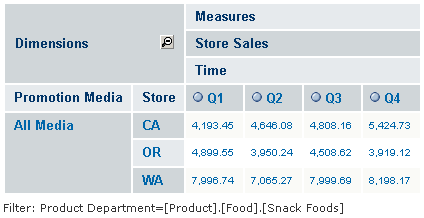

# Displaying Product Sales by Time Across Store Locations

We can also analyze multiple numeric values across time. Suppose we want to compare the quarterly snack foods sales dollar amount among the West Coast states.

In the following example, we’ll use the Foodmart Sample Analysis View.

To compare quarterly snack foods sales dollar amounts among the West Coast states

1.  Click **View &gt; Repository** to display the Repository panel.

2.  In the Folders panel, expand the folder **Organization &gt;** **Analysis Components &gt;** **Analysis Views**.

    A list of OLAP views appears in the Repository panel

3.  Click **Foodmart Sample Analysis View** to open it.

4.  Click .

    For details about using cube dimensions, see [Columns, Rows, and Filters](cube_configuration.md).

5.  Click the **Move to Rows** icon  next to the **Store** filter to create a row, then expand the Store row and select **All Stores &gt; USA**. Click **OK**.

6.  Click the filter icon  next to **Product** in the Rows section, then click it and expand to and select **All Products &gt; Food &gt; Snack Foods**.

7.  Click **OK** twice to accept the selections.

8.  Click **Zoom on Drill** to activate it. When active, its tool bar button looks like this .

9.  Click the **Edit Display Options** tool bar button , click the **Show all parent Columns** check box to clear it, and click **OK**.

10. In the table, click **USA** to zoom in.

The following navigation table appears.

2012 Quarterly Snack Food Sales, Dollar Amount, for West Coast States

The view now shows the quarterly snack food sales compared by state.
