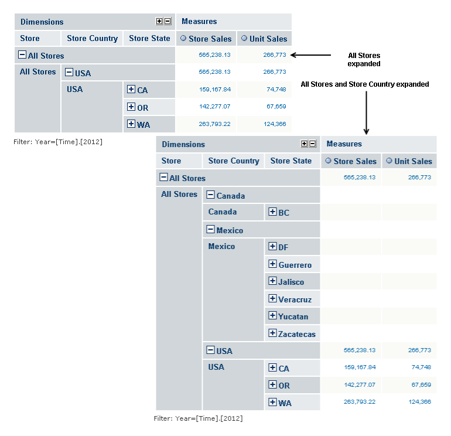
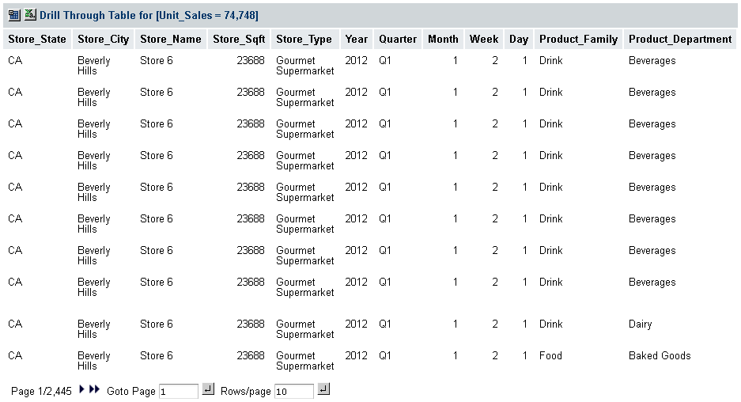
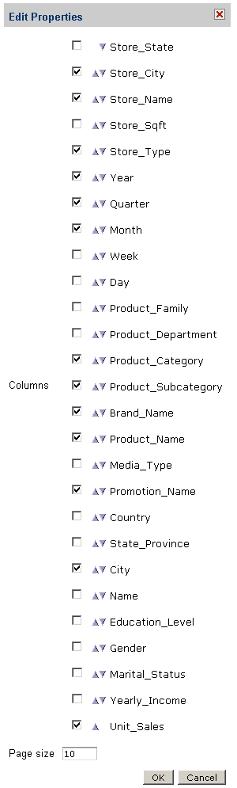

# Navigation Table Controls

The navigation table displays the data from the OLAP view as rows and columns. The table controls adjust the display to help you understand the data. Three controls apply to dimension members:

- Expand Member
- Expand Position
- Zoom on Drill

**Drill-through** applies to measures.

## Expand Position

**Expand Position** displays the child members of the selected member.

To expand a position, click  in its header; to collapse it, . **Expand Position** affects only the member that you click. The sibling members remain as they were.

You can also expand the columns one at a time by clicking  in the icon group at the top of the navigation table. The columns expand sequentially from left to right. In the example, STORE would be expanded first, then STORE COUNTRY, STORE STATE, STORE CITY, and finally STORE NAME.

Clicking  in the icon group collapses all of the columns, not one column at a time.

*Figure 1: Expanding Positions*

## Zoom on Drill

**Zoom on Drill** displays the dimension members that compose the current member. For instance, zooming on Products displays the members in Product— Drink, Food, and Non-Consumable. Likewise, zooming on Drink displays the members in Drink—Alcoholic Beverages, Beverages, and Dairy.

To zoom on a member, select . The **Zoom on Drill** cursor  appears. Click the cursor on the member.

By default, when you select **Zoom on Drill**, the **Show all parent columns** cube option is turned on, as well. This keeps the member hierarchy in the view.

## Drill-through

Drill-through displays the detailed data that produced a measure’s value, if that the value is an aggregation of other values. For instance, the total sales figures for a store are aggregated from the sales figures of everything sold in the store. The data for one sale of one item is not aggregated. Measures values are usually aggregated. By default, the data contains every column in the source data.

Click any aggregated value in the Measures columns to display the drill-through table for that value. The following figure shows part of the drill-through table for the measure `74,748`, which is the unit sales measure for CA (California). Notice that the table is very large. It has 2,445 pages. At ten rows to a page, that is 24,450 rows.

To disable drill-through, open the Display Options dialog ([Figure 1-10, “Sort Options in Display Options Dialog,” on page 1](cube_configuration.md)) and select **Hide Drill-through links**.

*Figure 2: Drill-through Table for Unit Sales*

In the drill-through tables, these controls are available:

- **Sorting**. Rows in the drill-through table can be sorted based on a given column. To sort by a column, use the sort icon next to that column’s header. Clicking that column’s  resets the sort mode to natural order, that is, the record order in the database, which is indicated by .
- **Forward/Backward**. Click the left and right arrows to go to another page.
- **First/Last**. Click the double arrows to go to the first or last page.
- **Go to Page**. Enter a number and click the icon to go to the specified page.
- **Rows per Page**. Enter a number and click the icon to set the number of rows per page.

Notice that there are 2,445 pages in the table. To filter the table and reduce its size, use the Edit Properties dialog. To open the dialog, click  at the top-left corner of the drill-through table.

*Figure 3: Edit Properties Dialog for a Drill-through Table*

The Edit Properties dialog has three controls:

- **Measures**. Though not labeled in this dialog, the items in the list above the Columns label are measures. To include a measure in the table, select its checkbox.

To hide a measure from view, clear its checkbox.

- **Columns**. To include a column in the table, select its checkbox. Use the up-down triangles  to move the column to the left or right.

To hide a column from view, clear its checkbox.

- **Page size**. Specifies the number of rows on a page.
