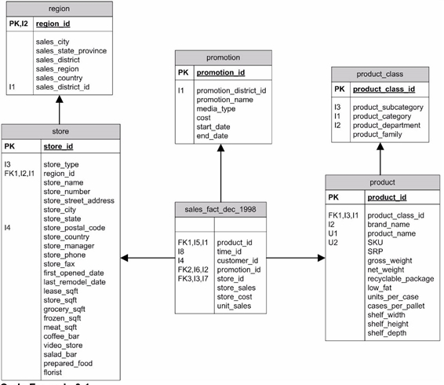

# Creating the Database

Jaspersoft OLAP uses data from a SQL database, and uses a Relational OLAP (ROLAP) architecture. Unlike multi-dimensional (MOLAP) tools, such as Hyperion and Cognos, Jaspersoft OLAP does not process data from the database into an intermediate form. Typically, it runs against star and snowflake schemas, which are database structures used for analysis.

From a business perspective, consider the case of a retail business that has gathered data regarding point-of-sale transactions as well as information on product and store locations. These data, generated by their point-of-sale system, are organized into a multidimensional database that is denormalized to optimize for retrieval and for OLAP operations. An example of a multidimensional database structure is shown in Figure 2‑5. For a complete example, refer to the sample schemas in your JasperReports Server installation under js-install&gt;\\samples\\schemas\\FoodmartSchema.xml.

This example assumes you are using Relational On-line Analytical Processing (ROLAP).

Database Structure of FoodMart Data Source

This sample data source is organized in a data structure called a star-schema, where the measures are stored in the fact tables, and the dimensions are stored in the dimension tables. For example, the SALES_FACT_DEC_1998 is a fact table containing measures, such as STORE_SALES, STORE_COST and UNIT_SALES. The foreign keys STORE_ID, PROMOTION_ID and PRODUCT_ID are associated with the dimension tables STORE, PROMOTION, and PRODUCT, respectively. The STORE and PRODUCT tables are further normalized by their summary tables, REGION and PRODUCT_CLASS, respectively.

The foodmart database depicted in Figure 2‑5 is included with Jaspersoft OLAP as sample data that can be installed with the product.
