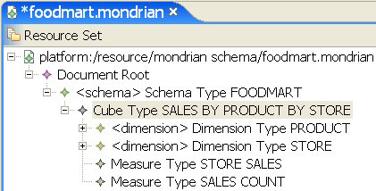

# Dimensions

Dimensions contain the qualitative labels that characterize the cube’s data. For example, the PRODUCT dimension contains characteristics such as PRODUCT FAMILY and PRODUCT DEPARTMENT.

A dimension is organized hierarchically; each level of the hierarchy represents the next level of granularity in the dimension. For example, “Hierarchy for the FoodMart Cube” depicts the PRODUCT dimension, which has six levels. Each level except the bottom level is the parent of the level below it. You can also say that each level except the top level is the child of the level above it.

For example, PRODUCT FAMILY is the parent of the PRODUCT DEPARTMENT, which is the parent of PRODUCT CATEGORY. The most granular level is the PRODUCT NAME. It represents a specific product, such as ADJ Rosy Sunglasses.

Hierarchy for the FoodMart Cube
