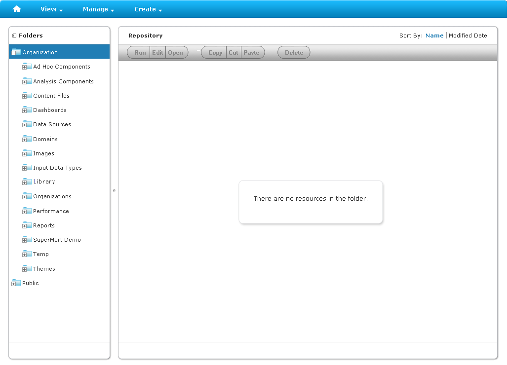

# Jaspersoft OLAP and the Repository

Jaspersoft OLAP extends the JasperReports Server web application to provide these OLAP features:

- Browser-based OLAP interactive views are called OLAP views.
- OLAP objects are managed in JasperReports Server's repository, including browser-based maintenance and object-level security.
- JasperReports can use Jaspersoft OLAP connections and MDX as a basis for Ad Hoc views and reports, gaining access to advanced scalability and calculations.
- XML/A services: Client applications, such as Excel, can run MDX queries against Jaspersoft OLAP cubes through the XML/A web services protocol. Jaspersoft ODBO Connect connects Microsoft Excel Pivot Tables to cubes through XML/A. You can get ODBO Connect from <https://community.jaspersoft.com/wiki/getting-started-odbo-connect>.
- Jaspersoft OLAP commercial editions provide the following:
  - OLAP data-level security based on user profiles.
  - Browser-based management of run time parameters.
  - Access to remote XML/A providers from within JasperReports Server.
  - Jaspersoft OLAP performance monitoring.
  - The Ad Hoc Editor can access OLAP client connections directly, and topics can be based on them as well.

In the JasperReports Server repository (Figure 2‑4), Jaspersoft OLAP resources are stored in folders; security for each folder can be controlled separately. The repository is displayed in two panels. The Folders panel displays all the folders in the repository, while the Repository panel displays the contents of the selected folder.

Repository with Default Folders

For more information on folders and the repository, refer to the Jaspersoft OLAP User Guide.
