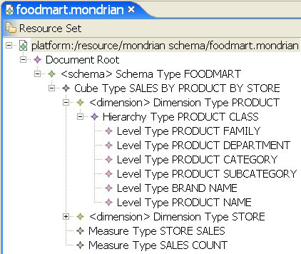

# Measures and Facts

Measures and facts provide the quantitative information in a cube. A measure is a formula; the value that such a formula yields is a fact.

For example, the STORE SALES measure represents the dollar amount of sales figures for a given store (or collection of stores, depending on the STORE dimension); the SALES COUNT measure represents the unit count of goods sold by a given store. These figures are aggregations of the transactional data, using summary functions such as SUM. In the example shown in Figure 2‑3, STORE SALES is the SUM of the store_sales column in the transactional data.

Measure Created with the SUM Aggregation Function
