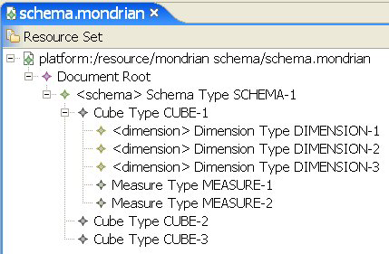

# OLAP Schema

An OLAP schema is a logical model that defines a multidimensional data structure. It defines one or more cubes in a single database that each are defined by one or more dimensions and measures. In Jaspersoft OLAP, the schema maps OLAP concepts onto the underlying database tables and columns, and also defines calculated fields and other OLAP relationships that don’t exist in the physical database.

The Jaspersoft OLAP Workbench is a graphical tool to help you define and test the schema. You can also edit the schema XML file in a text editor.

Because Jaspersoft OLAP relies on Mondrian (an OLAP engine), the OLAP schemas you create for Jaspersoft OLAP must follow the Mondrian schema format, which is written in XML (for an example, refer to the sample schemas in your JasperReports Server installation under js-install&gt;\\samples\\OLAP\\schemas\\\
FoodmartSchema.xml.

There are many graphical tools that can help you build a schema, including the Workbench.

Jaspersoft OLAP Workbench - Store Cube

The Workbench enables you to define a cube, including its dimensions, measures, and member properties, using data stored in a JDBC data source. The Workbench is freely available from <http://sourceforge.net/projects/jasperserver/files/JasperServer/>.
