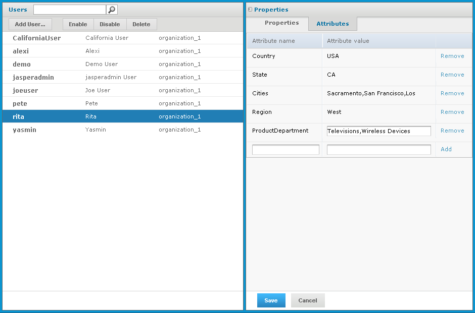

# Assigning Attributes

!!! note

    Attributes can be defined for each server, organization, role, or user. See the JasperReports Server Administrator Guide for more information about defining the attributes.

Notice the attributes listed below the user’s roles in [“Rita’s User Account”](selecting_users_for_the_roles.md). CZS implemented them to take advantage of the variable substitution feature, which simplifies the creation of the access grant definition. This section explains the concept.

CZS determined that they need to describe their users in terms of the product lines that they sell and the geographical areas where they sell. Thus, each CZS user is assigned five attributes:

- Four describe the employee’s geographical area of responsibility: country, region, state, and city. These attributes correspond to the levels of the Geographical Area dimension. The access grant definition shown in [Attributes and Variable Substitution](profile_attributes_and_variable_subs.md) refers to these attributes.
- One describes the products that the employee is responsible for selling: product department. This attribute corresponds to the Product Line level of the product dimension.

Each user’s attributes determine the data returned to him by the view, based on an access grant definition that refers to these attributes by using variable substitution. For example, Rita’s attribute value for Cities is `San Francisco, Los Angeles, Sacramento` while Pete’s is `San Francisco`. Thus, Pete sees that a subset of the data Rita sees.

CZS assigned the following attributes to their users:

<table style="width:100%;">
<colgroup>
<col style="width: 16%" />
<col style="width: 16%" />
<col style="width: 16%" />
<col style="width: 16%" />
<col style="width: 16%" />
<col style="width: 16%" />
</colgroup>
<thead>
<tr>
<th colspan="6">
Attributes of CZS Users
</th>
</tr>
<tr>
<th rowspan="3">
User
</th>
<th colspan="5">
User Attributes
</th>
</tr>
<tr>
<th colspan="4">
Geographical
</th>
<th rowspan="2">
Product/Department
</th>
</tr>
<tr>
<th>
Country
</th>
<th>
Region
</th>
<th>
State
</th>
<th>
Cities
</th>
</tr>
</thead>
<tbody>
<tr>
<td>
Rita
</td>
<td>
USA
</td>
<td>
West
</td>
<td>
CA
</td>
<td>
San Francisco, 
Los Angeles, 
Sacramento,
</td>
<td>
Television, Wireless Devices
</td>
</tr>
<tr>
<td>
Pete
</td>
<td>
USA
</td>
<td>
West
</td>
<td>
CA
</td>
<td>
San Francisco
</td>
<td>
Television
</td>
</tr>
<tr>
<td>
Yasmin
</td>
<td>
USA
</td>
<td>
West
</td>
<td>
CA
</td>
<td>
San Francisco
</td>
<td>
Wireless Devices
</td>
</tr>
<tr>
<td>
Alexi
</td>
<td>
Japan
</td>
<td>
Kansai
</td>
<td>
Osaka
</td>
<td>
Osaka, Sakai
</td>
<td>
Wireless Devices
</td>
</tr>
</tbody>
</table>

At a high level, CZS took the following steps in defining and leveraging attributes:

1.  Defined the required attributes for each user by editing the associated account. These attributes are referred to by variable substitution in the AGXML file.
2.  Created an access grant definition (AGXML file) that refers to these attributes.
3.  Used the access grant definition in a Mondrian connection.
4.  Used the Mondrian connection in the Ad Hoc Editor.

For details about configuring attributes and Mondrian connections, refer to:

- Defining Attributes for Users
- Using Attributes in an Access Grant Definition
- [Creating a Mondrian Connection](creating_a_mondrian_connection_czs.md)
- [Creating a Sales Numbers Ad Hoc View](generating_a_sales_olap_view.md)

## Defining Attributes for Users

Attributes can be created for each user, role, or organization defined in the server. At the user level, they are maintained as part of the account, which you can edit by clicking **Manage \> Users**. CZS edited each of their users to include the attributes they mapped out during their planning phase. Editing Rita’s User Attributes shows Rita’s attributes in the **Manage \> Users** page.

*Figure 1: Editing Rita’s User Attributes*

For more information, refer to the JasperReports Server Administrator Guide.

## Using Attributes in an Access Grant Definition

With the attributes defined, CZS took advantage of them using variable substitution in their access grant definitions, as described in [Attributes and Variable Substitution](profile_attributes_and_variable_subs.md).

CZS's access grant definition (`czs-access-grant.agxml`) is shown in [Access Grant Definition for CZS](reference_material.md). It utilizes the attributes discussed in this section (Country, Region, State, Cities, and ProductDepartment).
