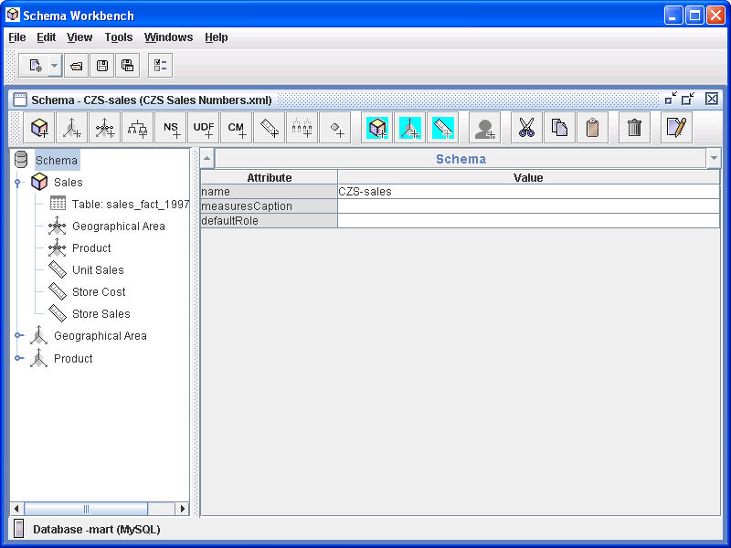

# Creating an OLAP Schema

Having defined their dimensions and measures, CZS created the czs-sales OLAP schema. An OLAP schema is an XML file that defines a cube’s structure. The Jaspersoft OLAP Workbench can simplify the task of creating a schema. For details, refer to the documentation provided with the Workbench.

Jaspersoft OLAP Workbench

Once the OLAP schema is created, add it to the repository. For details, refer to the Jaspersoft OLAP User Guide.

For the XML behind this OLAP schema, refer to [OLAP Schema](../get-started/olap_schema.md).
