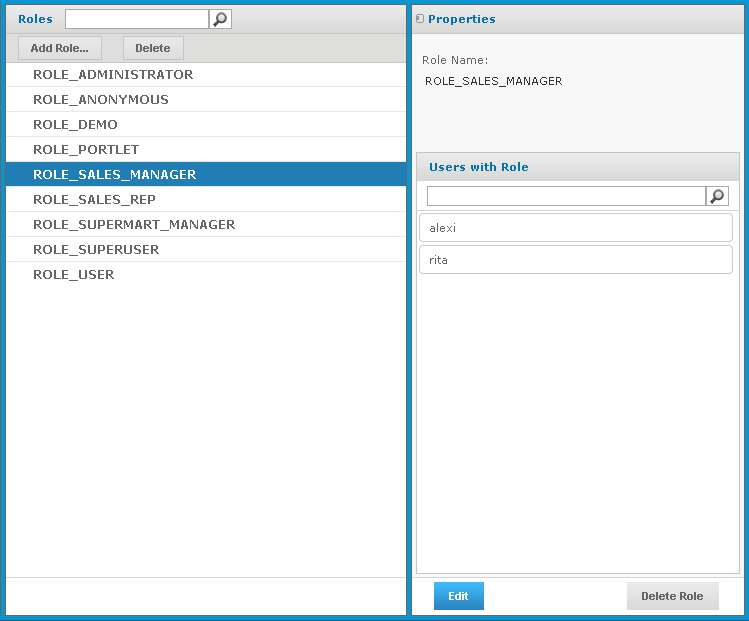

# Determining Roles

Data security in Jaspersoft OLAP relies on a user’s roles to determine the access permissions to grant. CZS defined these roles:

- ROLE_SALES_MANAGER is assigned to Sales Managers.
- ROLE_SALES_REP is assigned to Sales Reps.

CZS grants each role sufficient access to view the Sales Numbers Ad Hoc view. For details about creating roles and assigning privileges, refer to the boot JasperReports Server Administrator Guide.

The following shows CZS's ROLE_SALES_MANAGER:

CZS's ROLE_SALES_MANAGER User Role
