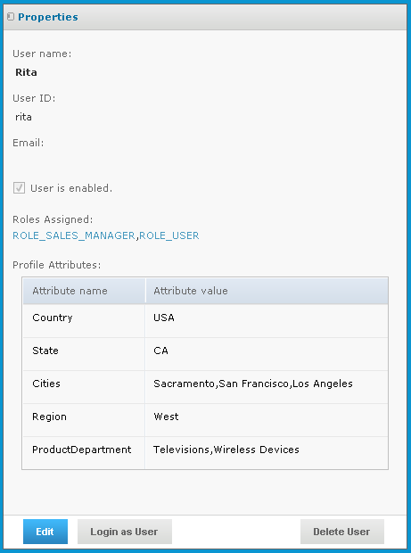

# Selecting Users for the Roles

CZS defined a user account for each of their employees. It then assigned roles to each account; the roles are consistent with the employees’ levels of responsibility.

|        |                    |
|--------|--------------------|
| Rita   | ROLE_SALES_MANAGER |
| Pete   | ROLE_SALES_REP     |
| Yasmin | ROLE_SALES_REP     |
| Alexi  | ROLE_SALES_MANAGER |

For details about creating users, refer to the JasperReports Server Administrator Guide.

The following figure shows the configuration of Rita’s user account:

Rita’s User Account
