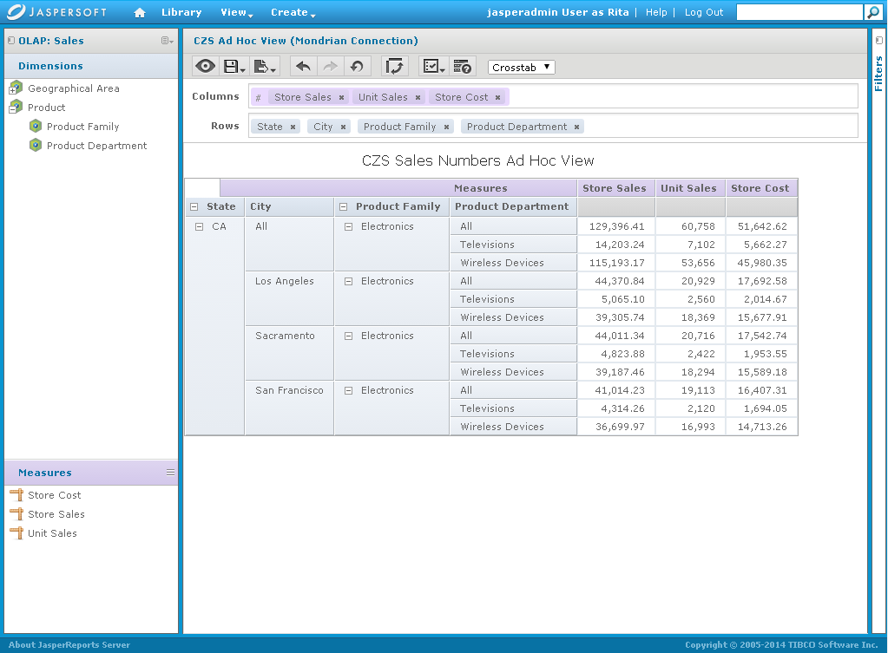
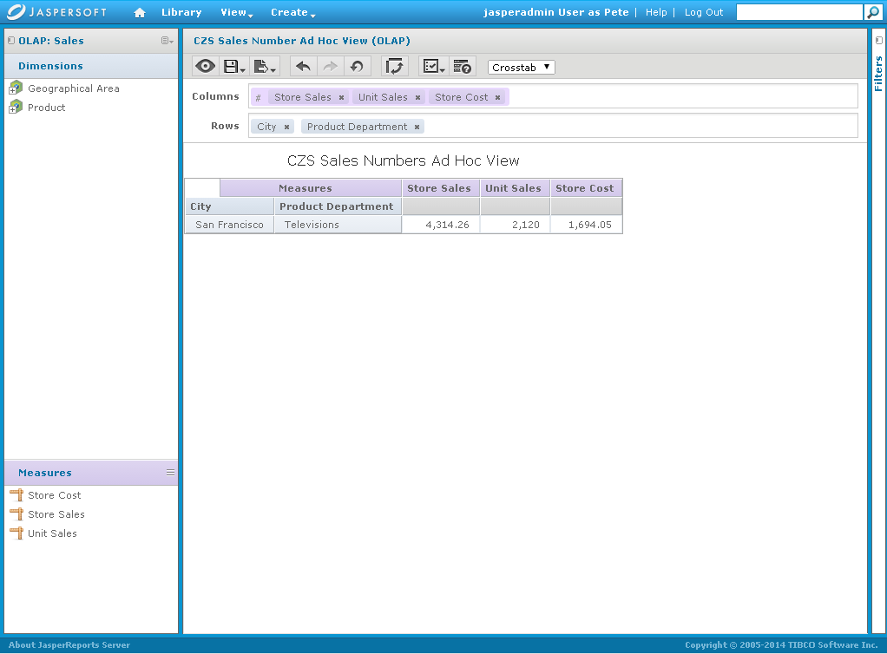
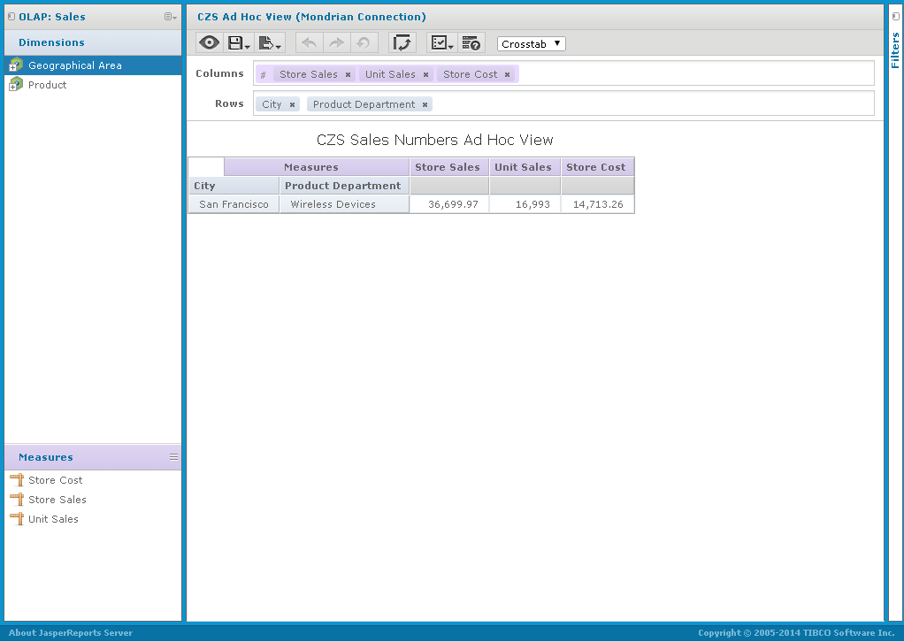
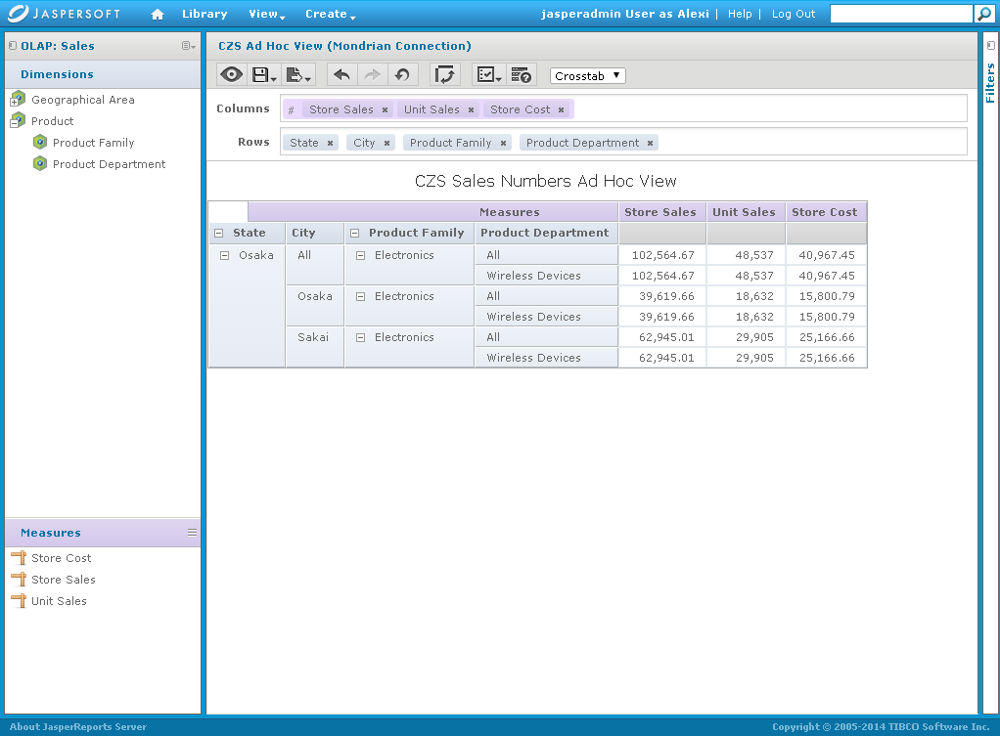

# Testing the Results

Finally, CZS tested the view security by logging in as each CZS user and checking the user’s access within the view.

To test the access granted to users on data in the CZS Sales Numbers Ad Hoc view

1.  Click **Manage \>** **Users**.
2.  In the Users panel, select the CZS user to test.
3.  In the user’s Properties panel, click **Login as User**.

The selected user’s Home page appears.

1.  In the Search field, enter CZS and press return
2.  Click **CZS Sales Numbers Ad Hoc View**.

The view appears.

1.  Test the view to ensure that it only displays data the user should see and does not hide data the user should see.
2.  Click **Log Out** to return to your Home page, then login as each of the other users.

When reviewing the CZS Ad Hoc views below (Figure 1-1 to Figure 1-4), note the different access each user has to the data.

Rita can see all data for the state of California and the three California cities where CZS has offices (Los Angeles, Sacramento, and San Francisco).

Rita’s View

Pete can only see television data about San Francisco:

Pete’s View

Yasmin can only see wireless devices data about San Francisco.

Yasmin’s View

Alexi can only see data for Osaka prefecture and the two cities there where CZS has offices (Osaka and Sakai).

Alexi’s View
