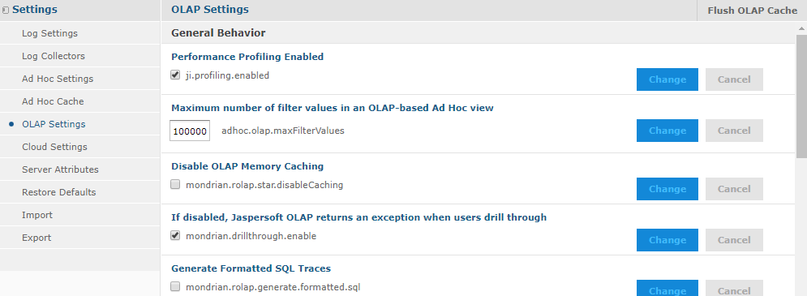

# Changing OLAP Settings

Various configurable properties control the OLAP engine’s behavior. In most cases, you can use the default values for these properties. However, if you want to adjust the performance, you may need to change them.

We recommend that you carefully review the effects of the changes you make to the performance tuning variables, and to test these changes before using them in a production environment.

!!! note

    The **Manage** menu only appears if you have an administrative role, such as ROLE_ADMINISTRATOR (for the all editions) and ROLE_SUPERUSER (for commercial editions). In commercial editions with a single organization, the **Manage &gt; Server Settings** menu can be made available to the jasperadmin account by assigning it ROLE_SUPERUSER; otherwise, only superuser can access the Server Settings page.

To change the OLAP settings

1.  Click **Manage &gt; Server Settings**.

2.  Click **OLAP Settings**.

    The **OLAP Settings** page appears.

    

    *Figure 1 OLAP Settings Page, Commercial Editions*

    Each property is listed with its underlying name (as it appears in the underlying OLAP engine), as well as a more descriptive label. The properties are described in [Table 1-1](changing_olap_settings.md).

3.  If your edition of the server includes it, click the **Performance Profiling Enabled** checkbox to generate performance reports and views, and click **Change**.

    The page displays a message indicating that the setting was updated.

4.  Locate and analyze the performance reports and views. The reports are found in the repository at **/performance/reports**. The views are found at **/performance/views**.

5.  Review the available properties described below to determine if they can be changed to improve performance.

6.  Adjust any options as needed, click **Change**, and run the performance views and reports to understand the impact your changes made.

7.  Adjust the settings as necessary.

Test your views and adjust properties as your findings dictate.

!!! note

    To log the SQL queries Jaspersoft OLAP sends to the database, set the **Generate Formatted SQL Traces** option. This ensures that Jaspersoft OLAP writes the SQL queries it executes to the log file you specify.

The following table lists the properties’ meanings.

**OLAP Settings**

<table>
<colgroup>
<col style="width: 50%" />
<col style="width: 50%" />
</colgroup>
<thead>
<tr>
<th>
Property
</th>
<th>
Notes
</th>
</tr>
</thead>
<tbody>
<tr>
<td colspan="2">
General Behavior
</td>
</tr>
<tr>
<td>
<strong>Performance Profiling Enabled</strong>
</td>
<td>
When enabled, performance profiling data is generated and recorded. The availability of this setting is controlled by your license.
</td>
</tr>
<tr>
<td>
<strong>Maximum number of filter values in an OLAP-based Ad Hoc view</strong>
</td>
<td>
The number of filter values that can be listed in an Ad Hoc view that is based on an OLAP schema. If your filters have a large number of possible values, use this setting to allow Jaspersoft OLAP to return them all. Note that setting this value to a large number can impact the performance of your OLAP.
</td>
</tr>
<tr>
<td>
<strong>Disable OLAP Memory Caching</strong>
</td>
<td>
Turns off caching completely. Disabling caching can have a very noticeable negative performance impact.
</td>
</tr>
<tr>
<td>
<strong>If disabled, Jaspersoft OLAP returns an exception when users drill through</strong>
</td>
<td>
If disabled, Jaspersoft OLAP returns an exception if you attempt to drill-through. This can be useful when the underlying data contains confidential information or is so voluminous that drill-through performance would be unacceptable.
</td>
</tr>
<tr>
<td>
<strong>Generate Formatted SQL Traces</strong>
</td>
<td>
When tracing is enabled, Jaspersoft OLAP formats SQL queries in the trace output with line breaks, which makes them easier to read.
</td>
</tr>
<tr>
<td>
<strong>Query Limit</strong>
</td>
<td>
The maximum number of concurrent queries is allowed.
</td>
</tr>
<tr>
<td>
<strong>Result Limit (number of rows)</strong>
</td>
<td>
When set to a number greater than 0, result sets are limited to the specified number of rows.
</td>
</tr>
<tr>
<td>
<strong>Maximum number of MDX query threads per Jaspersoft OLAP instance</strong>
</td>
<td>
For each Jaspersoft OLAP instance in your deployment, the maximum number of concurrent threads that can be used for MDX queries. For more information about running multiple instances in a single deployment, refer to <a href="performance_tuning.md">Performance Tuning</a>.
</td>
</tr>
<tr>
<td>
<strong>Interval between polling operations performed by the RolapConnection shepherd thread</strong>
</td>
<td>
Specifies the interval between polling operations performed by the RolapConnection shepherd thread. This controls query timeouts and cancellation, so a small value (a few milliseconds) is usually best. When this is set to a value higher than the value defined for the <strong>If &gt; 0, Maximum query time (number of seconds)</strong> setting, the timeout is not enforced as expected.
</td>
</tr>
<tr>
<td>
<strong>Maximum number of passes allowable while evaluating an MDX expression</strong>
</td>
<td>
When evaluating an MDX query, the maximum number of passes is allowed. Jaspersoft OLAP returns an error when this threshold is exceeded; for example, the error may occur during complex calculations.
</td>
</tr>
<tr>
<td>
<strong>Class name of ExpCompiler to use</strong>
</td>
<td>
If entered, this must be a Java class name that is an implementation of the <code>mondrian.calc.ExpCompiler</code> interface. Refer to the Mondrian Javadoc for more information.
</td>
</tr>
<tr>
<td>
<strong>MDX identifiers are case-sensitive</strong>
</td>
<td>
Specifies whether the MDX parser considers the case of identifiers.
</td>
</tr>
<tr>
<td>
<strong>If &gt; 0, the number of cells that are batched together when building segments</strong>
</td>
<td>
When set to a number greater than zero, defines a limit on the number of cells that can be batched together when building segments.
</td>
</tr>
<tr>
<td>
<strong>Sibling members are ordered according to their ordinal expression</strong>
</td>
<td>
Specifies whether siblings at the same level of a dimension are compared according to the order key value retrieved from their ordinal expression. By default, ordinal expressions are only used for ORDER BY, and Jaspersoft OLAP ignores the actual values. When this property is enabled, Jaspersoft OLAP can correctly order members when native filtering is used. Note that this setting requires that the RDBMS provides non-null instances of <code>java.lang.Comparable</code> that yield the correct ordering when calling their <code>Comparable.compareTo</code> method.
</td>
</tr>
<tr>
<td>
<strong>If &gt; 0, Maximum query time (number of seconds)</strong>
</td>
<td>
When set to a value greater than zero, Jaspersoft OLAP times out if the query takes longer than the specified number of seconds. If a query exceeds the limit, Jaspersoft OLAP returns an error.

For more information, refer to the Query Limit and Result Limit entries in this table.
</td>
</tr>
<tr>
<td>
Number of elements read when processing high cardinality dimension elements
</td>
<td>
This property determines how many members Mondrian reads in one block from the database. Setting large values for this property increases performance but can overload memory. Values should be prime with <code>mondrian.result.limit.</code>

For more information, refer to the <a href="http://mondrian.pentaho.com/documentation/">configuration guide</a>.
</td>
</tr>
<tr>
<td>
<strong>Sparse Segment Density Threshold</strong>
</td>
<td>
Performance tuning variable. This property only applies when SparseSegmentCountThreshold is enabled. It determines whether to use a sparse or a dense representation when collections of cell values are stored in memory.
</td>
</tr>
<tr>
<td>
<strong>Sparse Segment Count Threshold (number of cell values)</strong>
</td>
<td>
Performance tuning variable. this property only applies when the SparseSegmentDensityThreshold is set. It determines whether a sparse or a dense representation is used when collections of cell values are stored in memory.

When storing collections of cell values, Jaspersoft OLAP can use either a sparse or a dense representation. This is determined by the possible and actual number of values: density is calculated as actual / possible.

Whenever possible, Jaspersoft OLAP uses a sparse representation - countThreshold * actual &gt; densityThreshold.

For example, for the default values (countThreshold = 1000, SparseSegmentDensityThreshold = 0.5), Jaspersoft OLAP uses a dense representation for:

<ul>
<li>1000 possible, 0 actual, or</li>
<li>2000 possible, 500 actual, or</li>
<li>3000 possible, 1000 actual</li>
</ul>

If there are fewer actual values or more possible values, Jaspersoft OLAP uses a sparse representation.
</td>
</tr>
<tr>
<td>
<strong>During schema load, invalid members are ignored and will be treated as a null</strong>
</td>
<td>
When enabled, Jaspersoft OLAP ignores invalid members during schema load. They are treated as null members if they are referenced in a later query.
</td>
</tr>
<tr>
<td>
<strong>During query validation, invalid members are ignored and will be treated as a null</strong>
</td>
<td>
When enabled, Jaspersoft OLAP ignores invalid members during query validation. Invalid members are ignored and are treated as null members.
</td>
</tr>
<tr>
<td>
<strong>Defines how a null Member is represented in the result output</strong>
</td>
<td>
Specifies how Jaspersoft OLAP should represent a null member in the result output.
</td>
</tr>
<tr>
<td>
<strong>If &gt; 0, the maximum number of iterations allowed when evaluating an aggregate</strong>
</td>
<td>
When set to a number greater than 0, the maximum number of iterations allowed when evaluating an aggregate. When set to 0, iterations are unlimited.

If a query exceeds the limit, Jaspersoft OLAP returns an error that specifies this property’s value. For more information, refer to the Query Limit and Result Limit entries in this table.
</td>
</tr>
<tr>
<td>
<strong>If &gt; 0, crossjoin result limit beyond which the optimizer will be applied (number of rows)</strong>
</td>
<td>
When set to a number greater than 0, specifies a threshold for a crossjoin input list's size. If it exceeds this value, and the axis has the NON EMPTY qualifier, Jaspersoft OLAP uses the non-empty optimizer.

When this property is set to 0, Jaspersoft OLAP applies the non-empty optimizer to all crossjoin input lists. To ensure that the optimizer is never applied to crossjoin input lists, set this value to the <code>Integer.MAX_VALUE</code>.
</td>
</tr>
<tr>
<td>
<strong>Enable the in-memory rollup of segment data</strong>
</td>
<td>
When enabled (the default setting), segment data are rolled up in-memory.
</td>
</tr>
<tr>
<td>
<strong>If there are unrelated dimensions to a measure in the context during aggregation, the measure is ignored in the evaluation context</strong>
</td>
<td>
When dimensions unrelated to a measure are detected during aggregation, the measure is ignored in the evaluation context. Note that this property can only affects measures whose CubeUsage’s <code>IgnoreUnrelatedDimensions</code> is false.

For more information, refer to the <a href="http://mondrian.pentaho.com/documentation/">configuration guide</a>.
</td>
</tr>
<tr>
<td>
<strong>Do elements of a dimension (levels, hierarchies, members) need to be prefixed with the dimension name in the MDX query</strong>
</td>
<td>
Determines if elements of dimension (levels, hierarchies, and members) must be prefixed with the dimension name in MDX queries.

This property determines whether certain queries succeed or fail based on the way the dimension elements are defined in the MDX query. When this property is enabled, this query fails:

<code>select {[Omaha]} on columns from cust</code>

When this property is disabled, that same query succeeds.

With the property enabled, the correct query is:

<code>select {[Nebraska].[Omaha]} on columns from cust</code>

If your schema is very large or complex, Jaspersoft recommends enabling this setting, as processing such schemas can be very resource-intensive.

For more information, refer to the <a href="http://mondrian.pentaho.com/documentation/">configuration guide</a>.
</td>
</tr>
<tr>
<td>
<strong>Division by null or zero produces NULL</strong>
</td>
<td>
By default, when Jaspersoft OLAP attempts to divide by zero or null, it evaluates to Infinity, which is correct for some analysis providers. When this property is enabled, Jaspersoft OLAP instead evaluates such calculations to null, which can be helpful in certain circumstances.
</td>
</tr>
<tr>
<td>
<strong>Comma-separated list of classes to use to get statistics about the number of rows in a table</strong>
</td>
<td>
Comma-separated list of classes to use to get statistics about the number of rows in a table or the number of distinct values in a column.
</td>
</tr>
<tr>
<td>
<strong>Solve Order evaluation behavior</strong>
</td>
<td>
Specifies how to evaluate the <code>SOLVE_ORDER</code>:

<ul>
<li>Absolute. Any specified scope is ignored and the <code>SOLVE_ORDER</code> value is absolute. For example, Jaspersoft OLAP gives precedence to a query-defined calculated member with a <code>SOLVE_ORDER</code> of 1 over a cube-defined value of 2.</li>
<li>Scoped. Jaspersoft OLAP first resolves cube-calculated members, then resolves session-scoped members, and finally resolves query-defined calculations. Jaspersoft OLAP only applies the <code>SOLVE_ORDER</code> value within the scope in which it was defined.</li>
</ul></td>
</tr>
<tr>
<td colspan="2">
<strong>Aggregate Settings</strong>
</td>
</tr>
<tr>
<td>
<strong>Enable Aggregate Tables</strong>
</td>
<td>
When enabled, Jaspersoft OLAP identifies tables in the database that are aggregated, and uses those aggregate values. Those values may use a different aggregator than the measures in the OLAP schema. Users may expect to see the aggregate values as defined by the schema rather than those in aggregate tables. In this case, disable the <code>Enable Aggregate Tables</code> option.

For more information, refer to the <a href="http://mondrian.pentaho.com/documentation/">configuration guide</a>.
</td>
</tr>
<tr>
<td>
<strong>Choose Aggregate Table By Volume</strong>
</td>
<td>
Performance tuning variable for aggregates. This property only applies when aggregate tables are used. Consider using this property when optimizing for tables with many large columns. this property determines whether aggregate tables are ordered by volume or row count.

When this property is enabled, Jaspersoft OLAP uses the aggregate table with the smallest volume (number of rows multiplied by number of columns); when it is disabled, Jaspersoft OLAP uses the aggregate table with the fewest rows.
</td>
</tr>
<tr>
<td>
<strong>Optimize predicates</strong>
</td>
<td>
Determines whether Jaspersoft OLAP optimizes predicates. When this property is enabled, Jaspersoft OLAP optimizes certain predicates.

When it is disabled, predicates are only optimized when all of a dimension’s members are included. In this case, Jaspersoft OLAP only retrieves the data specified in the query.

For more information, refer to the <a href="http://mondrian.pentaho.com/documentation/">configuration guide</a>.
</td>
</tr>
<tr>
<td>
<strong>Rule file for aggregate table identification</strong>
</td>
<td>
Specifies a file that defines aggregate table recognition rules. This file can either reside in the application server or the file system. Typically, you can accept the default.
</td>
</tr>
<tr>
<td>
<strong>AggRule element's tag value</strong>
</td>
<td>
The AggRule element's tag value. Typically, you can accept the default.
</td>
</tr>
<tr>
<td>
<strong>SQL to log for aggregate table creation to support MDX with aggregates</strong>
</td>
<td>
Determines whether Jaspersoft OLAP prints the SQL code generated for aggregate tables.

When this property is enabled, Jaspersoft OLAP processes each aggregate request and prints both the lost and collapsed dimension, <code>create</code> and <code>insert</code> SQL statements. When used with the CmdRunner, it lets you automatically create aggregate table generation SQL.
</td>
</tr>
<tr>
<td>
<strong>Factory class for determining the tables and columns of a data source</strong>
</td>
<td>
If entered, this must be a Java class name that is an implementation of the <code>mondrian.rolap.aggmatcher.JdbcSchema.Factory</code> interface. The default implementation is <code>mondrian.rolap.aggmatcher.JdbcSchema.StdFactory</code>. Refer to the Mondrian Javadoc for more information.
</td>
</tr>
<tr>
<td colspan="2">
<strong>Cache and SQL Generation Settings</strong>
</td>
</tr>
<tr>
<td>
<strong>Use a cache for the results of frequently evaluated expressions</strong>
</td>
<td>
Determines whether Jaspersoft OLAP caches the results of frequently evaluated expressions. Enabling this property can reduce the number of unnecessary computations when processing a large amount of data.
</td>
</tr>
<tr>
<td>
<strong>Cache RolapCubeMember objects</strong>
</td>
<td>
Determines whether Jaspersoft OLAP caches RolapCubeMember objects, which each associate a member of a shared hierarchy with a cube that uses it.

Disable this property if you plan to use the member cache control.
</td>
</tr>
<tr>
<td>
<strong>Defines which SegmentCache implementation to use</strong>
</td>
<td>
Defines the SegmentCache implementation to use. Specify the value as a fully qualified class name, such as <code>org.example.SegmentCacheImpl</code> (where <code>SegmentCacheImpl </code>is an implementation of <code>mondrian.spi.SegmentCache</code>).
</td>
</tr>
<tr>
<td>
<strong>Maximum number of threads per Jaspersoft OLAP instance used to perform operations on external caches</strong>
</td>
<td>
The maximum number of threads per Jaspersoft OLAP instance that can be used to perform operations on external caches. For more information about running multiple instances in a single deployment, refer to <a href="performance_tuning.md">Performance Tuning</a>.
</td>
</tr>
<tr>
<td>
<strong>Maximum number of threads per Jaspersoft OLAP instance used to run SQL queries when populating segments</strong>
</td>
<td>
The maximum number of threads per Jaspersoft OLAP instance that can be used to run SQL queries when populating segments. For more information about running multiple instances in a single deployment, refer to <a href="performance_tuning.md">Performance Tuning</a>.
</td>
</tr>
<tr>
<td>
<strong>Determines whether the data from segments is cached locally</strong>
</td>
<td>
Determines whether data from segments are cached locally. To create custom caches, implement the SegmentCache SPI (Schema Processing Interface).
</td>
</tr>
<tr>
<td>
<strong>Maximum number of constraints in a single `IN' SQL clause</strong>
</td>
<td>
The maximum number of constraints in a single SQL IN clause. This value varies with your RDBMS type and configuration. Jaspersoft recommends these values:

<ul>
<li>DB2: 2,500</li>
<li>MySQL: 10,000</li>
<li>Oracle: 1,000</li>
<li>Postgres: 10,000</li>
<li>Other: 10,000</li>
</ul></td>
</tr>
<tr>
<td>
<strong>Some NON-EMPTY CrossJoin MDX statements will be computed in the database</strong>
</td>
<td>
When enabled, Jaspersoft OLAP pushes down to the database processing related to some NON-EMPTY <code>CrossJoin</code> MDX statements.
</td>
</tr>
<tr>
<td>
<strong>Some TopCount MDX statements are computed in the database</strong>
</td>
<td>
When enabled, Jaspersoft OLAP pushes down to the database processing related to some <code>TopCount</code> MDX statements.
</td>
</tr>
<tr>
<td>
<strong>Some Filter() MDX statements will be computed in the database</strong>
</td>
<td>
When enabled, Jaspersoft OLAP pushes down to the database processing related to some <code>Filter() </code>MDX statements.
</td>
</tr>
<tr>
<td>
<strong>Some NON-EMPTY MDX statements are computed in the database</strong>
</td>
<td>
When enabled, Jaspersoft OLAP pushes down to the database processing related to some NON-EMPTY MDX set operations (such as <code>member.children, level.members, and member.descendants</code>).
</td>
</tr>
<tr>
<td>
<strong>Expand non-native sub-expressions of a native expression into MemberLists</strong>
</td>
<td>
When enabled, Jaspersoft OLAP expands non-native sub-expressions of a native expression into MemberLists.
</td>
</tr>
<tr>
<td>
<strong>If enabled, some queries against high-level members of snowflake dimensions are more expensive</strong>
</td>
<td>
When enabled, some queries against members of high levels of snowflake dimensions are more expensive. When disabled, and some rows in an outer snowflake table are not referenced by a row in an inner snowflake table, some queries return members that have no children.
</td>
</tr>
<tr>
<td>
<strong>Alerting action in case native evaluation of a function is enabled but not supported in a particular query</strong>
</td>
<td>
Specifies the error level (OFF, WARN, or ERROR) to use when a function’s native evaluation is enabled but is not supported in the context of a particular query's usage. Errors are only returned in the case of a <code>NonEmptyCrossJoin</code>.

Alerts are only raised when there is a possibility that native evaluation would improve matters.
</td>
</tr>
<tr>
<td>
<strong>Some rollup queries are combined using group by grouping sets if the SQL dialect allows it</strong>
</td>
<td>
When enabled, Jaspersoft OLAP combines some rollup queries using <code>group by grouping sets</code>. Note that this property only applies to data stored in Oracle, DB2, or Teradata.
</td>
</tr>
<tr>
<td colspan="2">
<strong>XML/A Settings</strong>
</td>
</tr>
<tr>
<td>
<strong>XML/A Maximum Drill Through Rows</strong>
</td>
<td>
Limits the number of rows returned from an XML/A drill-through operation.
</td>
</tr>
<tr>
<td>
<strong>First row in the result of an XML/A drill-through request will be filled with the total count of rows</strong>
</td>
<td>
If this property is enabled, the first row returned for an XML/A drill-through request shows the total count of rows in the underlying database.
</td>
</tr>
<tr>
<td>
<strong>Interval between refreshes to the list of XML/A catalogs</strong>
</td>
<td>
Determines the frequency of refreshes to the list of XML/A catalogs in a remote server. Values can be suffixed with units of measures for time, such as:

<ul>
<li><code>s</code> to specify seconds</li>
<li><code>ms</code> to specify milliseconds</li>
</ul>

If no unit of measure is specified, Jaspersoft OLAP assumes that the unit is milliseconds.
</td>
</tr>
<tr>
<td colspan="2">
<strong>Memory Monitoring Settings</strong>
</td>
</tr>
<tr>
<td>
<strong>Use Java Memory monitoring to avoid out of memory</strong>
</td>
<td>
When enabled, Jaspersoft OLAP uses the Java’s memory monitoring capability. In this case, when memory is exhausted, Jaspersoft OLAP returns a <code>MemoryLimitExceededException</code> exception rather than an out of memory error.
</td>
</tr>
<tr>
<td>
<strong>Threshold to limit memory used (percent of total memory</strong>
</td>
<td>
Specifies the percent of memory usage that should trigger a notification to Jaspersoft OLAP that memory is low.
</td>
</tr>
<tr>
<td>
<strong>The number of previous execution instances Jaspersoft OLAP keeps in its history</strong>
</td>
<td>
Defines the number of previous execution instances the Jaspersoft OLAP keeps in its history so that it can send the events that happen thereafter. Setting this property too high can cause the Java Virtual Machine to run out of memory. Setting it too low can prevent some events from reaching the monitor's listeners.
</td>
</tr>
<tr>
<td>
<strong>Class name of factory to manage memory</strong>
</td>
<td>
If entered, this must be a Java class name that is an implementation of the <code>mondrian.util.MemoryMonitor interface</code>. Such a class (<code>mondrian.util.NotificationMemoryMonitor</code>). Refer to the Mondrian Javadoc for more information.
</td>
</tr>
</tbody>
</table>

These properties are stored as server-level attributes. We recommend that you allow JasperReports Server to manage these properties automatically; change the values using the administrator-only `Manage` menu options, unless you need to reset the option to the default. For more information about default server-level attributes, refer to the JasperReports Server Administrator Guide

For more information about these properties, refer to the [configuration guide](http://mondrian.pentaho.com/documentation/configuration.php). Use the name of each property (shown below each descriptive label) when searching this reference.

Many other properties can be set by editing configuration files, but some of them do not affect Jaspersoft OLAP because they are controlled in the repository user interface. For example, you do not have to provide a connectString property, or to specify the jdbcDrivers for Mondrian, because Jaspersoft OLAP automatically generates these properties when the DataSource for an `AnalysisClientConnection` is selected.

!!! note

    To log the SQL queries Jaspersoft OLAP sends to the database, set the **Generate Formatted SQL Traces** option. This ensures that Jaspersoft OLAP writes the SQL queries it executes to the log file you specify.
