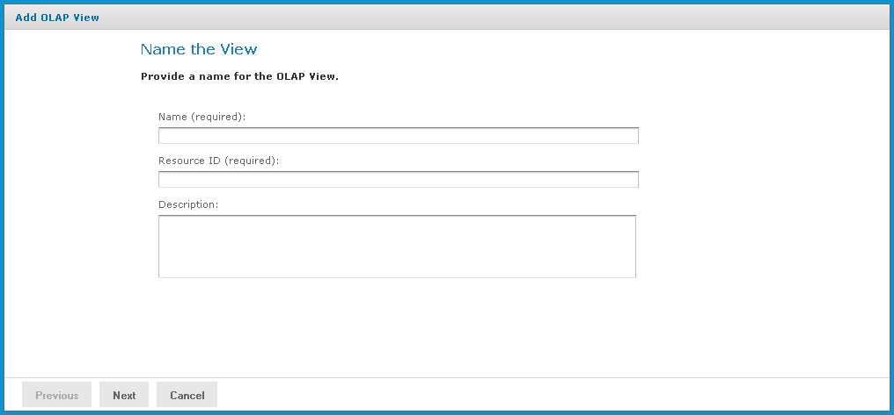
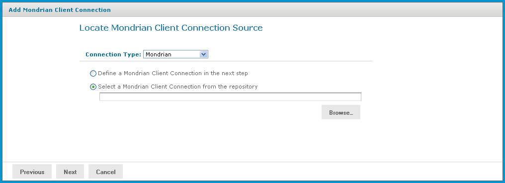
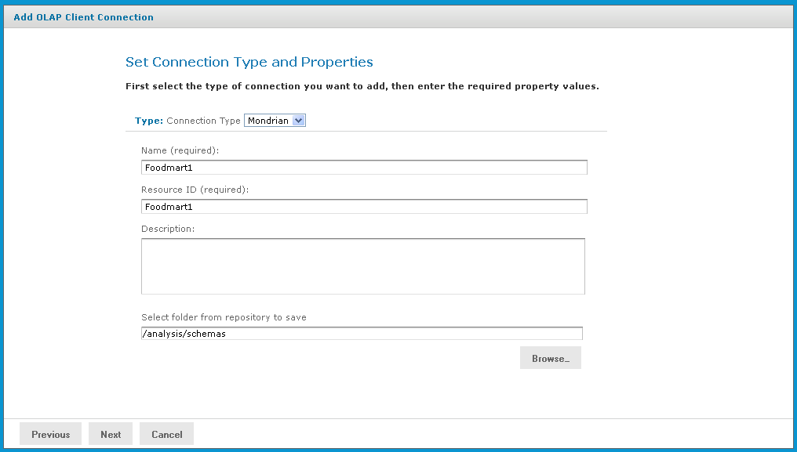
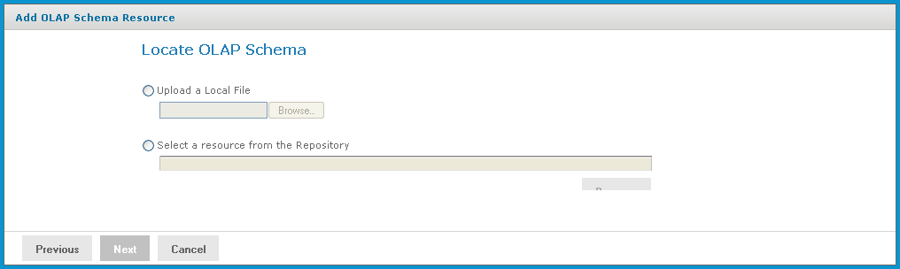
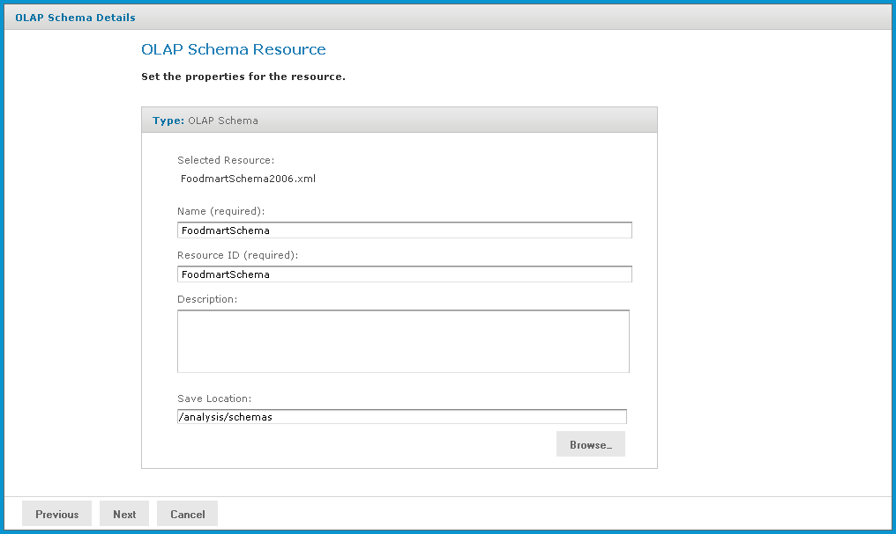
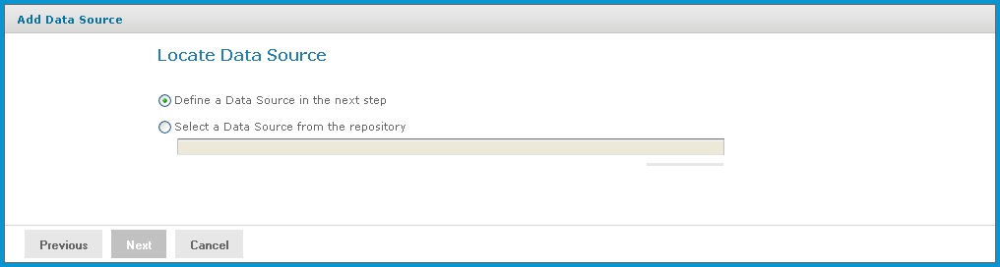
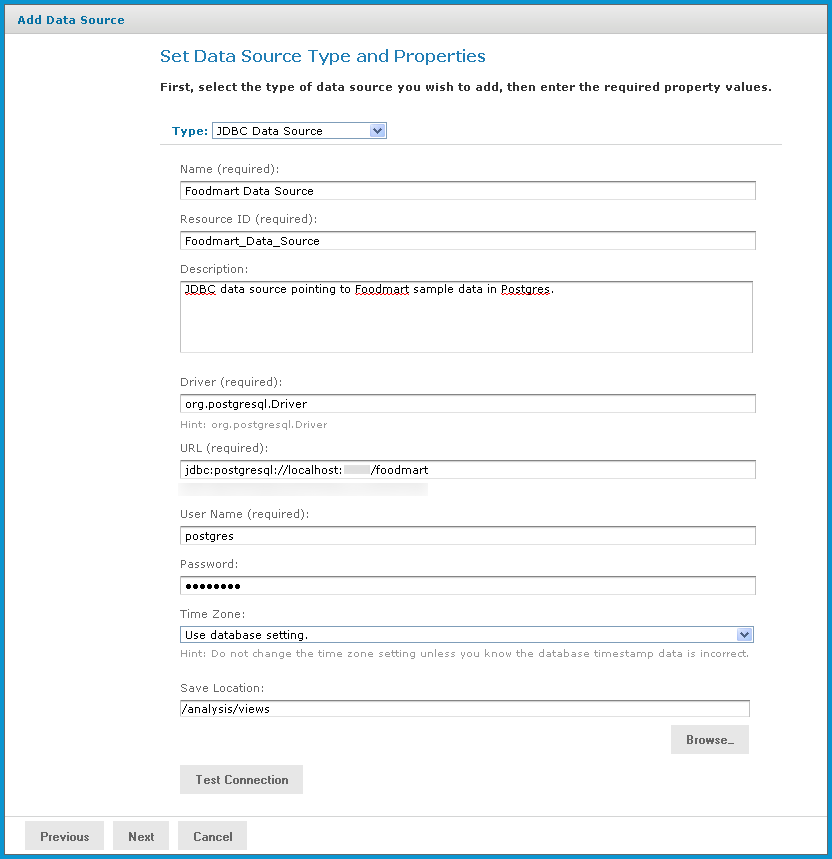
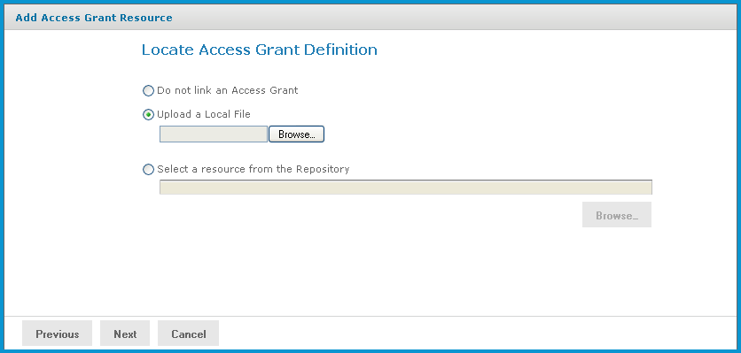
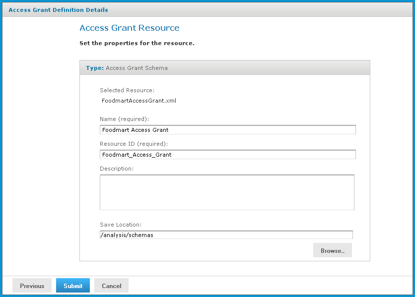
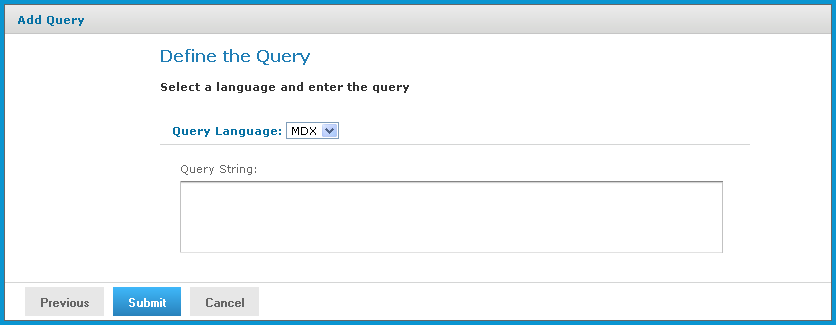

# Creating an OLAP View with a Mondrian Connection

An OLAP view can retrieve data from a Mondrian connection. For more information on Mondrian connections, refer to [Editing a Mondrian Connection](editing_a_mondrian_connection.md).

To create an OLAP, view with a local Mondrian connection,

1.  Click **View \> Repository**.

The repository page appears.

1.  In the **Folders** panel, navigate to **Organization \> Organization \> Analysis Components \> Analysis Views**.
2.  Right-click the folder and select **Add Resource \> OLAP View**.

The **Name the View** page appears and prompts you to provide a name for the new view.

*Figure 1: Name the View Page*

1.  Enter a name and description for the new view. The **Resource ID** field is auto-generated when you type in the **Name** field. After it is saved, it cannot be changed.
2.  Click **Next**.

The **Locate Mondrian Client Connection Source** page appears and prompts you to select or create a local Mondrian connection.

*Figure 2: Locate Mondrian Client Connection Source Page*

1.  Click either:

- **Define a Mondrian Client Connection in the next step**.
- **Select a Mondrian Client Connection from the repository**.

Then click **Browse**, navigate to the connection you want, and click **Select**.

1.  Click **Next**.

If you chose to define a new Mondrian connection, the **Set Connection Type and Properties** page appears and prompts you to define a connection.

*Figure 3: Set Connection Type and Properties Page*

1.  To change the type of the connection, select a connection type from the **Type** dropdown and complete the fields. Otherwise, enter the requested information. For details see [Creating a Mondrian Connection](creating_a_mondrian_connection.md).
2.  To chose a location for the connection, click **Browse**, navigate to a folder, and click **Select**.
3.  Click **Next.**

The **Locate OLAP Schema** page appears and prompts you to upload an OLAP schema or select one from the repository.

*Figure 4: Locate OLAP Schema Page*

1.  Click either:

- **Upload a Local File** to select a file from your local computer.

Then click **Browse,** navigate to select the file you want, and click **Select**.

- **Select a resource from the Repository** to select an existing schema.

Then click **Browse**, navigate to select the schema, and click **Select**.

1.  Click **Next**.

The **OLAP Schema Resource** page appears.

*Figure 5: OLAP Schema Resource Page*

If you chose to upload a new file, the fields are editable. Enter the requested information. For details, refer to [Working with OLAP Schemas](working_with_olap_schemas.md).

1.  Click **Next**.

The **Locate Data Source** page appears and prompts you to create or select a data source.

*Figure 6: Locate Data Source Page*

1.  Click either:

- **Define a Data Source in the next step** to add a data source.
- **Select a Data Source from the repository** to select a data source from the repository.

Then click **Browse**, navigate to the data source you want to use, and click **Select**. Click **Next** and skip to step 18.

1.  Click **Next**.

If you chose to create a new data source, the **Set Data Source Type and Properties** page appear.

*Figure 7: Set Data Source Type and Properties Page*

1.  Enter the requested information and test the connection. For details, refer to [Working with Data Sources](working_with_data_sources.md) and to the JasperReports Server Administrator Guide.
2.  When the test succeeds, click **Next**.

If you use a commercial edition of the server, the **Locate Access Grant Definition** page appears, prompting you to set the properties for the resource.

*Figure 8: Locate Access Grant Definition Page*

1.  Click one of the following:

- **Do not link an Access Grant** if you do not need to apply for data security.

Then click **Next** and skip to another step 22.

- **Upload a Local File** to select a file from your local computer.

Then click **Browse,** navigate to select the file you want, and click **Select**.

- **Select a resource from the Repository** to select an existing schema.

Then click **Browse**, navigate to select the schema, and click **Select**.

In our case, we do not need to secure the data in the view, so you will not specify an access grant schema. The next steps show you how to add a file if it’s needed.

1.  Click **Next**.

The **Access Grant Resource** page appears.

*Figure 9: Access Grant Resource Page*

1.  If you chose to upload a new file from your computer, the fields are editable. Enter the requested information. For details, refer to [Uploading an Access Grant Schema](uploading_an_access_grant_schema.md). If you chose a file from the repository, the fields are not editable.
2.  Click **Next**.

The **Define the Query** page appears and prompts you for an MDX query string.

*Figure 10: Define the Query Page*

1.  Enter an MDX query. For example, type:

`select {[Measures].[Unit Sales], [Measures].[Store Cost], [Measures].[Store Sales]} on columns, {([Promotion Media].[All Media], [Product].[All Products])} ON rows from Sales where ([Time].[2012].[Q4].[12])`

To learn more about writing MDX queries, refer to the reference material listed in [External Information Resources](external_information_resources.md).

1.  Click **Submit**.

If the view passes validation, it is added to the repository. If you receive an error, it is likely that the problem is a typo in your query. Carefully review the query to ensure that it is valid.

1.  When you have a valid OLAP view, clicking **Submit** adds it to the repository.

If the view passes validation, it is added to the repository.
