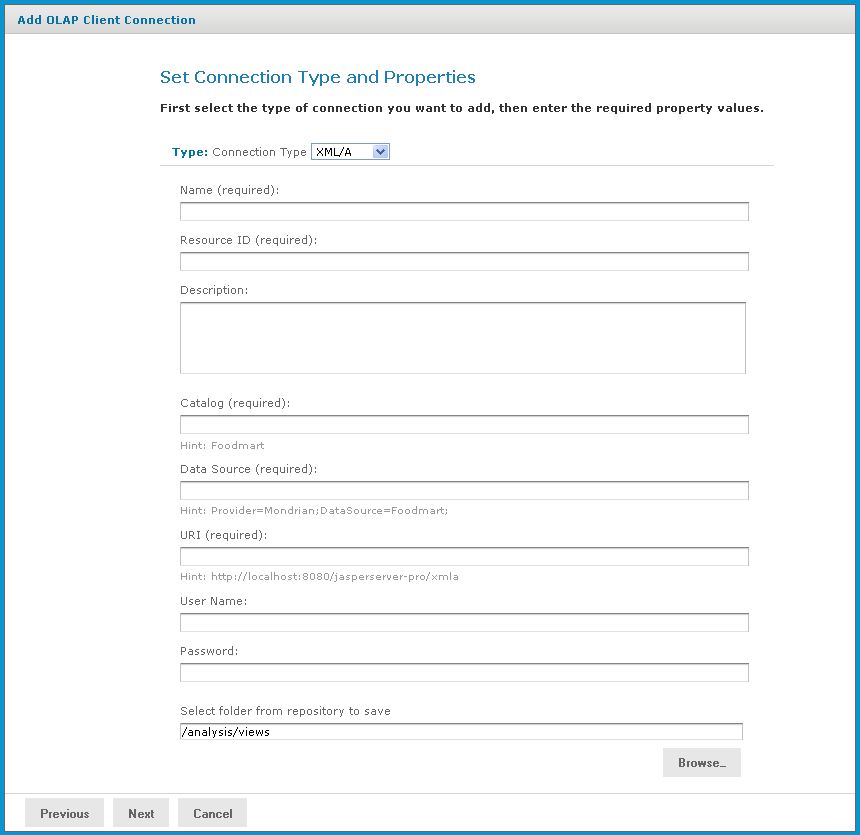

# Creating an OLAP View with an XML/A Connection

An OLAP view can retrieve data from an XML/A connection. An XML/A connection is a connection to a remote Mondrian client connection. For more information on XML/A connections, refer to [Working with XML/A Connections](working_with_xml_a_connections.md) and [Working with XML/A Sources](working_with_xml_a_sources.md).

To create an OLAP view with an XML/A connection:

1.  Click **View \> Repository**.

    The repository appears.

2.  In the Folder panel, navigate to **Organization \> Organization \> Analysis Components \> Analysis Views**.

3.  Right-click the **Analysis Views** folder and select **Add Resource \> OLAP View** from the context menu.

    The **Name the View** page appears and prompts you to enter the basic details about the new view.

    

    *Figure 1: Name the View Page*

4.  Enter a name and a description of the view and click **Next**.

    The **Locate Mondrian Connection** page appears.

5.  In the **Connection Type** dropdown, select XML/A Connection.

6.  Click either:

    - **Define a XML/A Client Connection in the next step** to add a new connection.
    - **Select a XML/A Client Connection from the Repository** to select a data source from the repository.

    Click **Browse**, navigate to the location where you want to add the file, and click **Select**. Click **Next** and skip to step 9.

7.  If you chose to create a client connection, the **Set Connection Type and Properties** page appears and prompts you to define the connection, Enter the requested information. For details, refer to [Working with XML/A Connections](working_with_xml_a_connections.md).

    

    *Figure 2: Set Connection Type and Properties - XML/A Page*

    !!! note

        Your XML/A provider may be another JasperReports Server instance hosting Mondrian connections. For more information, refer to sections [Working with XML/A Connections](working_with_xml_a_connections.md) and [Working with XML/A Sources](working_with_xml_a_sources.md).

8.  Click **Next**.

    The **Define the Query** page appears and prompts you for a query string.

    

    *Figure 3: Define the Query Page*

9.  In the **Query String** field, enter the MDX query. For example, type:

    `select {[Measures].[Unit Sales], [Measures].[Store Cost], [Measures].[Store Sales]} on columns, {([Promotion Media].[All Media], [Product].[All Products])} ON rows from Sales where ([Time].[2012].[Q4].[12])`

    To learn more about writing MDX queries, refer to the reference material listed in [External Information Resources](external_information_resources.md).

10. Click **Submit**.

    If the view passes validation, it is added to the repository. If you receive an error, it is likely that the problem is a typo in your query. Carefully review the query to ensure that it is valid.

11. When you have ca valid OLAP view, clicking **Submit** adds it to the repository.

If the view passes validation, it is added to the repository.
