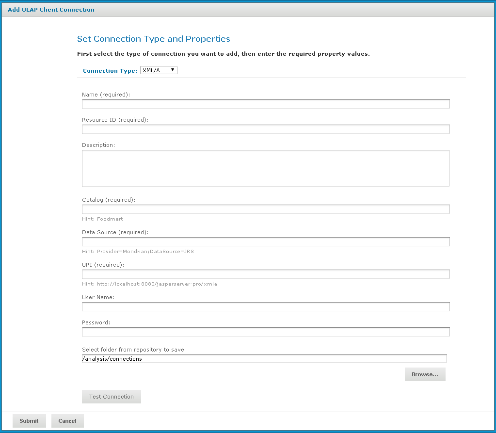

# Creating an XML/A Connection

When creating an XML/A connection, the type of server providing the data determines the values you must specify. This section generally assumes you are connecting to a Mondrian connection stored in a remote JasperReports Server, but also provides some details about connecting to Microsoft SQL Server Analytic Services.

To create an XML/A connection

1.  Click **View \> Repository**.

The repository page appears.

1.  In the **Folders** panel, navigate to **Organization \> Organization \> Analysis Components \> Analysis Connections**.
2.  Right-click the folder and select **Add Resource \> OLAP Client Connection**.

The **Set Connection Type and Properties** page appears and prompts you to define a connection.

1.  In the **Connection Type** dropdown, select XML/A Connection.

The page refreshes and prompts you to define the XML/A connection.

1.  Enter general details, such as the name, label, and description of the connection.
2.  Enter the details, such as the catalog, data source, and URI, that define the XML/A source you want to connect to:
3.  Catalog: the name of the schema that defines the data cube.
4.  Data Source:

- If you are connecting to JasperReports Server, enter the full connection string. For example: `Provider=Mondrian;DataSource=JRS`

Note that, in previous releases, the **DataSource** portion of the connection string was the catalog name. In the current release, it is always **JRS**.

- If you are connecting to Microsoft SQL Server Analytic Services and the connection will be used by OLAP views and reports created in iReport or Jaspersoft Studio, enter the full connection string. For example: `Provider=MSOLAP.4;Data Source=172.16.254.1;Catalog=AdventureWorks`
- If you are connecting to Microsoft SQL Server Analytic Services and the connection can be used by Ad Hoc views and their reports, use the Microsoft SQL Server’s instance name. For example: **Win-MyHost**

!!! note

    When connecting to the Microsoft SQL Server Analytic Service, the form of the data source depends on the way you plan to use this XML/A connection:

    - If you plan to use the XML/A connection to create Ad Hoc views, use the Microsoft SQL Server’s instance name. This is typically the name of the computer hosting Microsoft SQL Server. For example, if your Microsoft SQL Server instance is installed on **Win-MyHost**, the data source is: 
      **Win-MyHost**.
    - If you plan to use the XML/A connection to create OLAP views, use the full connect string. For example, if your Microsoft SQL Server instance is installed on a computer with the IP address **172.16.254.1**, and your catalog is named AdvnetureWorks, the data source is: 
      `Provider=MSOLAP.4;Data Source=172.16.254.1;Catalog=AdventureWorks`

1.  URI (Uniform Resource Identifier): the identifier of the XML/A provider; typically a computer name or URL.
2.  Enter the credentials (the username and password) that Jaspersoft OLAP can pass to the remote XML/A provider to log in. If this user’s password changes, the connection fails. You can leave the **username** and **password** fields blank, so the logged in user’s credentials are passed to the remote server when the connection is accessed.

If the name of the user includes a backslash (\\, you must escape the character by placing a backslash in front of it. For example, consider the case when the username includes a domain, such as **domain\username**. This is represented in the **username** field as **domain\\username**.

!!! warning

    The credentials you define for an XML/A connection are transmitted to the XML/A provider as clear-text. Because of the security risk inherent in this approach, Jaspersoft recommends that you always specify a username and password when defining an XML/A connection to prevent your users’ passwords from being transmitted. This user should have restricted rights to the remote XML/A provider. For more information, see section [XML/A Security](xml_a_security.md).

!!! note

    Your XML/A provider may be another JasperReports Server instance where local Mondrian connections have been defined. For more information, refer to the section [Working with XML/A Sources](working_with_xml_a_sources.md).

*Figure 1: Set Connection Type and Properties - XML/A Page*

1.  Click **Test Connection**.

Jaspersoft OLAP attempts to connect to the remote server:

- If it can connect, a message indicating success appears.
- If the connection fails, a message indicating the type of problem appears. For example, the message might indicate that a catalog with the specified name was not found in the data source; re-enter the catalog name and test the connection again. If a data source with the specified name is not found, the message may indicate that no data source was found; examine your remote server's data sources, update the connection's details, and click **Test Connection** again.

1.  Click the **Show Details** link to learn more about the problem.
2.  When the test succeeds, click **Submit**.
3.  Click **Submit**.

The new XML/A connection appears in the repository.

!!! note

    - If you specify an instance of JasperReports Server as your XML/A provider (in the **URI** field), and it hosts more than one organization, specify the organization name in the **username** field, separated from the account name with the pipe character (\|). For example, to connect as a user named **joeuser** in an organization named **organization_1**, specify **joeuser\|organization_1** in the **username** field.

    - If you are logged in as a superuser, you cannot use the Ad Hoc Editor to access data exposed through an XML/A connection. Instead, Jaspersoft recommends that you log in as jasperadmin or a non-administrative user when creating Ad Hoc views from XML/A connections.
