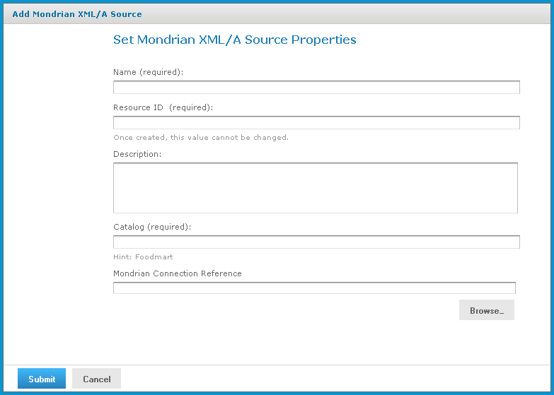

# Creating an XML/A Source

An XML/A source provides access to a single catalog (database schema) referenced by a Mondrian connection in a local instance of JasperReports Server. It defines a particular Mondrian connection in the repository that answers OLAP requests. The XML/A source is referenced by remote clients (such as an XML/A connection in a remote instance of JasperReports Server). The catalog name that you specify uniquely defines the data that an XML/A client can retrieve from the source.

An XML/A source is also sometimes called an XML/A definition.

To add an XML/A source

1.  Click **View \> Repository**.
2.  In the Folder panel, navigate to **Organization \> Analysis Components \> xml/a**.
3.  Right-click the folder and select **Add Resource \> Mondrian XML/A Source** from the context-menu.

The Set Mondrian XML/A Source Properties page appears and prompts you to enter basic information.

Set Mondrian XML/A Source Properties Page

1.  Enter XML/A source information. For example:

|  |  |
|----|----|
| **Name** | SugarCrmMondrianXmlaSource |
| **Resource ID** | Sugar CRM Mondrian XML/A Source |
| **Description** | Sugar CRM Mondrian XML/A Source |
| **Catalog** | The name of the database that contains the data to analyze. |
| **Mondrian Connection Reference** | The path and name of the connection this XML/A source references. If the XML/A provider is JasperReports Server, its value is the connection’s URI. |

1.  Click **Submit** to save the XML/A source.

Once you create an XML/A source in and an XML/A provider such as Jaspersoft OLAP, you must create an XML/A connection in your client application that points to it. For more information, see [Performance Tuning](performance_tuning.md).
