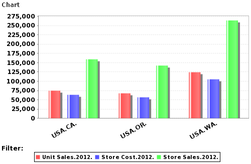

# Displaying Charts

Charts can provide more dramatic visual impact. Create a simple view to display as a chart.

To view a chart:

1\. From the Repository, open the Foodmart Sample Analysis View.

2\. Click .

3\. Click the **Move to Rows** icon next to the Store filter to create a row, then click **Store**.

4\. Expand All Stores in then USA, and select **CA**, **OR**, and **WA**. Click **OK**.

5\. Click the filter icon next to **Promotion Media** and **Production** in the Rows section to remove them from the row.

6\. Click **OK**.

7\. Click **Collapse All** .

8\. Click **Show Chart** .

A default chart output appears.

Default chart for Product Sales Across Store Locations
