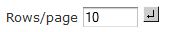

# Drill-through Table

The drill-through table displays supporting details for the selected roll-up value in the navigation table (described in [Navigation Table](navigation_table.md)). The following sections describe the available functionality.

**Drill-Through Table Icons and Options**

| Icon | Name | Description |
|----|----|----|
|  | Edit Properties | Displays at the top-left corner of the drill-through table. Selects the columns to display or hide in the drill-through table. The up and down arrows move the columns and specify the number of rows to display per page. |
|  | Output as CSV | Displayed at the top-left corner of the drill-through table. Prompts you to view or save the current drill-through table in comma-separated values format. |
|  | Expand/Collapse Member | Synchronizes the expansion or contraction of rows across all hierarchy members when they are clicked. |
|  | First, Previous, Next, Last | Click the arrows to navigate the pages of data. |
|  | Goto Page | Enter the number of the page you want to view and press return to display the page. |
|  | Rows/page | Set the number of rows to display. |
