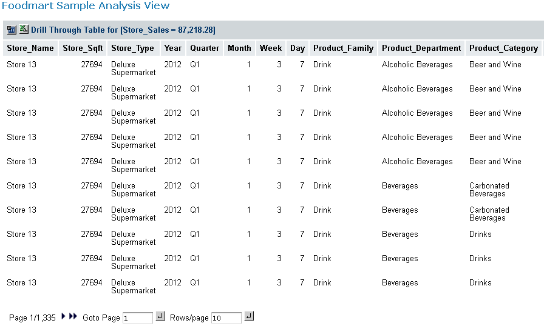

# Drilling Through to Details

The drill-through operation displays detailed transaction information for a given aggregated value.

To work with source data

- Using the table created in Sorting the Display, click the number \$87,218.28 next to Store 13.

The drill-through table appears in a new page.

This is the default behavior. You can also display the drill-through table in the same page as the navigation table.

The drill-through table shows the underlying data in the database that is used to generate the summarized information in the navigation table. This is useful for validation of results. Drill-through data can also reveal interesting trends or anomalies. For example, you might identify a particular demographic that tends to make larger purchases.

As shown in the following figure, Carbonated Beverages are among the items making up the Store Sales.

*Figure 1: Drill-through Table Showing High-value Items*

Note that you can export the current set of source data to an Excel spreadsheet by clicking at the top of the drill-through table. You can change the columns that are displayed and their sort order by clicking . Navigate through the paged data and control the number of rows per page using the controls at the bottom of the drill-through table.
