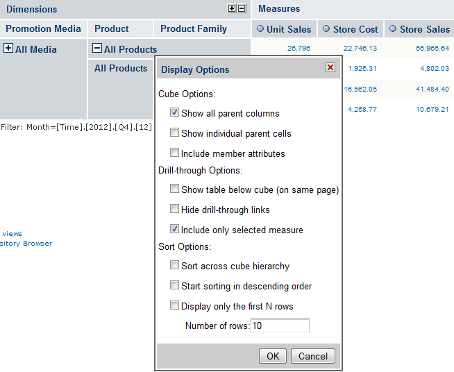
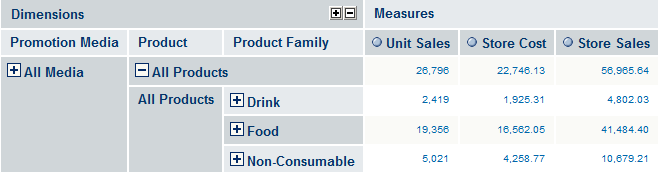
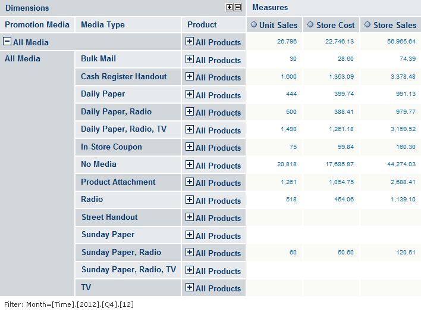
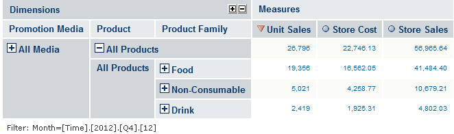

# Edit Display Options

The **Display Options** dialog lets you control the content and appearance of the information in your view, such as cube options, drill-through options, and sort options, which are described in the following sections.

*Figure 1 Display options Dialog*

## Cube Options

<table>
<tbody>
<tr>
<td>
Show all parent columns
</td>
<td>
Displays the column headings of a given hierarchy. The following navigation table shows Product and Product Family as parent column headings.
</td>
</tr>
<tr>
<td colspan="2">

</td>
</tr>
</tbody>
</table>

<table>
<tbody>
<tr>
<td>
Show individual parent cells
</td>
<td>
Displays each parent member of a given hierarchy. The following navigation table displays all parent cells for Promotion, Media and Product dimensions.
</td>
</tr>
<tr>
<td colspan="2">

</td>
</tr>
<tr>
<td>
Include member attributes
</td>
<td>
Displays the member properties of the displayed hierarchy members.
</td>
</tr>
</tbody>
</table>

## Drill-through Operations

|  |  |
|----|----|
| Show table below cube (on same page) | Displays the drill-through table below the navigation table. By default, the drill-through table appears in a separate browser window. |
| Hide drill-through links | Removes the hyperlinks from the fact data in measures. |
| Include only selected measures | Limits the display to only the selected measure in the drill-through table. |

## Sort Options

The option to sort across a cube's hierarchy is also available in the form of a toolbar button . In either case, it changes the behavior of sorting across or within dimension hierarchies. In the following example, **Sort Across Hierarchy** is selected, and the Unit Sales measure is sorted in descending order across the Product hierarchy.

For more information, see the Jaspersoft OLAP Ultimate Guide.

*Figure 2 Sorting Across Hierarchy*

The **Display Options** dialog also provides the following options:

|  |  |
|----|----|
| Start sorting in descending order | Toggles the sort behavior between ascending and descending. |
| Display only the first N rows | Limits the number of rows displayed after sorting. |
