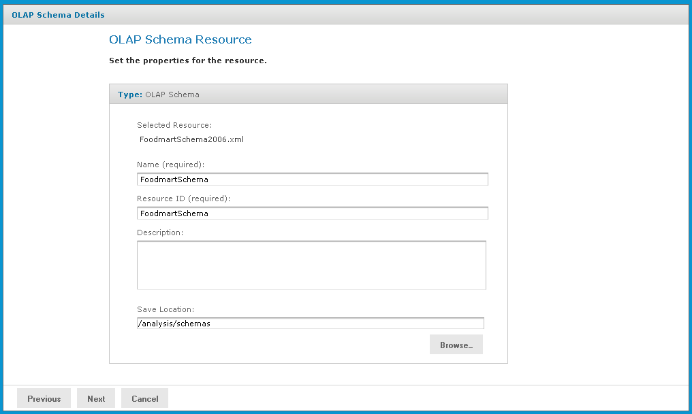

# Editing a Mondrian Connection

You can change the connection name, schema, data source, and access grant definition in a Mondrian connection.

To edit a Mondrian connection

1.  In the **Search** field, enter the name (or partial name) of the Mondrian connection you want to edit, and click the Search icon. For example, enter a **foodmart**.

    The repository appears and displays objects that match the text you entered.

2.  Right-click the Mondrian connection that you want to edit and click **Edit**.

    The **Set Connection Type and Properties** page appears with the fields populated.

    

    *Figure 1: Set Connection Type and Properties Page*

3.  Change values as necessary and click **Next**.

    The **Locate OLAP Schema** page appears.

    

    *Figure 2: Locate OLAP Schema Page*

    You can either accept the existing file or replace it. If you replace the file, you can either upload a new file or select one from the repository.

4.  To accept the existing file, click **Next**.

5.  To replace the file, either:

-   Click **Upload a Local File** and click **Browse** to upload a new schema from your local computer.

    -   Click **Select a resource from the Repository**, click **Browse**, and navigate the repository to the schema you want to use. Then click **Select**.

        1.  Click **Next**.

            The **OLAP Schema Resource** page appears.

            

            *Figure 3: OLAP Schema Resource*

        2.  If you chose to upload a new file, enter a name and description for it.

            If you accepted the existing file or selected one from the repository, the fields are not editable.

        3.  Click **Next**.

            The **Locate Data Source** page appears.

            

            *Figure 4: Locate the Data Source*

            You can either accept the existing data source or replace it. If you replace it, you can either define a new data source or select one from the repository.

        4.  To accept the existing data source, click **Next**.

        5.  To replace the data source, either:

    -   Click **Define a Data Source in the next step**.

    -   Click **Select a Data Source from the Repository**, click **Browse**, and navigate the repository to locate the data source you want to use. Then click **Select**.

        1.  Click **Next**.

            If you accepted the existing data source, or if you selected a data source from the repository, that connection is used. Clicking **Next** displays the **Locate Access Grant** page.

            If you chose to define a new data source, the **Set Data Source Type and Properties** page appear.

            

            *Figure 5: Set Data Source Type and Properties Page*

        2.  Enter the requested information, For details on defining data sources, refer to [Working with Data Sources](working_with_data_sources.md) and to the JasperReports Server Administrator Guide.

            !!! note

                Test the new data source to ensure it works properly.

        3.  Click **Submit**.

            The **Locate Access Grant Definition** page appears.

            

            *Figure 6: Locate Access Grant Definition Page*

        4.  Click one of the following options:

    -   **Do not link an Access Grant**. Click **Next** and skip step 17.

    -   **Upload a Local File**. Click **Browse** to select a different local file.

    -   **Select a resource from the Repository**. Click **Browse** to select a different file in the repository.

1.  Click **Next**.

    If you chose to secure the data, the **Access Grant Resource** page appears.

    

    *Figure 7: Access Grant Resource Page*

2.  If you upload a new AGXML file, enter the requested information. For details, refer [Uploading an Access Grant Schema](uploading_an_access_grant_schema.md). If you select a resource from the repository, the fields are not editable.

3.  Click **Submit**.

The updated connection appears in the repository.
