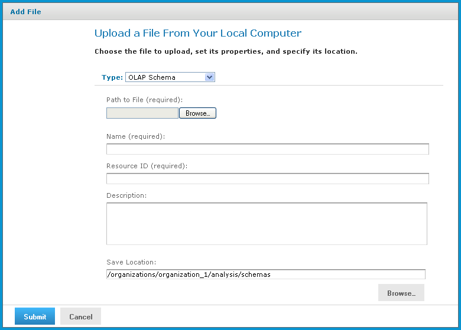

# Editing an OLAP Schema

You can change the schema name, the schema file, and the location of an OLAP schema.

To change an OLAP schema's naming and file source

1.  In the **Search** field, enter the name (or partial name) of the schema you want to edit, and click the **Search** icon. For example, enter **sugar**.

    The search results appear, displaying objects that match the text you entered.

2.  Select the schema, right-click, and click **Edit**.

    The **Upload a File From Your Local Computer** page appears and prompts you the values.

    !!! note

        You cannot change the **Type** or **Resource ID** fields.

    

    *Figure 1 Upload a File From Your Local Computer - OLAP Schema*

3.  To upload a new file, next to the **Path to File** field, click **Browse**, and navigate to and select the file you want to upload.

4.  Enter changes to the **Name** and **Description** fields as necessary.

5.  Under the **Save Location** field, click **Browse** and navigate to the location where you want to store the file, and click **Select**.

6.  Click **Submit**.

The edited schema appears in the repository.
