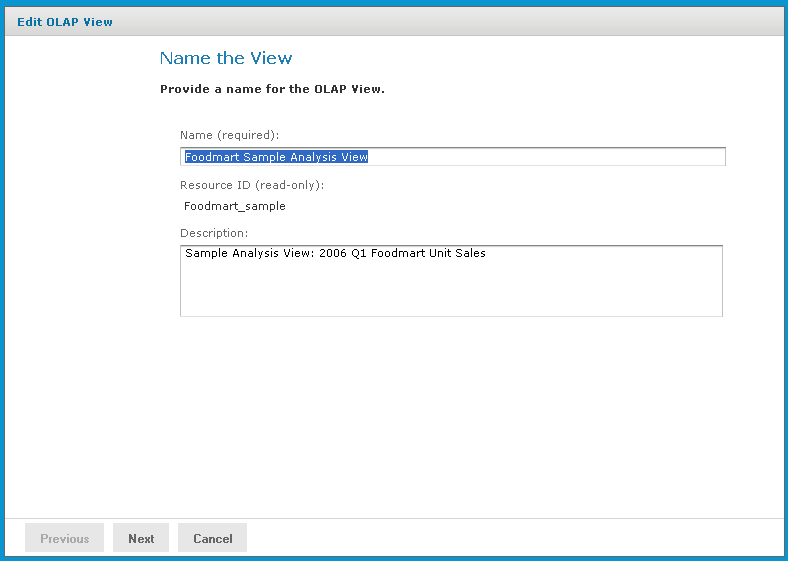
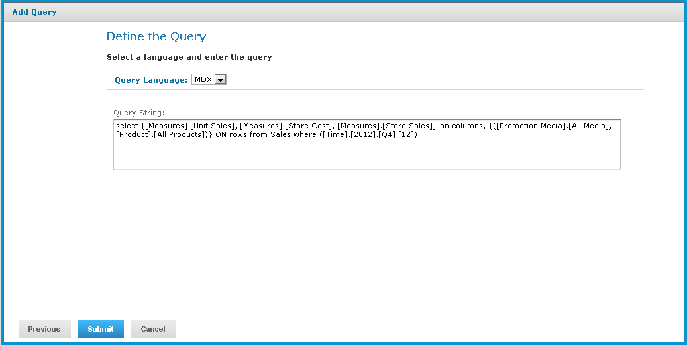

# Editing an OLAP View

To change the naming, connection, or MDX query in an OLAP views

1.  In the **Search** field in the repository, enter the name (or partial name) of the OLAP view you want to edit, and click the **Search** icon.

For example, enter **food**.

The repository displays the objects that match the text you enter.

1.  Right-click a view and click **Edit**. In this example, we are editing the Foodmart Sample Analysis View.

The **Name the View** page appears with the fields populated.

*Figure 1: Name the View Page*

1.  Make your changes to the fields as necessary and click **Next.**

The page that appears depends on the type of client connection defined in the view. For example, if the view specifies a Mondrian connection, the **Locate a Mondrian Connection Source** page appears.

*Figure 2: Locate Mondrian Client Connection Source Page*

1.  Depending on the type of connection specified, enter values as necessary. Click each field that you want to change and enter new values. For details, refer to [Creating an OLAP View with a Mondrian Connection](creating_an_olap_view_with_a_mondria.md) and [Creating an OLAP View with an XML/A Connection](creating_an_olap_view_with_an_xml_a_.md).
2.  Click **Next.**

The **Define a Query** page appears with the query language set to MDX.

*Figure 3: Define the Query Page*

1.  Change the query or enter a new one, if necessary.

!!! note

    You can also edit a view’s MDX query by modifying the navigation table and saving the view. To learn more about writing MDX queries, refer to the reference material listed in [External Information Resources](external_information_resources.md).

1.  Click **Submit.**

If the view passes validation, it is added to the repository. If you receive an error, it is likely that the problem is a typo in your query. Carefully review the query to ensure that it is valid.

1.  When you have a valid OLAP view, clicking **Submit** adds it to the repository.
