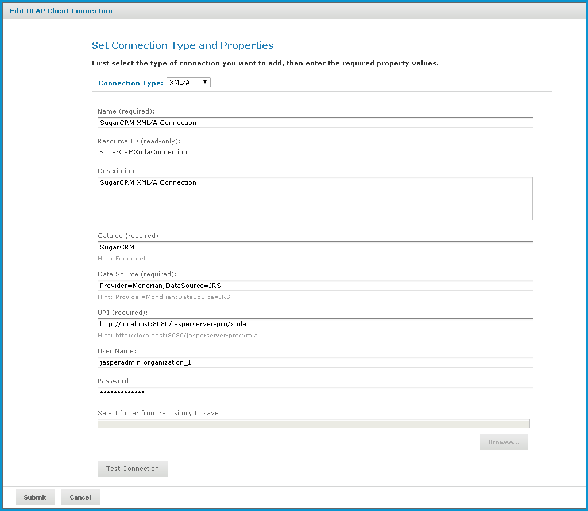

# Editing an XML/A Connection

!!! note

    In previous releases, XML/A connections that pointed to remote JasperReports Server instances had to specify slightly different information than what is required in this release. If you have recently upgraded from a version prior to 5.6, you must edit these XML/A connections' **Data Source** field.

    For example, in previous versions, the Foodmart XML/A connection specified:

    `Provider=Mondrian;DataSource=Foodmart`

    During an upgrade, this connection must be changed to:

    `Provider=Mondrian;DataSource=JRS`

To edit an XML/A connection’s naming and properties

1.  In the **Search** field, enter the name (or partial name) of the connection you want to edit, and click the **Search** icon. For example, enter `sugar`.

    The search results appear, displaying objects that match the text you entered.

2.  Right-click the XML/A connection that you want to change and click **Edit**.

    The **Set Connection Type and Properties** page appears.

    

    *Figure 1: Set Connection Type and Properties*

3.  Make changes as necessary.

4.  Click **Test Connection**.

    Jaspersoft OLAP attempts to connect to the remote server:

    - If it can connect, a message indicating success appears.
    - If the connection fails, a message indicating the type of problem appears. For example, the message might indicate that a catalog with the specified name was not found in the data source; re-enter the catalog name and test the connection again. If a data source with the specified name is not found, the message may indicate that no data source was found; examine your remote server's data sources, update the connection's details, and click **Test Connection** again.

5.  Click the **Show Details** link to learn more about the problem.

6.  When the test succeeds, click **Submit**.

The edited XML/A Connection appears in the repository.
