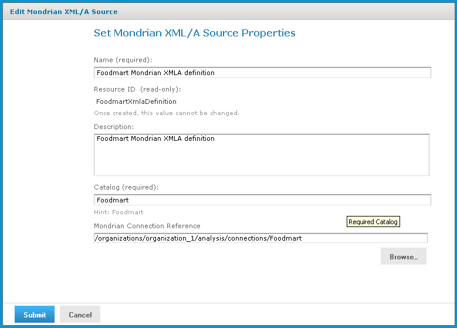

# Editing an XML/A Source

You can change an XML/A source name, connection properties, and location in the repository.

To edit an XML/A source

1.  In the **Search** field, enter the name (or partial name) of the schema you want to edit, and click the Search icon.

    For example, enter `food`.

    The search results appear, displaying objects that match the text you entered.

2.  Right-click an XML/A source, and click **Edit** on the context-menu.

    The Set Mondrian XML/A Source Properties page appears.

    

    Set Mondrian XML/A Source Properties Page

3.  Click each active field that you want to change and enter the new data.

4.  Click **Submit**.

The updated source appears in the repository.
