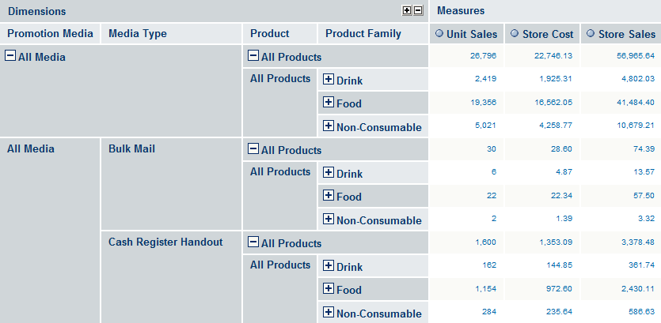
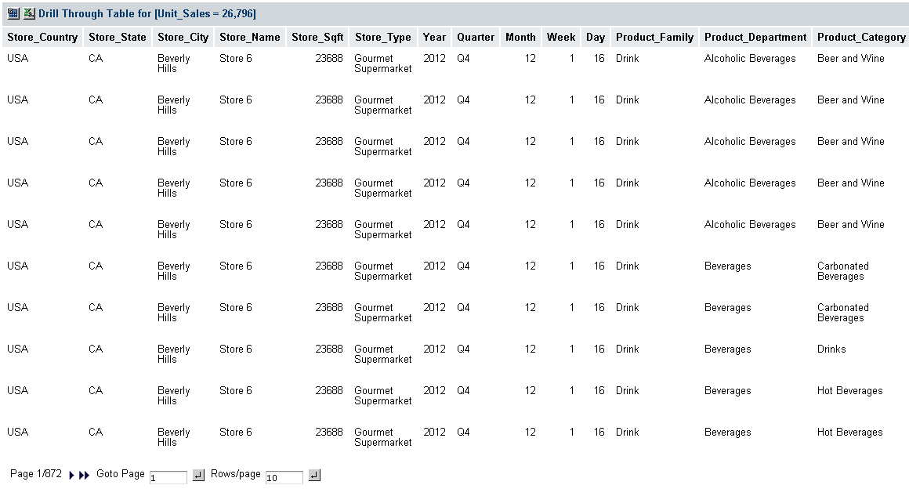
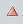
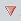

# Navigation Table

The navigation table appears at the top of the OLAP view ([Foodmart Sample Analysis View](opening_an_olap_view.md)). It shows the data that is retrieved by the current MDX query, which appears in both the main view and in a drill-through tables.

<table>
<caption>
Navigation Table Icons and Options
</caption>
<colgroup>
<col style="width: 33%" />
<col style="width: 33%" />
<col style="width: 33%" />
</colgroup>
<thead>
<tr>
<th>
Icon
</th>
<th>
Name
</th>
<th>
Description
</th>
</tr>
</thead>
<tbody>
<tr>
<td>

</td>
<td>
Expand Position
</td>
<td>
Expands rows at a specific hierarchy member.
</td>
</tr>
<tr>
<td>

</td>
<td>
Collapse Position
</td>
<td>
Collapses rows at a specific hierarchy member.
</td>
</tr>
<tr>
<td></td>
<td>
Expand/Collapse Member
</td>
<td>
Synchronizes the expansion or contraction of rows across all hierarchy members when they are clicked.

</td>
</tr>
<tr>
<td></td>
<td>
Zoom In/Out
</td>
<td>
Click hyperlinked hierarchy members to replace the current table with a sub-table that depicts the selected member. This option is only available when <strong>Zoom on Drill</strong> is enabled.
</td>
</tr>
<tr>
<td></td>
<td>
Zoom Out All
</td>
<td>
Restores the navigation table to its initial view after having zoomed. This option is only available when you are in Zoom on Drill mode.
</td>
</tr>
<tr>
<td> </td>
<td>Show Source Data</td>
<td>
Click hyperlinked fact data to display additional columns from that specific fact data. The following drill-through table shows the drill-through of Total Unit Sale for Alcoholic Beverages. For more information about the drill-through table’s options, refer to <a href="drill_through_table.md">Drill-through Table</a>.

</td>
</tr>
<tr>
<td>

</td>
<td>
Natural Order
</td>
<td>
Located next to measure labels, indicates that the navigation table is sorted according to the order of hierarchy members. Click it to change the sort order.
</td>
</tr>
<tr>
<td>

</td>
<td>
Ascending
</td>
<td>
Located next to measure labels, indicates that the navigation table is sorted according to their numeric value, from smallest to largest. Click it to change the sort order.
</td>
</tr>
<tr>
<td>

</td>
<td>
Descending
</td>
<td>
Located next to measure labels, indicates that the navigation table is sorted according to their numeric value, from largest to smallest. Click it to change the sort order.
</td>
</tr>
<tr>
<td>

</td>
<td>
Expand All
</td>
<td>
Located near the top-left corner of the navigation table, expands all of the currently displayed members (all those that display the plus sign) to the next level of detail in the hierarchies. This can be selected repeatedly to expand all levels of detail. This option is only available when the Zoom on Drill is not active. This operation is limited by the memory available to the application server that hosts the JasperReports Server. It stops expanding members when this limit is reached.
</td>
</tr>
<tr>
<td>

</td>
<td>
Collapse All
</td>
<td>
Located in the top-left corner of the navigation table, collapses the navigation table to its initial view.
</td>
</tr>
</tbody>
</table>
