# OLAP Tool Bar

The tool bar on the left side of your view provides access to many OLAP operations and features.

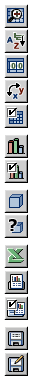

*Figure 1 OLAP Tool Bar*

**OLAP Tool Bar Icons**

<table>
<colgroup>
<col style="width: 33%" />
<col style="width: 33%" />
<col style="width: 33%" />
</colgroup>
<thead>
<tr>
<th>
Icon
</th>
<th>
Name
</th>
<th>
Description
</th>
</tr>
</thead>
<tbody>
<tr>
<td>

</td>
<td>
Zoom on Drill
</td>
<td>
Toggles (that is, turns on or off) the zoom in/out hyperlinks for hierarchy members. See <a href="drill-into-member.md">Drilling into a Dimension Member</a>.
</td>
</tr>
<tr>
<td>

</td>
<td>
Sort Across Hierarchy
</td>
<td>
Toggles between sort of and sort within hierarchy. See <a href="edit-display-options.md">"Sort Options"</a>.
</td>
</tr>
<tr>
<td>
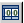
</td>
<td>
Hide Empty Rows/Columns
</td>
<td>
Hides or reveals rows or columns that do not have relevant fact data. See <a href="row-and-col-display.md">Row and Column Display Options</a>.
</td>
</tr>
<tr>
<td>
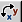
</td>
<td>
Swap Axes
</td>
<td>
Changes the orientation of the table by switching the columns and rows.

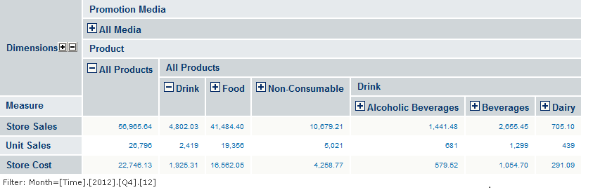
</td>
</tr>
<tr>
<td>

</td>
<td>
Edit Display Options
</td>
<td>
Allows users to configure the cube options, drill-through options, and sort options. <a href="edit-display-options.md">See "Editing Display Options"</a>.
</td>
</tr>
<tr>
<td>

</td>
<td>
Show Chart
</td>
<td>
Displays a chart of the navigation table data.

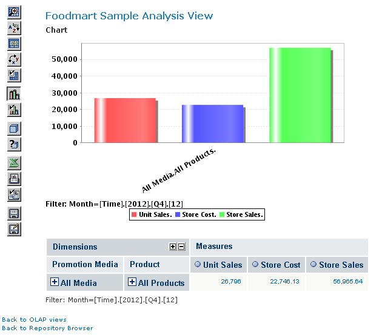
</td>
</tr>
<tr>
<td>
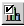
</td>
<td>
Edit Chart Options
</td>
<td>
Defines various charting options.

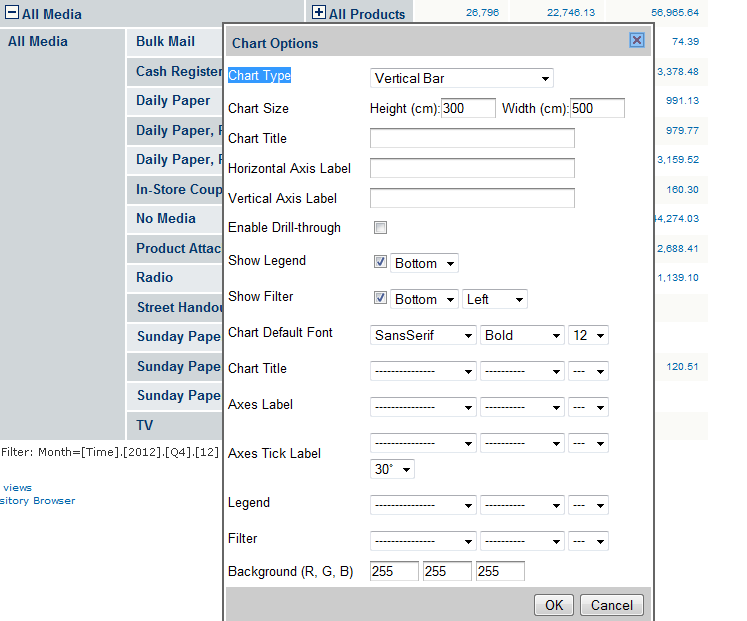
</td>
</tr>
<tr>
<td>

</td>
<td>
Change Data Cube
</td>
<td>
Changes an OLAP view and defines dimension filters.
</td>
</tr>
<tr>
<td>

</td>
<td>
Show MDX Query
</td>
<td>
Changes the navigation table by editing the MDX query that generates the view. This feature is intended for advanced users familiar with MDX and the data structures underlying the view.

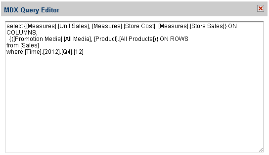
</td>
</tr>
<tr>
<td>

</td>
<td>
Export to Excel
</td>
<td>
Prompts you to view or save the current navigation table in Microsoft Excel format.

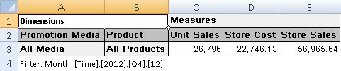
</td>
</tr>
<tr>
<td>
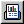
</td>
<td>
Export to PDF
</td>
<td>
Prompts you to view or save the current navigation table in Adobe Acrobat PDF format.

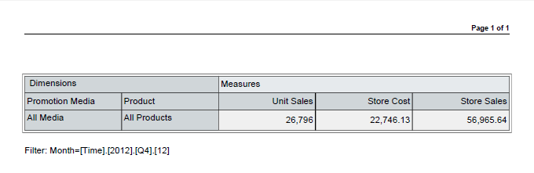
</td>
</tr>
<tr>
<td>
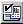
</td>
<td>
Edit Output Options
</td>
<td>
Defines various output options.

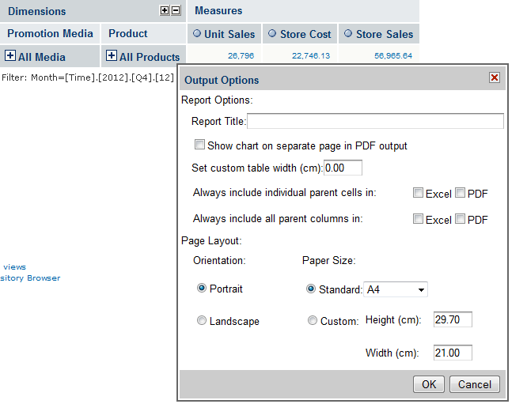
</td>
</tr>
<tr>
<td>

</td>
<td>
Save View
</td>
<td>
Saves this OLAP view. Changes you have made since you opened the view are saved to the repository. If you do not have permission to save the view in its current location, the Save View As dialog prompts you to select a new location.
</td>
</tr>
<tr>
<td>

</td>
<td>
Save View As
</td>
<td>
Saves this OLAP view under a new name and location. Changes you have made since opening the view are saved to the repository in the location you select. Note that you cannot use the Save View As button to overwrite an existing view (even if you have sufficient permissions).
</td>
</tr>
</tbody>
</table>
