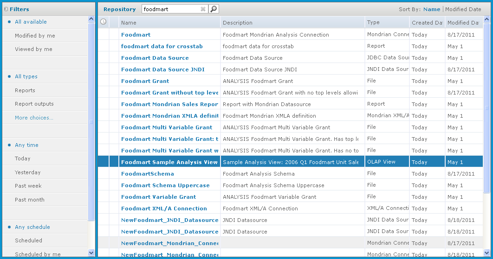
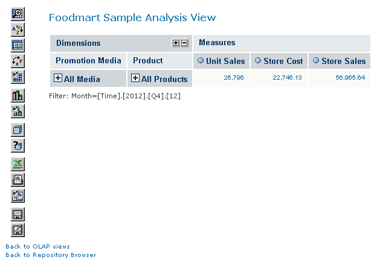

# Opening an OLAP View

To open an OLAP view,

1.  Click **View \> Repository**.

The repository appears.

1.  Scroll through the repository to select an OLAP view or type the name (or partial name) of the view you want to see in the search field at the top of the page.

For example, enter **Foodmart**.

The repository reappears, displaying the objects that match your text.

*Figure 1: Search Results in the Repository*

1.  To display an OLAP view, right-click it and select **Run**. For example, right-click the **Foodmart Sample Analysis View** and click **Run**.

JasperReports Server displays the view.

*Figure 2: Foodmart Sample Analysis View*

1.  Click the tool bar buttons and values in the navigation table to explore the data.
