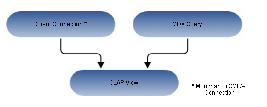

# Overview of an OLAP View

An OLAP view is a collection of multidimensional data that is based on an OLAP client connection and an MDX query. It is the entry point to analysis operations, such as slice and dice, navigate, and drill-through. End users open these views from the repository once an administrators create them. Creating a view entails identifying the elements that allow Jaspersoft OLAP to retrieve and secure the data.

Anatomy of an OLAP View

For more information about client connections, refer to [Editing a Mondrian Connection](editing_a_mondrian_connection.md) and [Editing an XML/A Connection](editing_an_xml_a_connection.md).
