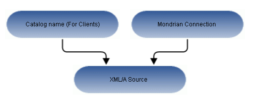

# Overview of XML/A Sources

An XML/A connection points to a Mondrian connection (exposed by the XML/A source) in a remote XML/A provider, allowing you to separate your front end processing from back end processing when analyzing data in views and reports.

Jaspersoft OLAP can run as a XML/A server, allowing OLAP queries to be run from remote clients and query results returned to those clients over the XML/A web services protocol. The OLAP data for XML/A comes from Mondrian connections referenced by XML/A sources.

Jaspersoft OLAP XML/A connections provide a client view to XML/A servers, including Jaspersoft OLAP. You may want to run separate Jaspersoft OLAP servers, splitting the Jaspersoft OLAP XML/A clients from the XML/A servers. This client/server configuration allows load balancing, around-the-clock availability, and fail-over in Jaspersoft OLAP environments. Other clients that can connect to Jaspersoft OLAP when it is run as a XML/A server include Excel Pivot Tables with the Jaspersoft ODBO Driver.

In order to allow Jaspersoft OLAP to run as a XML/A server, XML/A sources need to be defined in the repository. The list of XML/A sources a given client can connect to can be controlled by repository permissions, as XML/A clients must authenticate via username and password, and their access to the repository can be limited by permissions. In commercial editions of Jaspersoft OLAP, OLAP data level security can be used to filter OLAP query results based on the logged in user making the XML/A requests. See [Uploading an Access Grant Schema](uploading_an_access_grant_schema.md).

Anatomy of an XML/A Source

!!! note

    When your JasperReports Server instance hosts multiple organizations, an XML/A source must be created in the same organizations as the Mondrian connection it points to. If the Mondrian connection is in the Public folder, the XML/A source must also be in the Public folder.
