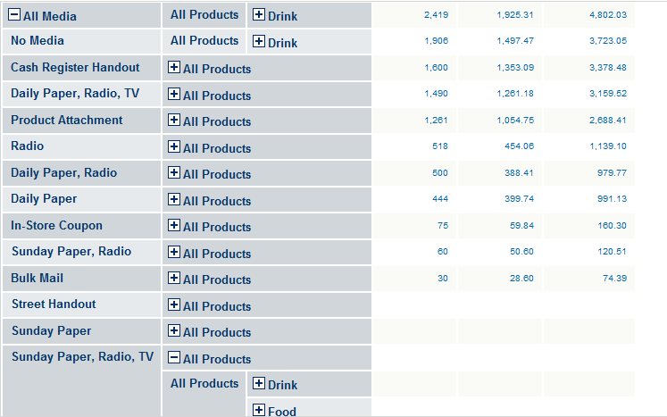

# Row and Column Display Options

The **Hide Empty Rows/Columns** button  allows you to hide or reveal rows or columns that do not have relevant fact data. The following example includes empty rows for Promotion Media (Street Handout; Sunday Paper; and Sunday Paper, Radio, TV).

*Figure 1: Showing Empty Rows*
