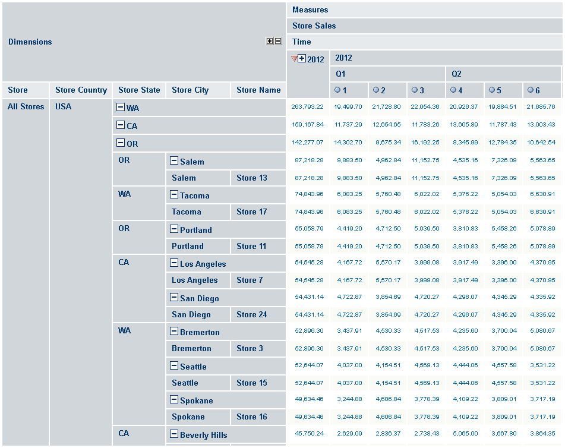

# Sorting the Display

Sorting allows you to display an ordered view of data.

To sort the display

1.  Open your Analysis View.
2.  Click .
3.  Click the **Move to Rows** icon  next to the filter you want to use to create a row, then expand it as needed.
4.  Click next to **Promotion Media** and **Product** to remove them from the view.
5.  Next to the Time filter, click the **Move to Columns** icon  to make Time a column.
6.  Click **Time** to open a tree displaying the dimension members.
7.  Expand Time by clicking  next to it, and select **2012**, then click **OK**.
8.  Click **Measures** in the column section, and deselect **Unit Sales** and **Store Cost**.
9.  Click **OK**, then click **OK** again.
10. Click to activate **Zoom on Drill**. When active, its tool bar button looks like this .
11. Click to zoom into USA.
12. Clear **Zoom on Drill** by clicking .
13. Click the navigation table’s **Expand All Members** button .
14. Click the **Edit Display Options** button  and make sure **Show all parent columns**, **Sort across the cube hierarchy**, and **Start sorting in descending order** are selected, then click **OK**.
15. Click the navigation table’s **Expand All Members** button again.
16. Click the **Sort** button  next to 2012.

The navigation table displays the top stores for the year ordered by dollar sales amount.

*Figure 1: Sorting the Top West Coast Stores in Sales*
