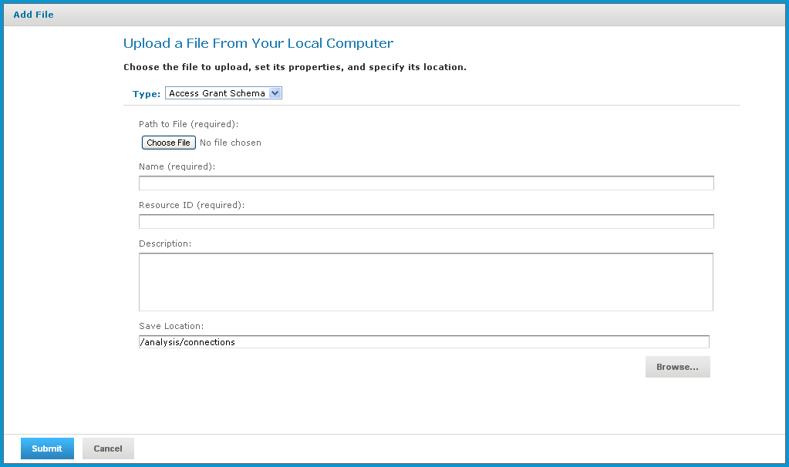

# Uploading an Access Grant Schema

To upload an access grant schema (AGXML)

1.  Click **View\> Repository** .

    The repository page appears.

2.  In the **Folders** panel, navigate to **Organization \> Organization \> Analysis Components \> Analysis Schemas**.

3.  Right-click the folder and select **Add Resource \> File \> Access Grant Schema.**

    The **Upload a File From Your Local Computer** page appears and prompts you to select a file and set its properties.

    

    *Figure 1: Upload a File From Your Local Computer - Access Grant Schema*

4.  Under **Path to File**, click **Choose File** and locate the access grant schema you want to add.

5.  Enter a name and description for the schema.

    The **Resource ID** is auto-generated as you type in the **Name** field. You can change the ID if necessary.

6.  To select a different folder to hold the schema, click **Browse** next to the **Save Location** field and navigate to the location in the repository where you want the file to reside.

7.  Click **Submit**.

The new file appears in the repository.
