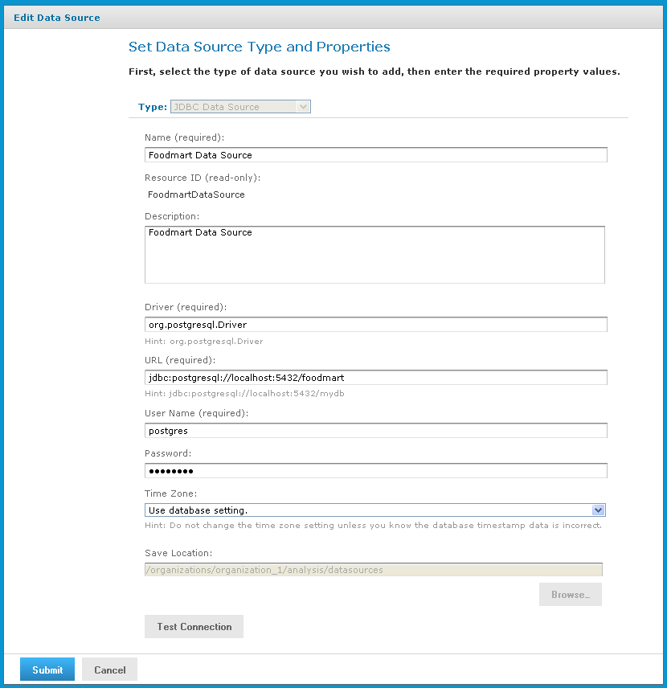

# Working with Data Sources

A data source is a resource in the repository that defines how and where to obtain the data displayed by reports or views. Typically, it includes the location of the data and the details you need to access it, such as a username and password. In the case of Jaspersoft OLAP, data sources are exposed through Mondrian connections.

For detailed information about data sources, refer to the JasperReports Server Administrator Guide.

To edit a data source

1.  In the **Search** field, enter the name (or partial name) of the object you want to edit, and click the Search icon. For example, enter **food**.

    The search results display objects that match the text you entered.

2.  Right-click the data source and click **Edit** from the context-menu.

    The **Set Data Source Type and Properties** page appears.

    

    *Figure 1 Set Data Source Type and Properties*

    !!! note

        The options displayed depend on the type of data source selected.

3.  Change the values as necessary and click **Test Connection** to ensure that the connection is valid.

    A banner at the top of the page displays a message: **Connection successful** or **Connection failed**.

4.  If the connection test fails, check the values that you entered, or check that the data is available from the service you specify, and test the connection again.

5.  When the test succeeds, click **Submit**.

The data source is saved to the repository.
