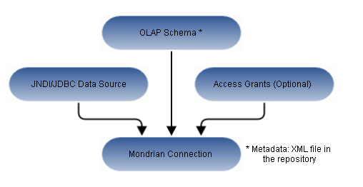

# Working with Mondrian Connections

!!! info "Important"

    This section describes functionality that can be restricted by the software license for JasperReports Server. If you do not see some of the options described in this section, your license may prohibit you from using them. To find out what you are licensed to use, or to upgrade your license, contact Jaspersoft.

A Mondrian connection describes how to present your transactional data as a multidimensional cube for analysis.

Anatomy of a Mondrian Connection

If you use JasperReports Server Community Project, you cannot include access grants in your Mondrian connection. Data-level security is only supported in commercial editions of the server.
