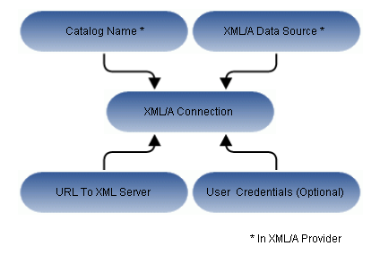

# Working with XML/A Connections

An XML/A connection describes how to connect to a remote XML/A provider, such as an XML/A source in another instance of JasperReports Server. In this case, the XML/A source points to a Mondrian connection in the remote server.

*Figure 1: Anatomy of an XML/A Connection*

JasperReports Server can act as either an XML/A provider or as an XML/A client. In the former case, remote servers retrieve data from an OLAP data source exposed by an XML/A definition in the JasperReports Server repository. In the latter case, JasperReports Server connects to a remote XML/A provider to retrieve data that populate reports and views. Typically, the server accesses a remote instance of JasperReports Server to form a distributed environment ([Performance Tuning](performance_tuning.md)), but the server can also connect to other types of XML/A provider, such as Microsoft SQL Server Analytic Services (SSAS). Because JasperReports Server uses OLAP4J (<http://www.olap4j.org/>), it may also be able to connect to other types of XML/A provider, though such configurations are not currently certified. In this release, only JasperReports Server and Microsoft SQL Server Analytic Services are certified as XML/A providers.

The remote server must also be configured for XML/A. For instructions regarding Jaspersoft OLAP, see [Jaspersoft OLAP Administration](administration.md) and [Creating an XML/A Source](creating_an_xml_a_source.md). If you are connecting to Microsoft SQL Server Analytic Services at a high level, you must:

-   Configure Internet Information Services (IIS) to provide connectivity to Microsoft SQL Server Analytic Services.

-   Deploy and configure msmdpump.dll, which is an IIS extension that provides data connectivity via HTTP.

-   Configure security in Microsoft SQL Server Analytic Services according to your needs.

-   Test Microsoft SQL Server Analytic Services using an XML/A client tool, such as waRehouse EXplorer (REX; <http://sourceforge.net/projects/whex>), which is an open source Java client for browsing multidimensional data sources. Testing with a third-party tool can help you troubleshoot your Microsoft SQL Server Analytic Services configuration.

For more information about Microsoft SQL Server Analytic Services, refer to the associated documentation.
