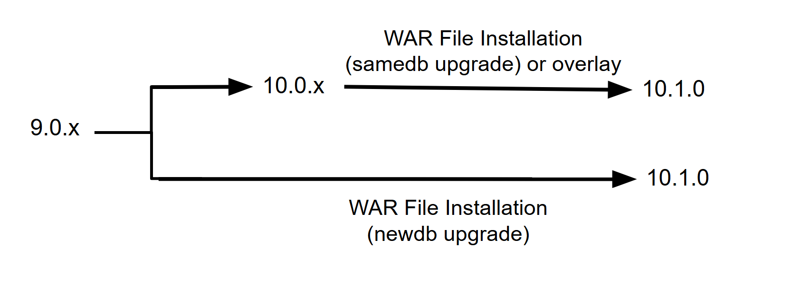

# Migration and Compatibility

This section includes the following topics:

- Upgrade Paths

- Upgrade File

- Database Changes

- Upgrade from Community Project

- Important Upgrade Information

## Upgrade Paths

Your current version determines your upgrade path:

|                                                         |
|---------------------------------------------------------|
|  |
| Paths for Upgrading to Version 10.1                     |

You can upgrade directly to 10.1.0 from versions 9 and/or 10.

|            |        |
|------------|--------|
| Version 9  | 9.0.x  |
| Version 10 | 10.0.x |

!!! note

    If your instance is JasperReports® Server 10.0.0 Compact, you can only upgrade to 10.1.0 Compact. If your instance is JasperReports® Server 10.0.0 Split, you can only upgrade to 10.1.0 Split.

## Upgrade File

To upgrade, start with the WAR File Distribution ZIP:

js-jrs_10.1.0

\_bin.zip

Download it from [Jaspersoft Technical Support](https://www.jaspersoft.com/support) .

The complete upgrade procedure is described in JasperReports® Server Upgrade Guide.

## Database Changes

Between certain versions of the server, we have changed the repository database to add new functionality. There are changes between 9.0.0, 10.0.0 and 10.1.0.

## Upgrade from Community Project

If your current instance is the Community version, you can follow the *Upgrade from Community Project* chapter of JasperReports® Server Upgrade Guide to upgrade to the Commercial version.

## Important Upgrade Information

There are major changes that must be considered when upgrading to JasperReports® Server 10.1.0. For details about how to upgrade, see *JasperReports® Server Upgrade Guide*.
