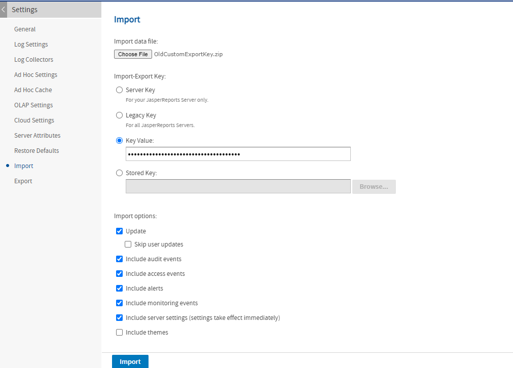
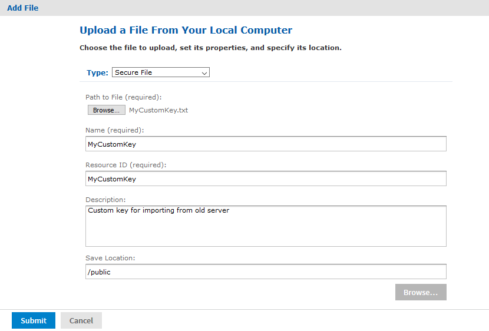
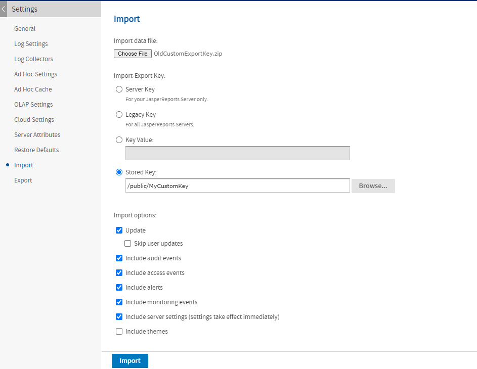
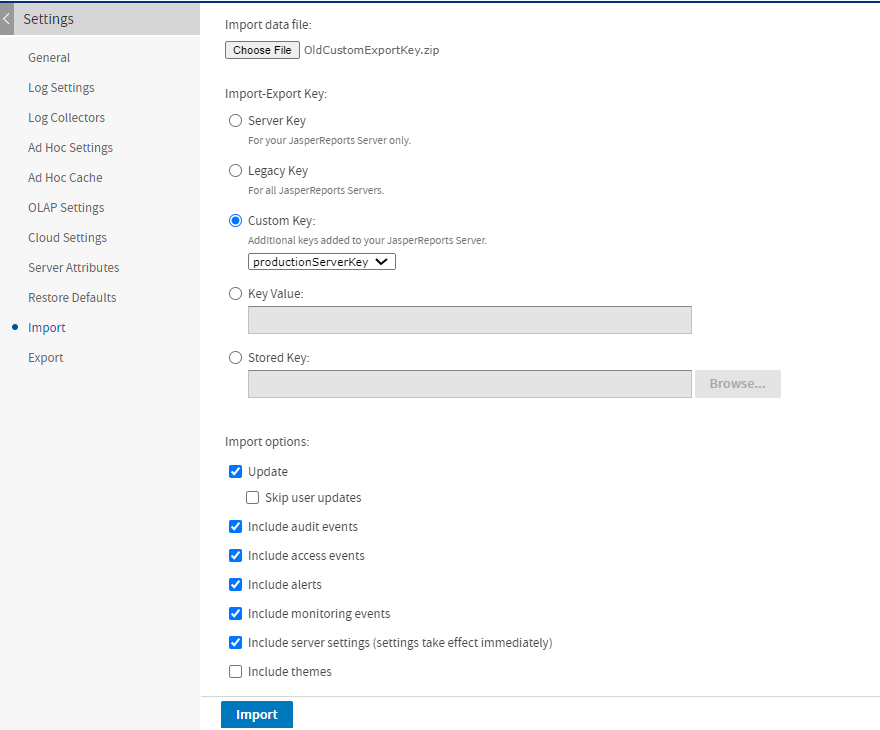

# Managing Keys for Import and Export

As of JasperReports Server 7.5, the management of the encryption keys used during import and export has been automated. These encryption keys are used by the server to encrypt user passwords so they are not revealed in export catalogs.

In previous versions of the server, the import-export key had to be configured manually outside the server. Beginning with version 7.5, the server creates and manages its import-export key internally, and also includes UI and REST options for specifying keys during import and export operations. However, there are still cases when you may need to manage keys on the server and specify keys during import-export operations.

The following table summarizes the use of keys when importing catalogs into the current version of the server:

<table>
<colgroup>
<col style="width: 50%" />
<col style="width: 50%" />
</colgroup>
<thead>
<tr>
<th>Origin of Export Catalog</th>
<th>Guidelines for Importing into 10.1</th>
</tr>
</thead>
<tbody>
<tr>
<td>Before version 7.5<br />
With default key</td>
<td>The current version of the server handles previous export catalogs created with legacy keys, and even older catalogs that did not use encryption. When importing through the UI, specify the Legacy key, and when importing through the command line, specify the <code>deprecatedImportExportEncSecret</code>.</td>
</tr>
<tr>
<td>Before version 7.5<br />
With custom import-export keys</td>
<td><p>The custom keys are not known to your server, so to import these catalogs, you will need to share the custom key with the importing server. There are two ways to specify custom keys:</p>
<ol>
<li><p>For one-time or occasional imports, you can enter the key's hex value into the UI or the import command line, or store it in the repository for repeated use.</p></li>
<li><p>For continual use, you should import the key to server's keystore with the command-line import command. Then the key is available by it is alias either through the UI or the command line when importing a catalog.</p></li>
</ol></td>
</tr>
<tr>
<td>Version 7.5 and later<br />
From the same server</td>
<td>When you import a catalog back into the same server, the server uses the same key for export, and import and thus can read its own export catalog. When importing through the UI, specify the Server key, and when importing through the command line, the key is detected automatically. This is also true after upgrading the server, as long as the catalog was exported from version 7.5 or later and the server's keystore was preserved during the upgrade. For more information about the keystore and catalogs during upgrade, see the <span>JasperReports Server Upgrade Guide</span>.</td>
</tr>
<tr>
<td>Version 7.5 and later<br />
From a different server</td>
<td><p>Because each server has unique randomly generate keys, the keys of the export server are not known to your server. However, unlike the custom key scenario above, you do not have direct access to the server's keys. Before you can move export catalogs between servers, such as test and production servers, you need to generate and share a key between the servers:</p>
<ol>
<li>Generate a key during the export operation on the first server.</li>
<li>Import the new key into the second server's keystore with the command-line import command.</li>
<li>Import the catalog into the second server and specify the custom key either through the UI or the command line.</li>
</ol>
<p>If you also import the key back into the originating server, both servers share the same key. Then if you specify this custom key during import and export, catalogs can be exported from either server and imported into the other one.</p></td>
</tr>
</tbody>
</table>

This guide documents the following operations to set up and manipulate keys:

-   Specifying custom keys during import and export operations.
-   Importing keys used by other servers.
-   Exporting keys for use in other servers.
-   Sharing custom keys between multiple servers.

For the default import and export operations, including specifying import-export keys through the UI, see the JasperReports Server Administrator Guide:

-   Importing catalogs from older servers with legacy or custom keys.
-   Exporting catalogs with a specific key.

The following sections describe the three ways to import a catalog that is encrypted with a custom key:

-   Use the import UI, and enter the key’s hexadecimal bytes in the Key Value field. This method is simple, but the key will not be stored in the server for multiple imports.
-   Store the custom key as a secure file resource in the repository, so it can be reused. Then use the import UI with the Stored Key field.
-   Use the import command line to import the key into the keystore so that it is available for any import operation in the future.

## Entering a Key Value in the Import UI

The simplest way to import a catalog with a custom key is to use the Settings UI for import and enter the key value. The key value is its representation in hexadecimal, for example:

0x1c 0x40 0xb9 0xf6 0xe2 0xd3 0xf9 0xd0 0x5a 0xab 0x84 0xe6 0xd4 0xe8 0x5f 0xed

1.  Log in as system administrator (`superuser` by default).

2.  Select **Manage &gt; Server Settings**, then click **Import** in the left-hand panel.

3.  In the right-hand panel, browse the file system to enter the catalog file you want to import.

    

    *Figure 1 Import UI with Key Value*

4.  Choose the **Key Value** radio button and paste the entire key value in the designated field. The characters of the key value are hidden to keep them secret.

5.  Select your import options and click **Import**.

If the key does not decrypt the catalog file, you get an error message, otherwise the import proceeds.

## Using a Stored Key in the Repository

If you have multiple files to import, you can store the custom key in a secure file resource in the repository. The contents of secure file resources are considered sensitive and protected internally in the same way as user passwords, that is, they are encrypted with a key in the internal database.

1.  Start by saving your custom key value as a hexadecimal number in a plain text file, for example:

    0x1c 0x40 0xb9 0xf6 0xe2 0xd3 0xf9 0xd0 0x5a 0xab 0x84 0xe6 0xd4 0xe8 0x5f 0xed

2.  Log in as system administrator (`superuser` by default).

3.  Select **View &gt; Repository**, then browse the repository tree to find an appropriate folder.

4.  Right-click the folder and select **Add Resource &gt; File&gt; Secure File**.

5.  In the **Add File** dialog, browse the file system to enter your text file with the key.

    *Figure 2 Add Secure File Dialog*

6.  Fill in the other fields and click **Submit**. The File appears in the repository.

7.  Select **Manage &gt; Server Settings**, then click **Import** in the left-hand panel.

8.  In the right-hand panel, browse the file system to enter the catalog file you want to import.

    

    *Figure 3 Import UI with Key File*

9.  Choose the **Stored Key** radio button and browse the repository to find your secure file.

10. Select your import options and click **Import**.

If the key does not decrypt the catalog file, you will get an error message, otherwise the import proceeds.

## Specifying an Import Key on the Command Line

Similar to the import UI, the `js-import` command-line utility has new options to specify the key needed to decrypt passwords in the catalog, for example, catalogs from older servers with different keys. There are two ways to specify the import key:

-   Give the hexadecimal bytes of the key.
-   Give the alias of a key in the server's keystore (`.jrsks`).

<table>
<thead>
<tr>
<th colspan="2"><p>js-import Options to Specify an Import Key</p></th>
</tr>
<tr>
<th><p>Option</p></th>
<th><p>Explanation</p></th>
</tr>
</thead>
<tbody>
<tr>
<td><p><code>--input-zip</code></p></td>
<td><p>Specifies the file path to a zipped input catalog from an older JasperReports Server instance that was configured to use custom keys.</p></td>
</tr>
<tr>
<td><p><code>import options</code></p></td>
<td><p>The standard import options specifying the import behavior, for example <code>--update --skip-user-update</code>. These options are documented in the <span>JasperReports Server Administrator Guide</span>.</p></td>
</tr>
<tr>
<td><p><code>--keyalias</code></p></td>
<td><p>When used with input-zip, this option specifies a key in the server's keystore (.jrsks) to use when decrypting passwords in the import catalog.</p></td>
</tr>
<tr>
<td><p><code>--secret-key</code></p></td>
<td><p>Lets you specify the hexadecimal representation of a key to be used as a one-time import key to decrypt any passwords in the input-zip.</p></td>
</tr>
<tr>
<td><p><code>--keyalg</code></p></td>
<td><p>When used with <code>--secret-key</code>, this option defines the algorithm, either AES or DES, for the hexidecimal key. The default is AES.</p></td>
</tr>
</tbody>
</table>

The following example shows how to import a catalog with a custom key.

``` bash
js-import.sh --secret-key "0x1c 0x40 0xb9 0xf6 0xe2 0xd3 0xf9 0xd0 0x5a 0xab 0x84 0xe6 0xd4
0xe8 0x5f 0xed" --input-zip myExport.zip
```

The following example shows how to import a catalog using a key already saved in the keystore.

``` bash
js-import.sh --keyalias productionServerKey --input-zip myExport.zip
```

## Importing a Key from the Command Line

If you have many catalogs to import from a server with a custom key, the `js-import` script has different options to import the key and add it to the local keystore (`.jrsks` by default). You can then use the example in the previous section to specify the new key by its alias when importing. There are three ways to define the key to import:

-   Provide the hexadecimal bytes of the key.
-   Provide a keystore and the alias (and password) of a key that it contains.
-   Request a random key to be generated and associated with an alias (and password) you provide.

<table>
<thead>
<tr>
<th colspan="2"><p>js-import Options to Import a Key</p></th>
</tr>
<tr>
<th><p>Option</p></th>
<th><p>Explanation</p></th>
</tr>
</thead>
<tbody>
<tr>
<td><p><code>--input-key</code></p></td>
<td><p>This option specifies a key to be added to the server's keystore. This option should be followed by the hexadecimal representation of the key, or by the <code>--keystore</code> or <code>--genkey</code> options (see below). Use the <code>--keyalias</code>, <code>--keyalg</code>, and <code>--keypass</code> options to add properties to the definition of the key in the keystore.</p></td>
</tr>
<tr>
<td><p><code>--keystore</code></p></td>
<td><p>This option specifies the path and filename of a keystore file from which to read and copy the key designated by the <code>--keyalias</code> option. Also specify the <code>--storepass</code> option to access the source keystore and the <code>--keypass</code> option to give the key's password in the keystore file.</p></td>
</tr>
<tr>
<td><p><code>--storepass</code></p></td>
<td><p>This option specifies the password for the keystore file from which to read and copy the key designated by the <code>--keyalias</code> option.</p></td>
</tr>
<tr>
<td><p><code>--genkey</code></p></td>
<td><p>This option triggers the import utility to generate a random key to be added to the server's keystore with the alias and password you specify (in the other options below) so that you can later access and use it. This option is a shortcut for creating a random key in an external keystore and then importing it with the <code>--keystore</code> option.</p></td>
</tr>
<tr>
<td><p><code>--keyalias</code></p></td>
<td><p>When used with a hexidecimal input-key, it specifies the alias of the new key to be imported. When used with the <code>--genkey</code> option, this specifies the alias of the new key to create. When used with the <code>--keystore</code> option, it specifies the alias of the key to be copied, and the copy of the key will have the same alias.</p></td>
</tr>
<tr>
<td><p><code>--keypass</code></p></td>
<td><p>When used with a hexidecimal input-key, it specifies the password of the new key to be imported. When used with the <code>--genkey</code> option, this specifies the password of the new key to create. When used with the <code>--keystore</code> option, it specifies the password of the key to be copied, and the copy of the key will have the same password.</p></td>
</tr>
<tr>
<td><p><code>--keyalg</code></p></td>
<td><p>When used with a hexidecimal input-key, this option defines the algorithm, either AES or DES, for the key being imported in the keystore. When used with the <code>--genkey</code> option, this specifies the algorithm to use when creating the new key.</p></td>
</tr>
<tr>
<td><p><code>--keysize</code></p></td>
<td><p>When used with a hexidecimal input-key, this option defines the key length in bits, usually 128 or 256, for the key being imported in the keystore. When used with the <code>--genkey</code> option, this specifies the length of the new key to create.</p></td>
</tr>
<tr>
<td><p><code>--visible</code></p></td>
<td><p>Specify this flag to make the imported key displayed in the list of Custom Keys as shown in <a href="#specifying-a-custom-key-in-the-import-ui">Specifying a Custom Key in the Import UI</a>. When omitted, the imported key is not available for UI import operations, only through command-line import operations (using <code>--keyalias</code>).</p></td>
</tr>
<tr>
<td><p><code>--keylabel</code></p></td>
<td><p>When --visible is specified, this option lets you specify the name of the key to display in the Custom Key selection interface. If --visible is specified without this option, the key alias is displayed in the UI. This option has no effect when --visible is not specified.</p></td>
</tr>
</tbody>
</table>

The following example shows how to add a key to the keystore, so it can be used for other import operations:

``` bash
js-import.sh --input-key "0x59 0xe3 0xd9 0xce 0x7f 0x34 0xab 0x27 0xb8 0xdf 0xc3 0x7e 0x01 0xab
             0x4d 0x6c" --keyalias productionKey --keyalg AES --keypass productionKeyPass
             --visible --keylabel ProductionServerKey
```

The following example shows how to copy a key from an external keystore file into the default keystore.

``` bash
js-import.sh --input-key --keystore ./mystore --storepass password --keyalias productionKey2
             --keypass productionKeyPass2 --visible --keylabel ProductionServerKey2
```

## Specifying a Custom Key in the Import UI

After adding custom keys to the keystore from the command line using the `--visible` option, you can also select the keys in the UI during import operations. The keys are identified by their alias or label if given.

1.  Log in as system administrator (`superuser` by default).

2.  Select **Manage &gt; Server Settings**, then click **Import** in the left-hand panel.

3.  In the right-hand panel, browse the file system to enter the catalog file you want to import.

    

    *Figure 4 Import UI with Key Value*

4.  When the server's keystore contains custom keys, the list of keys appears as the third bullet. Note that key files in the repository do not appear in this list, only custom keys in the keystore. Each key in the list is identified by its label if it was defined on import, otherwise by its alias. Choose this bullet and select your key from the drop-down list.

5.  Select your import options and click Import.

If the key does not decrypt the catalog file, you get an error message, otherwise the import proceeds.

## Specifying an Export Key on the Command Line

As with the export UI, you can specify custom keys when exporting from the command line. For example, you can create an export catalog that can be imported into another server instance that has different keys. There are three ways to specify the export key:

-   Provide the hexadecimal bytes of the key.
-   Give the alias of a key in the server's keystore (`.jrsks`).
-   Request a random key be generated and displayed on the console.

<table>
<thead>
<tr>
<th colspan="2"><p>js-export Options to Specify the Export Encryption Key</p></th>
</tr>
<tr>
<th><p>Option</p></th>
<th><p>Explanation</p></th>
</tr>
</thead>
<tbody>
<tr>
<td><p><code>--output-zip</code></p></td>
<td><p>Specifies the name of a zipped output catalog that will use the custom keys specified by the other options in this table. The <code>index.xml</code> file in the catalog contains new attributes to handle keys.</p></td>
</tr>
<tr>
<td><p><code>export options</code></p></td>
<td><p>The standard export options specifying the resources to export and export behavior, for example <code>--uris ... --skip-dependent-resources</code>. These options are documented in the <span>JasperReports Server Administrator Guide</span>.</p></td>
</tr>
<tr>
<td><p><code>--secret-key</code></p></td>
<td><p>This option lets you specify the hexadecimal representation of a key to be used as a one-time export key to encrypt any passwords in the output-zip.</p></td>
</tr>
<tr>
<td><p><code>--keyalg</code></p></td>
<td><p>This option may be specified only with the <code>secret-key</code> option above. It specifies the cryptography algorithm of the given key, either AES or DES (RSA is not supported by default). When not specified, the secret-key is assumed to use the same algorithm as the server's default import-export key (AES).</p></td>
</tr>
<tr>
<td><p><code>--keysize</code></p></td>
<td><p>This option may be specified only with the <code>secret-key</code> option above. It specifies the key length in bits (usually 128 or 256) to apply to the given key. When not specified, the size is the same as the server's default import-export key (128).</p></td>
</tr>
<tr>
<td><p><code>--keyalias</code></p></td>
<td><p>This option specifies a key in the keystore to use when encrypting passwords in the export catalog, instead of the default import-export key.</p></td>
</tr>
<tr>
<td><p><code>--keypass</code></p></td>
<td><p>This option may be specified only with the <code>keyalias</code> option above. It is required in the unlikely situation where the key with the given alias is held in the keystore, but the .jrsksp file is not configured with the password to access the key.</p></td>
</tr>
<tr>
<td><p><code>--genkey</code></p></td>
<td><p>This option generates a random key using the same algorithm and key size as the server's default import-export key (AES-128), and uses it to encrypt passwords in the export catalog. If the export is successful, the js-export script prints the key's hexadecimal representation and a unique alias for it on the console where it is running. You need to specify the same key when importing the catalog, for example with the <code>js-import --input-key</code> option or as explained in <a href="#entering-a-key-value-in-the-import-ui">Entering a Key Value in the Import UI</a>.</p></td>
</tr>
</tbody>
</table>

The following example shows how to export a catalog with passwords encrypted with a custom key:

``` bash
js-export.sh --uris /public/samples/AccountList --output-zip myExport.zip
--secret-key="0x6f 0x00 0xf1 0xbd 0x46 0x1f 0x62 0xa1 0x03 0x56 0x13 0xda 0x07 0x00 0x7c 0x10"
```

The following example shows how to export a catalog with passwords encrypted by one of the keys in the keystore:

``` bash
./js-export.sh --uris /public/samples/AccountList --output-zip myExport.zip
--keyalias productionServerKey --keypass "mykeypw2"
```

## Exporting a Key from the Command Line

The js-export utility can also be used to export one of the keys from the server's keystore (`.jrsks`). In addition to exporting repository resources in an export catalog, the following options generate a Java keystore file containing the specified key. The keystore is a secure file protected by the given password that can be used with the keytool utility or with the keystore options of the js-import tool. For more information, see [Importing a Key from the Command Line](#importing-a-key-from-the-command-line).

<table>
<thead>
<tr>
<th colspan="2"><p>js-export Options to Export a Key</p></th>
</tr>
<tr>
<th><p>Option</p></th>
<th><p>Explanation</p></th>
</tr>
</thead>
<tbody>
<tr>
<td><p><code>--keyalias</code></p></td>
<td><p>When used with the <code>--destkeystore</code> option below, this specifies the alias of the key to be exported from the server's keystore, and the copy of the key will have the same alias. If the export includes resources in an export catalog, any passwords it contains will be encrypted with this key.</p></td>
</tr>
<tr>
<td><p><code>--keypass</code></p></td>
<td><p>This option may be specified only with the <code>keyalias</code> option above. It is required in the unlikely situation where the key with the given alias is held in the keystore, but the <code>.jrsksp</code> file is not configured with the password to access the key.</p></td>
</tr>
<tr>
<td><p><code>--genkey</code></p></td>
<td><p>This option generates a random key using the same algorithm and key size as the server's default import-export key (AES-128), and exports it in the specified keystore. If the export includes resources in an export catalog, any passwords it contains will be encrypted with this key.</p></td>
</tr>
<tr>
<td><p><code>--destkeystore</code></p></td>
<td><p>This option specifies the filename of a keystore file to create, in order to export the key designated by the <code>--keyalias</code> option. You must also specify the <code>--deststorepass</code> option.</p></td>
</tr>
<tr>
<td><p><code>--deststorepass</code></p></td>
<td><p>This option specifies the password for the keystore file to be created to hold the exported key.</p></td>
</tr>
<tr>
<td><p><code>--destkeypass</code></p></td>
<td><p>Specifies a new password for the key in the newly created keystore.</p></td>
</tr>
</tbody>
</table>

You may specify both an output zip catalog and list of resources to export, as well as a key alias and keystore filename. In the following example of this, the export creates two output files, the zip catalog and the keystore, and any passwords in the catalog are encrypted with the same key that was exported.

``` bash
js-export.sh --everything --output-zip myExport.zip --destkeystore mystore --deststorepass storepw --genkey
```

The server that generates this key stores a copy of it in its keystore, and if you import the key to another server, they share the key. If you examine the key with the keytool utility, it has a unique alias name:

``` text
keytool -list -v -keystore ./mystore -storetype jceks

Enter keystore password: *******
Keystore type: JCEKS
Keystore provider: SunJCE
Your keystore contains 1 entry
Alias name: ced6b744-033d-4516-b293-c4776035a6f1
Creation date: Dec 12, 2019
Entry type: SecretKeyEntry

*******************************************
*******************************************
```

Now you can specify this unique alias name whenever importing or exporting from your two servers, the encryption is mutually compatible, and you will not need to export or import keys anymore.
